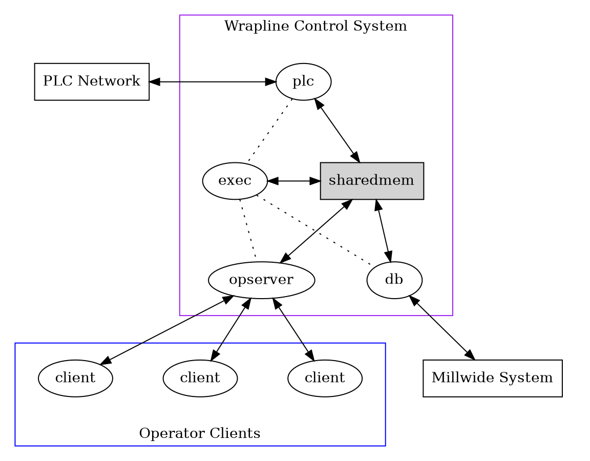
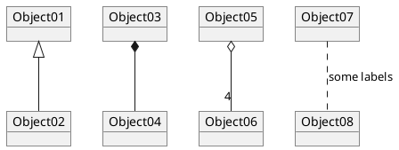

<div class="ox-hugo-toc toc has-section-numbers">

<div class="heading">Table of Contents</div>

- <span class="section-num">1</span> [한글 소개](#한글-소개)
- <span class="section-num">2</span> [How To Use This Document](#HowToUseThisDocument)
- <span class="section-num">3</span> [License](#License)
- <span class="section-num">4</span> [Change History - What's new](#ChangeHistory)
- <span class="section-num">5</span> [Getting Started](#GettingStarted)
    - <span class="section-num">5.1</span> [<span class="org-todo done FIXED">FIXED</span> Getting org-mode with Git](#GettingOrgModeWithGit)
    - <span class="section-num">5.2</span> [Org-Mode Setup](#Setup)
    - <span class="section-num">5.3</span> [Organizing Your Life Into Org Files](#OrgFiles)
    - <span class="section-num">5.4</span> [Agenda Setup](#AgendaSetup)
    - <span class="section-num">5.5</span> [<span class="org-todo todo FIXME">FIXME</span> Org File Structure](#OrgFileStructure)
    - <span class="section-num">5.6</span> [Key bindings](#KeyBindings)
- <span class="section-num">6</span> [Tasks and States](#TasksAndStates)
    - <span class="section-num">6.1</span> [<span class="org-todo todo FIXME">FIXME</span> TODO keywords](#TodoKeywords)
    - <span class="section-num">6.2</span> [<span class="org-todo todo FIXME">FIXME</span> Fast Todo Selection](#FastTodoSelection)
    - <span class="section-num">6.3</span> [<span class="org-todo todo FIXME">FIXME</span> TODO state triggers](#ToDoStateTriggers)
- <span class="section-num">7</span> [Adding New Tasks Quickly with Org Capture](#Capture)
    - <span class="section-num">7.1</span> [<span class="org-todo todo FIXME">FIXME</span> Capture Templates](#CaptureTemplates)
    - <span class="section-num">7.2</span> [Separate file for Capture Tasks](#CaptureRefileOrg)
    - <span class="section-num">7.3</span> [Capture Tasks is all about being FAST](#CaptureTasksAreFast)
- <span class="section-num">8</span> [Refiling Tasks](#Refiling)
    - <span class="section-num">8.1</span> [<span class="org-todo todo FIXME">FIXME</span> Refile Setup](#RefileSetup)
    - <span class="section-num">8.2</span> [Refiling Tasks](#RefilingTasks)
    - <span class="section-num">8.3</span> [Refiling Notes](#RefilingNotes)
    - <span class="section-num">8.4</span> [Refiling Phone Calls and Meetings](#RefilingPhoneCalls)
- <span class="section-num">9</span> [Custom agenda views](#CustomAgendaViews)
    - <span class="section-num">9.1</span> [Setup](#CustomAgendaViewSetup)
    - <span class="section-num">9.2</span> [What do I work on next?](#WhatDoIWorkOnNext)
    - <span class="section-num">9.3</span> [Reading email, newsgroups, and conversations on IRC](#ReadingMailNewsIRC)
    - <span class="section-num">9.4</span> [Filtering](#CustomAgendaViewFiltering)
- <span class="section-num">10</span> [Time Clocking](#Clocking)
    - <span class="section-num">10.1</span> [Clock Setup](#ClockSetup)
    - <span class="section-num">10.2</span> [Clocking in](#ClockingIn)
    - <span class="section-num">10.3</span> [Clock Everything - Create New Tasks](#ClockEverythingWithNewTasks)
    - <span class="section-num">10.4</span> [Finding tasks to clock in](#FindTasksToClockIn)
    - <span class="section-num">10.5</span> [Editing clock entries](#EditingClockEntries)
- <span class="section-num">11</span> [Time reporting and tracking](#TimeReportingAndTracking)
    - <span class="section-num">11.1</span> [Billing clients based on clocked time](#BillingClientsForClockedTime)
    - <span class="section-num">11.2</span> [Task Estimates and column view](#TaskEstimates)
    - <span class="section-num">11.3</span> [<span class="org-todo todo FIXME">FIXME</span> Providing progress reports to others](#ProgressReporting)
- <span class="section-num">12</span> [Tags](#Tags)
    - <span class="section-num">12.1</span> [<span class="org-todo todo FIXME">FIXME</span> Tags](#OrgTagAlist)
    - <span class="section-num">12.2</span> [Filetags](#FileTags)
    - <span class="section-num">12.3</span> [State Trigger Tags](#StateTriggerTags)
- <span class="section-num">13</span> [Handling Notes](#HandlingNotes)
- <span class="section-num">14</span> [<span class="org-todo todo FIXME">FIXME</span> Handling Phone Calls](#HandlinePhoneCalls)
- <span class="section-num">15</span> [GTD stuff](#GTD)
    - <span class="section-num">15.1</span> [Weekly Review Process](#GTDWeeklyReview)
    - <span class="section-num">15.2</span> [Project definition and finding stuck projects](#Projects)
- <span class="section-num">16</span> [Archiving](#Archiving)
    - <span class="section-num">16.1</span> [Archiving Subtrees](#ArchivingSubtrees)
    - <span class="section-num">16.2</span> [<span class="org-todo todo FIXME">FIXME</span> Archive Setup](#ArchiveSetup)
    - <span class="section-num">16.3</span> [Archive Tag - Hiding Information](#ArchiveTagHidesInfo)
    - <span class="section-num">16.4</span> [When to Archive](#WhenToArchive)
- <span class="section-num">17</span> [Publishing and Exporting](#Publishing)
    - <span class="section-num">17.1</span> [New Exporter Setup](#new-exporter-setup)
    - <span class="section-num">17.2</span> [<span class="org-todo todo FIXME">FIXME</span> Org-babel Setup](#OrgBabel)
    - <span class="section-num">17.3</span> [Playing with ditaa](#playingwithditaa)
    - <span class="section-num">17.4</span> [Playing with graphviz](#Graphviz)
    - <span class="section-num">17.5</span> [Playing with PlantUML](#PlantUML)
    - <span class="section-num">17.6</span> [Publishing Single Files](#PublishingSingleFiles)
    - <span class="section-num">17.7</span> [<span class="org-todo todo FIXME">FIXME</span> Publishing Projects](#PublishingProjects)
    - <span class="section-num">17.8</span> [Miscellaneous Export Settings](#MiscBabelExportSettings)
- <span class="section-num">18</span> [Reminders](#Reminders)
    - <span class="section-num">18.1</span> [<span class="org-todo todo FIXME">FIXME</span> Reminder Setup](#ReminderSetup)
- <span class="section-num">19</span> [Productivity Tools](#ProductivityTools)
    - <span class="section-num">19.1</span> [Abbrev-mode and Skeletons](#AbbrevMode)
    - <span class="section-num">19.2</span> [Focus On Current Work](#FocusOnCurrentWork)
    - <span class="section-num">19.3</span> [Tuning the Agenda Views](#TuningAgendaViews)
    - <span class="section-num">19.4</span> [<span class="org-todo todo FIXME">FIXME</span> Checklist handling](#ChecklistHandling)
    - <span class="section-num">19.5</span> [Backups](#Backups)
    - <span class="section-num">19.6</span> [Handling blocked tasks](#HandlingBlockedTasks)
    - <span class="section-num">19.7</span> [Org Task structure and presentation](#OrgTaskStructureAndPresentation)
    - <span class="section-num">19.8</span> [<span class="org-todo todo FIXME">FIXME</span> Attachments](#Attachments)
    - <span class="section-num">19.9</span> [Deadlines and Agenda Visibility](#DeadlinesAndAgendaVisibility)
    - <span class="section-num">19.10</span> [Exporting Tables to CSV](#TableExportToCSV)
    - <span class="section-num">19.11</span> [<span class="org-todo todo FIXME">FIXME</span> Minimize Emacs Frames](#MinimizeFrames)
    - <span class="section-num">19.12</span> [<span class="org-todo todo FIXME">FIXME</span> Logging stuff](#LoggingStuff)
    - <span class="section-num">19.13</span> [<span class="org-todo todo FIXME">FIXME</span> Limiting time spent on tasks](#LimitingTimeSpentOnTasks)
    - <span class="section-num">19.14</span> [<span class="org-todo todo FIXME">FIXME</span> Habit Tracking](#HabitTracking)
    - <span class="section-num">19.15</span> [Habits only log DONE state changes](#HabitsLogDone)
    - <span class="section-num">19.16</span> [Auto revert mode](#AutoRevertMode)
    - <span class="section-num">19.17</span> [<span class="org-todo todo FIXME">FIXME</span> Handling Encryption](#HandlingEncryption)
    - <span class="section-num">19.18</span> [Speed Commands](#SpeedCommands)
    - <span class="section-num">19.19</span> [Org Protocol](#OrgProtocol)
    - <span class="section-num">19.20</span> [Require a final newline when saving files](#RequireFinalNewline)
    - <span class="section-num">19.21</span> [Insert inactive timestamps and exclude from export](#InsertInactiveTimestamps)
    - <span class="section-num">19.22</span> [Return follows links](#ReturnFollowsLink)
    - <span class="section-num">19.23</span> [<span class="org-todo todo FIXME">FIXME</span> Highlight clock when running overtime](#HighlightClockOvertime)
    - <span class="section-num">19.24</span> [Meeting Notes](#MeetingNotes)
    - <span class="section-num">19.25</span> [Remove Highlights after changes](#HighlightPersistAfterEdit)
    - <span class="section-num">19.26</span> [<span class="org-todo todo FIXME">FIXME</span> Getting up to date org-mode info documentation](#OrgModeInfoDocumentation)
    - <span class="section-num">19.27</span> [Prefer future dates or not?](#FutureDates)
    - <span class="section-num">19.28</span> [Automatically change list bullets](#ListBullets)
    - <span class="section-num">19.29</span> [Remove indentation on agenda tags view](#IndentationOnTagsView)
    - <span class="section-num">19.30</span> [Fontify source blocks natively](#FontifySrcBlocksNatively)
    - <span class="section-num">19.31</span> [Agenda persistent filters](#AgendaPersistentFilters)
    - <span class="section-num">19.32</span> [Add tags for flagged entries](#TagFlaggedEntries)
    - <span class="section-num">19.33</span> [Mail links open compose-mail](#MailLinksOpenComposeMail)
    - <span class="section-num">19.34</span> [Composing mail from org mode subtrees](#MailingSubtrees)
    - <span class="section-num">19.35</span> [<span class="org-todo todo FIXME">FIXME</span> Use smex for M-x ido-completion](#SmexAndIdo)
    - <span class="section-num">19.36</span> [Use Emacs bookmarks for fast navigation](#BookmarksFastNavigation)
    - <span class="section-num">19.37</span> [Using org-mime to email](#OrgMimeMail)
    - <span class="section-num">19.38</span> [Remove multiple state change log details from the agenda](#StateChangeDetailsInAgenda)
    - <span class="section-num">19.39</span> [Drop old style references in tables](#OldTableReferences)
    - <span class="section-num">19.40</span> [Use system settings for file-application selection](#SystemSettingsForApplicationSelection)
    - <span class="section-num">19.41</span> [Use the current window for the agenda](#CurrentWindowForAgenda)
    - <span class="section-num">19.42</span> [Delete IDs when cloning](#DeleteIdsWhenCloning)
    - <span class="section-num">19.43</span> [Cycling plain lists](#CyclePlainLists)
    - <span class="section-num">19.44</span> [Showing source block syntax highlighting](#ShowSrcBlockSyntax)
    - <span class="section-num">19.45</span> [Inserting Structure Template Blocks](#StructureTemplateBlocks)
    - <span class="section-num">19.46</span> [NEXT is for tasks](#NextTasks)
    - <span class="section-num">19.47</span> [Startup in folded view](#StartupView)
    - <span class="section-num">19.48</span> [Allow alphabetical list entries](#AlphabeticalLists)
    - <span class="section-num">19.49</span> [<span class="org-todo todo FIXME">FIXME</span> Using orgstruct mode for mail](#OrgStructModeForMail)
    - <span class="section-num">19.50</span> [<span class="org-todo todo FIXME">FIXME</span> Using flyspell mode to reduce spelling errors](#FlySpellModeChecksSpelling)
    - <span class="section-num">19.51</span> [<span class="org-todo todo FIXME">FIXME</span> Preserving source block indentation](#PreserveSourceIndentations)
    - <span class="section-num">19.52</span> [<span class="org-todo todo FIXME">FIXME</span> Prevent editing invisible text](#PreventInvisibleEdits)
    - <span class="section-num">19.53</span> [Use utf-8 as default coding system](#DefaultCodingSystem)
    - <span class="section-num">19.54</span> [Keep clock durations in hours](#ClockDurationsNoDays)
    - <span class="section-num">19.55</span> [Create unique IDs for tasks when linking](#LinkingToTaskCreatesId)
- <span class="section-num">20</span> [Using Git for Automatic History, Backups, and Synchronization](#GitSync)
    - <span class="section-num">20.1</span> [<span class="org-todo todo FIXME">FIXME</span> Automatic Hourly Commits](#HourlyCommits)
    - <span class="section-num">20.2</span> [Git - Edit files with confidence](#GitEditWithConfidence)
    - <span class="section-num">20.3</span> [Git Repository synchronization](#git-sync)

</div>
<!--endtoc-->

<!--more-->

**Last revised and exported on 2024-01-05 04:47:21 +0900 with a word
count of 36824.**

Org-mode is a fabulous organizational tool originally built by Carsten
Dominik that operates on plain text files.  Org-mode is part of Emacs.

Org-mode 는 원래 Carsten Dominik 이 만든 멋진 정리 도구로, 일반 텍스트 파일에서
작동합니다. Org-mode 는 Emacs 의 일부입니다.


## <span class="section-num">1</span> 한글 소개 {#한글-소개}

<span class="timestamp-wrapper"><span class="timestamp">[2023-12-13 Wed 10:59] </span></span> Org-mode 를 사용하면 Organize Your Life 를 할 수 있다.
자유롭게 구성할 수 있다. 이 자유는 초심자에게는 벽이다. 그래서 본 문서가
유용하다. 한글 버전은 영한 번역을 하려고 만든 것이 아니다. 본 문서의 골격을
그대로 따라가되 Junghanacs Emacs 환경에서 충돌이 나는 일부 설정은 주석으로 처리
했다. 값을 변경하거나 추가해야 할 설정은 별도의 설정 파일에서 수행한다. 이러한
접근은 다른 Emacs 환경에서도 쉽게 적용하게 하고 개인 설정이 용이한 부분을 명확히
하게 한다.


## <span class="section-num">2</span> How To Use This Document {#HowToUseThisDocument}


This document assumes you've had some exposure to org-mode already so
concepts like the agenda, capture mode, etc.  won't be completely
foreign to you.  More information about org-mode can be found in the
[Org-Mode Manual](http://orgmode.org/index.html#sec-4.1) and on the [Worg Site](http://orgmode.org/worg/).

I have been using org-mode as my personal information manager for
years now.  I started small with just the default `TODO` and `DONE`
keywords.  I added small changes to my workflow and over time it
evolved into what is described by this document.

I still change my workflow and try new things regularly.  This document
describes mature workflows in my current org-mode setup.  I tend to
document changes to my workflow 30 days or more after implementing them
(assuming they are still around at that point) so that the new workflow
has a chance to mature.

Some of the customized Emacs settings described in this document are
set at their default values.  This explicitly shows the setting for
important org-mode variables used in my workflow and to keep my
workflow behaviour stable in the event that the default value changes
in the future.

This document is available as an [org file](http://doc.norang.ca/org-mode.org) which you can load in Emacs
and tangle with `C-c C-v C-t` which will create org-mode.el in the
same directory as the org-mode.org file.  This will extract all of the
elisp examples in this document into a file you can include in your
.emacs file.


## <span class="section-num">3</span> License {#License}


```text
Copyright (C)  2013-2023  Bernt Hansen.
Permission is granted to copy, distribute and/or modify this document
under the terms of the GNU Free Documentation License, Version 1.3
or any later version published by the Free Software Foundation;
with no Invariant Sections, no Front-Cover Texts, and no Back-Cover Texts.

Code in this document is free software: you can redistribute it
and/or modify it under the terms of the GNU General Public
License as published by the Free Software Foundation, either
version 3 of the License, or (at your option) any later version.

This code is distributed in the hope that it will be useful,
but WITHOUT ANY WARRANTY; without even the implied warranty of
MERCHANTABILITY or FITNESS FOR A PARTICULAR PURPOSE.  See the
GNU General Public License for more details.
```

This document <http://doc.norang.ca/org-mode.html> (either in its
[HTML format](http://doc.norang.ca/org-mode.html) or in its [Org format](http://doc.norang.ca/org-mode.org)) is licensed under the GNU Free
Documentation License version 1.3 or later
(<http://www.gnu.org/copyleft/fdl.html>).

The code examples and CSS stylesheets are licensed under the GNU
General Public License v3 or later
(<http://www.gnu.org/licenses/gpl.html>).


## <span class="section-num">4</span> Change History - What's new {#ChangeHistory}

This is version of this document.  This
document is created using the publishing features of `org-mode` git
version .

The source for this document can be found as a [plain text org file](http://doc.norang.ca/org-mode.org).  I
try to update this document about every six months.

The change history for this document can be found at
[git://git.norang.ca/org-mode-doc.git](http://git.norang.ca/?p%3Dorg-mode-doc.git%3Ba%3Dsummary).

This document is currently being reworked for recent versions of
org-mode and publishing tools used in by this document.

I am moving away from storing org settings in my .emacs and trying to
encapsulate those settings in the org-files themselves.


## <span class="section-num">5</span> Getting Started {#GettingStarted}

Getting started with `org-mode` is really easy.  You only need a few
lines in your emacs startup to use the latest version of org-mode from
the `git` repository.

Org-mode=를 시작하는 것은 정말 쉽습니다. 이맥스 시작에서 몇 줄만 추가하면 `git`
리포지토리의 최신 버전의 org-mode 를 사용할 수 있습니다.

I use currently use org-mode provided in the package system within emacs.

저는 현재 이맥의 패키지 시스템에서 제공하는 org-mode 를 사용하고 있습니다.


### <span class="org-todo done FIXED">FIXED</span> <span class="section-num">5.1</span> Getting org-mode with Git {#GettingOrgModeWithGit}


```text
별도로 Org-mode 를 다운 받을 필요 없다. Emacs 내장 버전을 사용하면 된다.
```

I keep a copy of the org-mode `git` repository in `~/git/org-mode/`.  This clone
was created with

```sh
cd ~/git
git clone https://git.savannah.gnu.org/git/emacs/org-mode.git
cd org-mode
make autoloads
```

To update and get new commits from the org-mode developers you can use

```sh
cd ~/git/org-mode
git pull
make uncompiled
```

I run uncompiled source files in my setup so the uncompiled `make` target is all you need.

I normally track the `master` branch in the org-mode repository.


### <span class="section-num">5.2</span> Org-Mode Setup {#Setup}

The following setup in my .emacs enables `org-mode` for org buffers.
`org-mode` is the default mode for `.org`, `.org_archive`, `.org_archive_20??`
files.

.emacs 에서 다음 설정은 조직 버퍼에 대해 `org-mode=를 활성화합니다. =org-mode=는
=.org`, `.org_archive`, `.org_archive_20??` 파일에 대한 기본 모드입니다.

```emacs-lisp
;;;
;;; Org Mode
;;;
(add-to-list 'load-path (expand-file-name "~/git/org-mode/lisp"))
(add-to-list 'auto-mode-alist '("\\.org\\(\\|_archive\\(_20[0-9][0-9]\\)?\\)$" . org-mode))
(require 'org)
;;
;; Standard key bindings
(global-set-key "\C-cl" 'org-store-link)
(global-set-key "\C-ca" 'org-agenda)
(global-set-key "\C-cb" 'org-iswitchb)
(global-set-key "\C-c " 'org-table-blank-field)
```

That's all you need to get started using headlines and lists in org-mode.

The rest of this document describes customizations I use in my setup,
how I structure org-mode files, and other changes to fit the way I
want org-mode to work.


### <span class="section-num">5.3</span> Organizing Your Life Into Org Files {#OrgFiles}

Tasks are separated into logical groupings or projects.
Use separate org files for large task groupings and
subdirectories for collections of files for multiple
projects that belong together.

작업은 논리적 그룹 또는 프로젝트로 구분됩니다. 대규모 작업 그룹에는 별도의 조직
파일을 사용하고, 함께 속한 여러 프로젝트의 파일 모음에는 하위 디렉터리를
사용합니다.

Here are sample files that I use.

The following org files collect non-work related tasks:

| Filename     | Description                                |
|--------------|--------------------------------------------|
| todo.org     | Personal tasks and things to keep track of |
| gsoc2009.org | Google Summer of Code stuff for 2009       |
| farm.org     | Farm related tasks                         |
| mark.org     | Tasks related to my son Mark               |
| org.org      | Org-mode related tasks                     |
| git.org      | Git related tasks                          |

The following org-file collects org capture notes and tasks:

| Filename   | Description         |
|------------|---------------------|
| refile.org | Capture task bucket |

The following work-related org-files keep my business notes (using
fictitious client names)

| Filename    | Description                             |
|-------------|-----------------------------------------|
| norang.org  | Norang tasks and notes                  |
| XYZ.org     | XYZ Corp tasks and notes                |
| ABC.org     | ABC Ltd tasks                           |
| ABC-DEF.org | ABC Ltd tasks for their client DEF Corp |
| ABC-KKK.org | ABC Ltd tasks for their client KKK Inc  |
| YYY.org     | YYY Inc tasks                           |

Org-mode is great for dealing with multiple clients and client
projects.  An org file becomes the collection of projects, notes,
etc. for a single client or client-project.

Client ABC Ltd. has multiple customer systems that I work on.
Separating the tasks for each client-customer into separate org files
helps keep things logically grouped and since clients come and go this
allows entire org files to be added or dropped from my agenda to keep
only what is important visible in agenda views.

Other org files are used for publishing only and do not contribute to the agenda.
See [Publishing and Exporting](#Publishing) for more details.


### <span class="section-num">5.4</span> Agenda Setup {#AgendaSetup}

The agenda collects details from various files and displays them in with
a calendar or list of tasks.  The files contributing to the agenda are
stored in the `org-agenda-files` variable.  `org-mode` manages the
`org-agenda-files` variable automatically using `C-c [` and `C-c ]` to
add and remove files respectively.

안건은 다양한 파일에서 세부 정보를 수집하여 캘린더나 작업 목록과 함께
표시합니다. 안건에 기여하는 파일은 `org-agenda-files` 변수에 저장됩니다.
`org-mode=는 =C-c [` 및 `C-c ]=를 사용하여 각각 파일을 추가하고 제거하여
=org-agenda-files` 변수를 자동으로 관리합니다.


### <span class="org-todo todo FIXME">FIXME</span> <span class="section-num">5.5</span> Org File Structure {#OrgFileStructure}

Most of my org files are set up with level 1 headings as main
categories only.  Tasks and projects normally start as level 2.

제 조직 파일 대부분은 레벨 1 제목을 기본 카테고리로만 설정되어 있습니다. 작업과
프로젝트는 보통 레벨 2 로 시작합니다.

Here are some examples of my level 1 headings in

`todo.org`:

-   Special Dates

    Includes level 2 headings for

    -   Birthdays
    -   Anniversaries
    -   Holidays

-   Finances
-   Health and Recreation
-   House Maintenance
-   Lawn and Garden Maintenance
-   Notes
-   Tasks
-   Vehicle Maintenance
-   Passwords

`norang.org`:

-   System Maintenance
-   Payroll
-   Accounting
-   Finances
-   Hardware Maintenance
-   Tasks
-   Research and Development
-   Notes
-   Purchase Order Tracking
-   Passwords

Each of these level 1 tasks normally has a `property drawer`
specifying the category for any tasks in that tree.  Level 1 headings
are set up like this:

이러한 각 레벨 1 작업에는 일반적으로 해당 트리에 있는 모든 작업의 카테고리를
지정하는 =프로퍼티 서랍=이 있습니다. 레벨 1 제목은 다음과 같이 설정됩니다:

```org
* Health and Recreation
  :PROPERTIES:
  :CATEGORY: Health
  :END:
  ...
* House Maintenance
  :PROPERTIES:
  :CATEGORY: House
  :END:
```


### <span class="section-num">5.6</span> Key bindings {#KeyBindings}

I live in the agenda.

I have the following custom key bindings set up for my emacs (sorted by frequency).

| Key     | For                                             | Used       |
|---------|-------------------------------------------------|------------|
| C-c a   | Enter Agenda                                    | Very Often |
| F11     | Goto currently clocked item                     | Very Often |
| C-c c   | Capture a task                                  | Very Often |
| C-F11   | Clock in a task (show menu with prefix)         | Often      |
| f5      | Show todo items for this subtree                | Often      |
| S-f5    | Widen                                           | Often      |
| f9 b    | Quick access to bbdb data                       | Often      |
| f9 c    | Calendar access                                 | Often      |
| C-c l   | Store a link for retrieval with C-c C-l         | Often      |
| C-S-f12 | Save buffers and publish current project        | Sometimes  |
| f8      | Go to next org file in org-agenda-files         | Sometimes  |
| f9 t    | Insert inactive timestamp                       | Sometimes  |
| f9 v    | Toggle visible mode (for showing/editing links) | Sometimes  |
| C-f9    | Previous buffer                                 | Sometimes  |
| C-f10   | Next buffer                                     | Sometimes  |
| C-x n r | Narrow to region                                | Sometimes  |
| f9 I    | Punch Clock In                                  | Sometimes  |
| f9 O    | Punch Clock Out                                 | Sometimes  |
| f9 o    | Switch to org scratch buffer                    | Sometimes  |
| f9 s    | Switch to scratch buffer                        | Sometimes  |
| C-c b   | Switch to org file                              | Sometimes  |
| f7      | Toggle line truncation/wrap                     | Rare       |
| f9 T    | Toggle insert inactive timestamp                | Rare       |

Here is the keybinding setup in lisp:

```emacs-lisp
;; Custom Key Bindings
(global-set-key (kbd "<f5>") 'bh/org-todo)
(global-set-key (kbd "<S-f5>") 'bh/widen)
(global-set-key (kbd "<f7>") 'bh/set-truncate-lines)
(global-set-key (kbd "<f8>") 'org-cycle-agenda-files)
(global-set-key (kbd "<f9> c") 'calendar)

(global-set-key (kbd "<f9> I") 'bh/punch-in)
(global-set-key (kbd "<f9> O") 'bh/punch-out)

(global-set-key (kbd "<f9> o") 'bh/make-org-scratch)

(global-set-key (kbd "<f9> s") 'bh/switch-to-scratch)

(global-set-key (kbd "<f9> t") 'bh/insert-inactive-timestamp)
(global-set-key (kbd "<f9> T") 'bh/toggle-insert-inactive-timestamp)

(global-set-key (kbd "<f9> v") 'visible-mode)
(global-set-key (kbd "<f9> l") 'org-toggle-link-display)
(global-set-key (kbd "<f9> SPC") 'bh/clock-in-last-task)
(global-set-key (kbd "C-<f9>") 'previous-buffer)
(global-set-key (kbd "M-<f9>") 'org-toggle-inline-images)
(global-set-key (kbd "C-x n r") 'narrow-to-region)
(global-set-key (kbd "C-<f10>") 'next-buffer)
(global-set-key (kbd "<f11>") 'org-clock-goto)
(global-set-key (kbd "C-<f11>") 'org-clock-in)
;; (global-set-key (kbd "C-s-<f12>") 'bh/save-then-publish)
(global-set-key (kbd "C-c c") 'org-capture)

(defun bh/set-truncate-lines ()
  "Toggle value of truncate-lines and refresh window display."
  (interactive)
  (setq truncate-lines (not truncate-lines))
  ;; now refresh window display (an idiom from simple.el):
  (save-excursion
    (set-window-start (selected-window)
                      (window-start (selected-window)))))

(defun bh/make-org-scratch ()
  (interactive)
  (find-file "/tmp/publish/scratch.org")
  (gnus-make-directory "/tmp/publish"))

(defun bh/switch-to-scratch ()
  (interactive)
  (switch-to-buffer "*scratch*"))
```

The main reason I have special key bindings (like `F9`, and `F11`) is
so that the keys work in any mode.  If I'm in the Emacs scratch buffer
then `C-u C-c C-x C-i` doesn't work, but the `C-F11` key combination
does and this saves me time since I don't have to visit an org-mode
buffer first just to clock in a recent task.


## <span class="section-num">6</span> Tasks and States {#TasksAndStates}

I use a common set of TODO keywords for most of my org files.

```org
#+SEQ_TODO: TODO(t) NEXT(n) | DONE(d!)
#+SEQ_TODO: WAITING(w@/!) HOLD(h@/!) | CANCELLED(c@)
```

`CANCELLED` and `DONE` are final completed states.
All other states are open active todo states.

The only exception to this is this document :) since I don't want
`org-mode` hiding the `TODO` keywords in exports when it appears in
headlines.
I have set up a dummy `#+SEQ_TODO: FIXME FIXED` entry at the
top of this file just to leave my `TODO` keyword untouched in this
document.


### <span class="org-todo todo FIXME">FIXME</span> <span class="section-num">6.1</span> TODO keywords {#TodoKeywords}

Todo keywords on headlines are tasks and the todo keyword defines the state these tasks are in.

I use a light colour theme in emacs.  I find this easier to read on bright sunny days.

Here are my `TODO` state colour settings:

```emacs-lisp
;; (setq org-todo-keyword-faces
;;       (quote (("TODO" :foreground "red" :weight bold)
;;               ("NEXT" :foreground "blue" :weight bold)
;;               ("DONE" :foreground "forest green" :weight bold)
;;               ("WAITING" :foreground "orange" :weight bold)
;;               ("HOLD" :foreground "magenta" :weight bold)
;;               ("CANCELLED" :foreground "forest green" :weight bold))))
```


#### <span class="section-num">6.1.1</span> Task States {#TodoKeywordTaskStates}

Tasks go through the sequence `TODO` -&gt; `DONE`.

The following diagram shows the possible state transitions for a task.




### <span class="org-todo todo FIXME">FIXME</span> <span class="section-num">6.2</span> Fast Todo Selection {#FastTodoSelection}

Fast todo selection allows changing from any task todo state to any
other state directly by selecting the appropriate key from the fast
todo selection key menu.  This is a great feature!

```emacs-lisp
;; (setq org-use-fast-todo-selection t)
```

Changing a task state is done with `C-c C-t KEY`

where `KEY` is the appropriate fast todo state selection key as defined in `org-todo-keywords`.

The setting

```emacs-lisp
(setq org-treat-S-cursor-todo-selection-as-state-change nil)
```

allows changing todo states with S-left and S-right skipping all of
the normal processing when entering or leaving a todo state.  This
cycles through the todo states but skips setting timestamps and
entering notes which is very convenient when all you want to do is fix
up the status of an entry.


### <span class="org-todo todo FIXME">FIXME</span> <span class="section-num">6.3</span> TODO state triggers {#ToDoStateTriggers}

I have a few triggers that automatically assign tags to tasks based on
state changes.  If a task moves to `CANCELLED` state then it gets a
`CANCELLED` tag.  Moving a `CANCELLED` task back to `TODO` removes the
`CANCELLED` tag.  These are used for filtering tasks in agenda views
which I'll talk about later.

The triggers break down to the following rules:

-   Moving a task to `CANCELLED` adds a `CANCELLED` tag
-   Moving a task to `WAITING` adds a `WAITING` tag
-   Moving a task to `HOLD` adds `WAITING` and `HOLD` tags
-   Moving a task to a done state removes `WAITING` and `HOLD` tags
-   Moving a task to `TODO` removes `WAITING`, `CANCELLED`, and `HOLD` tags
-   Moving a task to `NEXT` removes `WAITING`, `CANCELLED`, and `HOLD` tags
-   Moving a task to `DONE` removes `WAITING`, `CANCELLED`, and `HOLD` tags

The tags are used to filter tasks in the agenda views conveniently.

```emacs-lisp
;; (setq org-todo-state-tags-triggers
;;       (quote (("CANCELLED" ("CANCELLED" . t))
;;               ("WAITING" ("WAITING" . t))
;;               ("HOLD" ("WAITING") ("HOLD" . t))
;;               (done ("WAITING") ("HOLD"))
;;               ("TODO" ("WAITING") ("CANCELLED") ("HOLD"))
;;               ("NEXT" ("WAITING") ("CANCELLED") ("HOLD"))
;;               ("DONE" ("WAITING") ("CANCELLED") ("HOLD")))))
```


## <span class="section-num">7</span> Adding New Tasks Quickly with Org Capture {#Capture}

Org Capture mode replaces remember mode for capturing tasks and notes.

To add new tasks efficiently I use a minimal number of capture
templates.  I used to have lots of capture templates, one for each
org-file.  I'd start org-capture with `C-c c` and then pick a template
that filed the task under `* Tasks` in the appropriate file.

I found I still needed to refile these capture tasks again to the
correct location within the org-file so all of these different capture
templates weren't really helping at all.  Since then I've changed my
workflow to use a minimal number of capture templates -- I create the
new task quickly and refile it once.  This also saves me from
maintaining my org-capture templates when I add a new org file.


### <span class="org-todo todo FIXME">FIXME</span> <span class="section-num">7.1</span> Capture Templates {#CaptureTemplates}

When a new task needs to be added I categorize it into one of a few
things:

-   A phone call (p)
-   A meeting (m)
-   An email I need to respond to (r)
-   A new task (t)
-   A new note (n)
-   An interruption (j)
-   A new habit (h)

and pick the appropriate capture task.

Here is my setup for org-capture

```emacs-lisp
;; (setq org-directory "~/git/org")
;; (setq org-default-notes-file "~/git/org/refile.org")

;; ;; I use C-c c to start capture mode
;; (global-set-key (kbd "C-c c") 'org-capture)

;; ;; Capture templates for: TODO tasks, Notes, appointments, phone calls, meetings, and org-protocol
;; (setq org-capture-templates
;;       (quote (("t" "todo" entry (file "~/git/org/refile.org")
;;                "* TODO %?\n%U\n%a\n" :clock-in t :clock-resume t)
;;               ("r" "respond" entry (file "~/git/org/refile.org")
;;                "* NEXT Respond to %:from on %:subject\nSCHEDULED: %t\n%U\n%a\n" :clock-in t :clock-resume t :immediate-finish t)
;;               ("n" "note" entry (file "~/git/org/refile.org")
;;                "* %? :NOTE:\n%U\n%a\n" :clock-in t :clock-resume t)
;;               ("j" "Journal" entry (file+datetree "~/git/org/diary.org")
;;                "* %?\n%U\n" :clock-in t :clock-resume t)
;;               ("w" "org-protocol" entry (file "~/git/org/refile.org")
;;                "* TODO Review %c\n%U\n" :immediate-finish t)
;;               ("m" "Meeting" entry (file "~/git/org/refile.org")
;;                "* MEETING with %? :MEETING:\n%U" :clock-in t :clock-resume t)
;;               ("p" "Phone call" entry (file "~/git/org/refile.org")
;;                "* PHONE %? :PHONE:\n%U" :clock-in t :clock-resume t)
;;               ("h" "Habit" entry (file "~/git/org/refile.org")
;;                "* NEXT %?\n%U\n%a\nSCHEDULED: %(format-time-string \"%<<%Y-%m-%d %a .+1d/3d>>\")\n:PROPERTIES:\n:STYLE: habit\n:REPEAT_TO_STATE: NEXT\n:END:\n"))))
```

Capture mode now handles automatically clocking in and out of a
capture task.  This all works out of the box now without special hooks.
When I start a capture mode task the task is clocked in as specified
by `:clock-in t` and when the task is filed with `C-c C-c` the clock
resumes on the original clocking task.

The quick clocking in and out of capture mode tasks (often it takes
less than a minute to capture some new task details) can leave
empty clock drawers in my tasks which aren't really useful.  Since I
remove clocking lines with 0:00 length I end up with a clock drawer
like this:

```org
* TODO New Capture Task
  :LOGBOOK:
  :END:
  [2010-05-08 Sat 13:53]
```

I have the following setup to remove these empty `LOGBOOK` drawers if
they occur.

```emacs-lisp
;; Remove empty LOGBOOK drawers on clock out
(defun bh/remove-empty-drawer-on-clock-out ()
  (interactive)
  (save-excursion
    (beginning-of-line 0)
    (org-remove-empty-drawer-at (point))))
    ;; (org-remove-empty-drawer-at "LOGBOOK" (point))))

(add-hook 'org-clock-out-hook 'bh/remove-empty-drawer-on-clock-out 'append)

```


### <span class="section-num">7.2</span> Separate file for Capture Tasks {#CaptureRefileOrg}

I have a single org file which is the target for my capture templates.

I store notes, tasks, phone calls, and org-protocol tasks in
`refile.org`.  I used to use multiple files but found that didn't
really have any advantage over a single file.

Normally this file is empty except for a single line at the top which
creates a `REFILE` tag for anything in the file.

The file has a single permanent line at the top like this

```org
#+FILETAGS: REFILE
```


### <span class="section-num">7.3</span> Capture Tasks is all about being FAST {#CaptureTasksAreFast}

Okay I'm in the middle of something and oh yeah - I have to remember
to do that.  I don't stop what I'm doing.  I'm probably clocking a
project I'm working on and I don't want to lose my focus on that but I
can't afford to forget this little thing that just came up.

So what do I do?  Hit `C-c c` to start capture mode and select `t`
since it's a new task and I get a buffer like this:

```org
* TODO
  [2010-08-05 Thu 21:06]

  [[file:~/git/org-mode-doc/org-mode.org::*Capture%20Tasks%20is%20all%20about%20being%20FAST][Capture Tasks is all about being FAST]]
```

Enter the details of the TODO item and `C-c C-c` to file it away in
refile.org and go right back to what I'm really working on secure in
the knowledge that that item isn't going to get lost and I don't have
to think about it anymore at all now.

The amount of time I spend entering the captured note is clocked.  The
capture templates are set to automatically clock in and out of the
capture task.  This is great for interruptions and telephone calls
too.


## <span class="section-num">8</span> Refiling Tasks {#Refiling}

Refiling tasks is easy.  After collecting a bunch of new tasks in my
refile.org file using capture mode I need to move these to the
correct org file and topic.  All of my active org-files are in my
`org-agenda-files` variable and contribute to the agenda.

I collect capture tasks in refile.org for up to a week.  These now
stand out daily on my block agenda and I usually refile them during
the day.  I like to keep my refile task list empty.


### <span class="org-todo todo FIXME">FIXME</span> <span class="section-num">8.1</span> Refile Setup {#RefileSetup}

To refile tasks in org you need to tell it where you want to refile things.

In my setup I let any file in `org-agenda-files` and the current file
contribute to the list of valid refile targets.

I've recently moved to using IDO to complete targets directly.  I find
this to be faster than my previous complete in steps setup.  At first
I didn't like IDO but after reviewing the documentation again and
learning about `C-SPC` to limit target searches I find it is much
better than my previous complete-in-steps setup.  Now when I want to
refile something I do `C-c C-w` to start the refile process, then type
something to get some matching targets, then `C-SPC` to restrict the
matches to the current list, then continue searching with some other
text to find the target I need.  `C-j` also selects the current
completion as the final target.  I like this a lot.  I show full
outline paths in the targets so I can have the same heading in
multiple subtrees or projects and still tell them apart while
refiling.

I now exclude `DONE` state tasks as valid refile targets.  This helps to keep the
refile target list to a reasonable size.

Here is my refile configuration:

```emacs-lisp
; Targets include this file and any file contributing to the agenda - up to 9 levels deep
(setq org-refile-targets (quote ((nil :maxlevel . 9)
                                 (org-agenda-files :maxlevel . 9))))

; Use full outline paths for refile targets - we file directly with IDO
(setq org-refile-use-outline-path t)

; Targets complete directly with IDO
(setq org-outline-path-complete-in-steps nil)

; Allow refile to create parent tasks with confirmation
(setq org-refile-allow-creating-parent-nodes (quote confirm))

; Use IDO for both buffer and file completion and ido-everywhere to t
;; (setq org-completion-use-ido t)
;; (setq ido-everywhere t)
;; (setq ido-max-directory-size 100000)
;; (ido-mode (quote both))
;; ; Use the current window when visiting files and buffers with ido
;; (setq ido-default-file-method 'selected-window)
;; (setq ido-default-buffer-method 'selected-window)
; Use the current window for indirect buffer display
(setq org-indirect-buffer-display 'current-window)

;;;; Refile settings
; Exclude DONE state tasks from refile targets
(defun bh/verify-refile-target ()
  "Exclude todo keywords with a done state from refile targets"
  (not (member (nth 2 (org-heading-components)) org-done-keywords)))

(setq org-refile-target-verify-function 'bh/verify-refile-target)
```

To refile a task to my `norang.org` file under `System Maintenance` I
just put the cursor on the task and hit `C-c C-w` and enter `nor C-SPC
sys RET` and it's done.  IDO completion makes locating targets a snap.


### <span class="section-num">8.2</span> Refiling Tasks {#RefilingTasks}

Tasks to refile are in their own section of the block agenda.  To find
tasks to refile I run my agenda view with `F12 SPC` and scroll down to
second section of the block agenda: `Tasks to Refile`.  This view
shows all tasks (even ones marked in a `done` state).

Bulk refiling in the agenda works very well for multiple tasks going
to the same place.  Just mark the tasks with `m` and then `B r` to
refile all of them to a new location.  Occasionally I'll also refile
tasks as subtasks of the current clocking task using `C-2 C-c C-w`
from the `refile.org` file.

Refiling all of my tasks tends to take less than a minute so I
normally do this a couple of times a day.


### <span class="section-num">8.3</span> Refiling Notes {#RefilingNotes}

I keep a `* Notes` headline in most of my org-mode files.  Notes have
a `NOTE` tag which is created by the capture template for notes.  This
allows finding notes across multiple files easily using the agenda
search functions.

Notes created by capture tasks go first to `refile.org` and are later
refiled to the appropriate project file.  Some notes that are project
related get filed to the appropriate project instead of under the
catchall `* NOTES` task.  Generally these types of notes are specific
to the project and not generally useful -- so removing them from the
notes list when the project is archived makes sense.


### <span class="section-num">8.4</span> Refiling Phone Calls and Meetings {#RefilingPhoneCalls}

Phone calls and meetings are handled using capture mode.  I time my
calls and meetings using the capture mode template settings to clock
in and out the capture task while the phone call or meeting is in
progress.

Phone call and meeting tasks collect in `refile.org` and are later
refiled to the appropriate location.  Some phone calls are billable
and we want these tracked in the appropriate category.  I refile my
phone call and meeting tasks under the appropriate project so time
tracking and reports are as accurate as possible.


## <span class="section-num">9</span> Custom agenda views {#CustomAgendaViews}

I now have one block agenda view that has everything on it.  I also
keep separate single view agenda commands for use on my slower Eee
PC - since it takes prohibitively long to generate my block agenda on
that slow machine.  I'm striving to simplify my layout with everything
at my fingertips in a single agenda on my workstation which is where I
spend the bulk of my time.

Most of my old custom agenda views were rendered obsolete when
filtering functionality was added to the agenda in newer versions of
`org-mode` and now with block agenda functionality I can combine
everything into a single view.

Custom agenda views are used for:

-   Single block agenda shows the following
    -   overview of today
    -   Finding tasks to be refiled
    -   Finding stuck projects
    -   Finding NEXT tasks to work on
    -   Show all related tasks
    -   Reviewing projects
    -   Finding tasks waiting on something
    -   Findings tasks to be archived
-   Finding notes
-   Viewing habits

If I want just today's calendar view then `F12 a` is still faster than
generating the block agenda - especially if I want to view a week or
month's worth of information, or check my clocking data.  In that case
the extra detail on the block agenda view is never really needed and I
don't want to spend time waiting for it to be generated.


### <span class="section-num">9.1</span> Setup {#CustomAgendaViewSetup}

```emacs-lisp

;; ex) 2022-09-19 (월)
(setq org-agenda-format-date "%Y-%m-%d (%a)")

;; Do not dim blocked tasks
(setq org-agenda-dim-blocked-tasks nil)

;; Compact the block agenda view
;; (setq org-agenda-compact-blocks t)
(setq org-agenda-compact-blocks nil)

;; Custom agenda command definitions
(setq org-agenda-custom-commands
      (quote (("N" "Notes" tags "NOTE"
               ((org-agenda-overriding-header "Notes")
                (org-tags-match-list-sublevels t)))
              ("h" "Habits" tags-todo "STYLE=\"habit\""
               ((org-agenda-overriding-header "Habits")
                (org-agenda-sorting-strategy
                 '(todo-state-down effort-up category-keep))))
              ;; ADD 'r'
              ("r" "Agenda review"
               ((agenda "" ((org-agenda-span 7)))
                (stuck "")
                (todo "NEXT")
                (todo "TODO")
                (todo "HOLD"))
               ((org-agenda-archives-mode t)
                (org-agenda-compact-blocks nil)
                (org-agenda-show-all-dates nil)))
              (" " "Agenda"
               ((agenda "" nil)
                ;; ADD 'IMPORTANT'
                (tags-todo "+IMPORTANT-notoday"
                           ((org-agenda-overriding-header
                             "These are your IMPORTANT Tasks")
                            (org-agenda-dim-blocked-tasks)
                            ;; Sorting is *really* slowing it down.

                            ;; @TODO: Figure out a way to speed this up,
                            ;; maybe by specifying certain files here and
                            ;; creating a separate custom agenda for all
                            ;; important tasks.
                            ;; (org-agenda-sorting-strategy
                            ;;  '(timestamp-down effort-up))
                            ))
                (tags "REFILE"
                      ((org-agenda-overriding-header "Tasks to Refile")
                       (org-tags-match-list-sublevels nil)))
                (tags-todo "-CANCELLED/!"
                           ((org-agenda-overriding-header "Stuck Projects")
                            (org-agenda-skip-function 'bh/skip-non-stuck-projects)
                            (org-agenda-sorting-strategy
                             '(category-keep))))
                (tags-todo "-HOLD-CANCELLED/!"
                           ((org-agenda-overriding-header "Projects")
                            (org-agenda-skip-function 'bh/skip-non-projects)
                            (org-tags-match-list-sublevels 'indented)
                            (org-agenda-sorting-strategy
                             '(category-keep))))
                (tags-todo "-CANCELLED/!NEXT"
                           ((org-agenda-overriding-header (concat "Project Next Tasks"
                                                                  (if bh/hide-scheduled-and-waiting-next-tasks
                                                                      ""
                                                                    " (including WAITING and SCHEDULED tasks)")))
                            (org-agenda-skip-function 'bh/skip-projects-and-habits-and-single-tasks)
                            (org-tags-match-list-sublevels t)
                            (org-agenda-todo-ignore-scheduled bh/hide-scheduled-and-waiting-next-tasks)
                            (org-agenda-todo-ignore-deadlines bh/hide-scheduled-and-waiting-next-tasks)
                            (org-agenda-todo-ignore-with-date bh/hide-scheduled-and-waiting-next-tasks)
                            (org-agenda-sorting-strategy
                             '(todo-state-down effort-up category-keep))))
                (tags-todo "-REFILE-CANCELLED-WAITING-HOLD/!"
                           ((org-agenda-overriding-header (concat "Project Subtasks"
                                                                  (if bh/hide-scheduled-and-waiting-next-tasks
                                                                      ""
                                                                    " (including WAITING and SCHEDULED tasks)")))
                            (org-agenda-skip-function 'bh/skip-non-project-tasks)
                            (org-agenda-todo-ignore-scheduled bh/hide-scheduled-and-waiting-next-tasks)
                            (org-agenda-todo-ignore-deadlines bh/hide-scheduled-and-waiting-next-tasks)
                            (org-agenda-todo-ignore-with-date bh/hide-scheduled-and-waiting-next-tasks)
                            (org-agenda-sorting-strategy
                             '(category-keep))))
                (tags-todo "-REFILE-CANCELLED-WAITING-HOLD/!"
                           ((org-agenda-overriding-header (concat "Standalone Tasks"
                                                                  (if bh/hide-scheduled-and-waiting-next-tasks
                                                                      ""
                                                                    " (including WAITING and SCHEDULED tasks)")))
                            (org-agenda-skip-function 'bh/skip-project-tasks)
                            (org-agenda-todo-ignore-scheduled bh/hide-scheduled-and-waiting-next-tasks)
                            (org-agenda-todo-ignore-deadlines bh/hide-scheduled-and-waiting-next-tasks)
                            (org-agenda-todo-ignore-with-date bh/hide-scheduled-and-waiting-next-tasks)
                            (org-agenda-sorting-strategy
                             '(category-keep))))
                (tags-todo "-CANCELLED+WAITING|HOLD/!"
                           ((org-agenda-overriding-header (concat "Waiting and Postponed Tasks"
                                                                  (if bh/hide-scheduled-and-waiting-next-tasks
                                                                      ""
                                                                    " (including WAITING and SCHEDULED tasks)")))
                            (org-agenda-skip-function 'bh/skip-non-tasks)
                            (org-tags-match-list-sublevels nil)
                            (org-agenda-todo-ignore-scheduled bh/hide-scheduled-and-waiting-next-tasks)
                            (org-agenda-todo-ignore-deadlines bh/hide-scheduled-and-waiting-next-tasks)))
                (tags "-REFILE/"
                      ((org-agenda-overriding-header "Tasks to Archive")
                       (org-agenda-skip-function 'bh/skip-non-archivable-tasks)
                       (org-tags-match-list-sublevels nil))))
               nil))))

```

My block agenda view looks like this when not narrowed to a project.
This shows top-level projects and `NEXT` tasks but hides the project details since
we are not focused on any particular project.

**NOTE:** This agenda screen shot is out of date and does not currently match the agenda setup in this document.
This will be fixed soon.



After selecting a project (with `P` on any task in the agenda) the block agenda changes to show the project and
any subprojects in the Projects section.  Tasks show project-related tasks that are hidden when not
narrowed to a project.

This makes it easy to focus on the task at hand.

**NOTE:** This agenda screen shot is out of date and does not currently match the agenda setup in this document.
This will be fixed soon.



I generally work top-down on the agenda.  Things with deadlines and
scheduled dates (planned to work on today or earlier) show up in the
agenda at the top.

My day goes generally like this:

-   Punch in (this starts the clock on the default task)
-   Look at the agenda and make a mental note of anything important to deal with today
-   Read email and news
    -   create notes, and tasks for things that need responses with org-capture
-   Check refile tasks and respond to emails
-   Look at my agenda and work on important tasks for today
    -   Clock it in
    -   Work on it until it is `DONE` or it gets interrupted
-   Work on tasks
-   Make journal entries (`C-c c j`) for interruptions
-   Punch out for lunch and punch back in after lunch
-   work on more tasks
-   Refile tasks to empty the list
    -   Tag tasks to be refiled with `m` collecting all tasks for the same target
    -   Bulk refile the tasks to the target location with `B r`
    -   Repeat (or refile individually with `C-c C-w`) until all refile tasks are gone
-   Mark habits done today as DONE
-   Punch out at the end of the work day


### <span class="section-num">9.2</span> What do I work on next? {#WhatDoIWorkOnNext}

Start with deadlines and tasks scheduled today or earlier from the
daily agenda view.  Then move on to tasks in the `Next Tasks` list in
the block agenda view.  I tend to schedule current projects to 'today'
when I start work on them and they sit on my daily agenda reminding me
that they need to be completed.  I normally only schedule one or two
projects to the daily agenda and unschedule things that are no longer
important and don't deserve my attention today.

When I look for a new task to work on I generally hit `F12 SPC` to get
the block agenda and follow this order:

-   Pick something off today's agenda
    -   deadline for today (do this first - it's not late yet)
    -   deadline in the past (it's already late)
    -   a scheduled task for today (it's supposed to be done today)
    -   a scheduled task that is still on the agenda
    -   deadline that is coming up soon
-   pick a NEXT task
-   If you run out of items to work on look for a NEXT task in the current context
    pick a task from the Tasks list of the current project.


#### <span class="section-num">9.2.1</span> Why keep it all on the `NEXT` list? {#CustomAgendaViewsNextList}

I've moved to a more GTD way of doing things.  Now I just use a `NEXT`
list.  Only projects get tasks with `NEXT` keywords since stuck projects
initiate the need for marking or creating `NEXT` tasks.  A `NEXT` task
is something that is available to work on _now_, it is the next
logical step in some project.

I used to have a special keyword `ONGOING` for things that I do a lot
and want to clock but never really start/end.  I had a special agenda
view for `ONGOING` tasks that I would pull up to easily find the thing
I want to clock.

Since then I've moved away from using the `ONGOING` todo keyword.
Having an agenda view that shows `NEXT` tasks makes it easy to pick
the thing to clock - and I don't have to remember if I need to look in
the `ONGOING` list or the `NEXT` list when looking for the task to
clock-in.  The `NEXT` list is basically 'what is current' - any task
that moves a project forward.  I want to find the thing to work on as
fast as I can and actually do work on it - not spend time hunting
through my org files for the task that needs to be clocked-in.

To drop a task off the `NEXT` list simply move it back to the `TODO`
state.


### <span class="section-num">9.3</span> Reading email, newsgroups, and conversations on IRC {#ReadingMailNewsIRC}

When reading email, newsgroups, and conversations on IRC I just let
the default task (normally `** Organization`) clock the time I spend on
these tasks.  To read email I go to Gnus and read everything in my
inboxes.  If there are emails that require a response I use
org-capture to create a new task with a heading of 'Respond to &lt;user&gt;'
for each one.  This automatically links to the email in the task and
makes it easy to find later.  Some emails are quick to respond to and
some take research and a significant amount of time to complete.  I
clock each one in it's own task just in case I need that clocked time
later.  The capture template for Repond To tasks is now scheduled for
today so I can refile the task to the appropriate org file without
losing the task for a week.

Next, I go to my newly created tasks to be refiled from the block
agenda with `F12 a` and clock in an email task and deal with it.
Repeat this until all of the 'Respond to &lt;user&gt;' tasks are marked
`DONE`.

I read email and newgroups in Gnus so I don't separate clocked time
for quickly looking at things.  If an article has a useful piece of
information I want to remember I create a note for it with `C-c c n`
and enter the topic and file it.  This takes practically no time at
all and I know the note is safely filed for later retrieval.  The time
I spend in the capture buffer is clocked with that capture note.


### <span class="section-num">9.4</span> Filtering {#CustomAgendaViewFiltering}

So many tasks, so little time.  I have hundreds of tasks at any given
time (373 right now).  There is so much stuff to look at it can be
daunting.  This is where agenda filtering saves the day.

It's 11:53AM and I'm in work mode just before lunch.  I don't want to
see tasks that are not work related right now.  I also don't want to
work on a big project just before lunch... so I need to find small
tasks that I can knock off the list.

How do we do this?  Get a list of NEXT tasks from the block agenda and
then narrow it down with filtering.  Tasks are ordered in the NEXT
agenda view by estimated effort so the short tasks are first -- just
start at the top and work your way down.  I can limit the displayed
agenda tasks to those estimates of 10 minutes or less with `/ + 1` and
I can pick something that fits the minutes I have left before I take
off for lunch.


#### <span class="section-num">9.4.1</span> Automatically removing context based tasks with / RET {#CustomAgendaViewFilteringContext}

`/ RET` in the agenda is really useful.  This awesome feature was
added to org-mode by John Wiegley.  It removes tasks automatically by
filtering based on a user-provided function.

At work I have projects I'm working on which are assigned by my
manager.  Sometimes priorities changes and projects are delayed to
sometime in the future.  This means I need to stop working on these
immediately.  I put the project task on `HOLD` and work on something
else.  The `/ RET` filter removes `HOLD` tasks and subtasks (because
of tag inheritance).

At home I have some tasks tagged with `farm` since these need to be
performed when I am physically at our family farm.  Since I am there
infrequently I have added `farm` to the list of auto-excluded tags on
my system.  I can always explicitly filter to just `farm` tasks with
`/ TAB farm RET` when I am physically there.

I have the following setup to allow `/ RET` to filter tasks based on
the description above.

```emacs-lisp
(defun bh/org-auto-exclude-function (tag)
  "Automatic task exclusion in the agenda with / RET"
  (and (cond
        ((string= tag "hold")
         t)
        ((string= tag "farm")
         t))
       (concat "-" tag)))

(setq org-agenda-auto-exclude-function 'bh/org-auto-exclude-function)
```

This lets me filter tasks with just `/ RET` on the agenda which removes tasks I'm not
supposed to be working on now from the list of returned results.

This helps to keep my agenda clutter-free.


## <span class="section-num">10</span> Time Clocking {#Clocking}

Okay, I admit it.  I'm a clocking fanatic.

I clock everything at work.  Org-mode makes this really easy.  I'd
rather clock too much stuff than not enough so I find it's easier to
get in the habit of clocking everything.

This makes it possible to look back at the day and see where I'm
spending too much time, or not enough time on specific projects.  This
also helps a lot when you need to estimate how long something is going
to take to do -- you can use your clocking data from similar tasks to
help tune your estimates so they are more accurate.

Without clocking data it's hard to tell how long something took to do
after the fact.

I now use the concept of `punching in` and `punching out` at the start
and end of my work day.  I punch in when I arrive at work, punch out
for lunch, punch in after lunch, and punch out at the end of the day.
Every minute is clocked between punch-in and punch-out times.

Punching in defines a default task to clock time on whenever the clock
would normally stop.  I found that with the default org-mode setup I
would lose clocked minutes during the day, a minute here, a minute
there, and that all adds up.  This is especially true if you write
notes when moving to a DONE state - in this case the clock normally
stops before you have composed the note -- and good notes take a few
minutes to write.

My clocking setup basically works like this:

-   Punch in (start the clock)
    -   This clocks in a predefined task by `org-id` that is the default
        task to clock in whenever the clock normally stops
-   Clock in tasks normally, and let moving to a DONE state clock out
    -   clocking out automatically clocks time on a parent task or moves
        back to the predefined default task if no parent exists.
-   Continue clocking whatever tasks you work on
-   Punch out (stop the clock)

I'm free to change the default task multiple times during the day but
with the clock moving up the project tree on clock out I no longer
need to do this.  I simply have a single task that gets clocked in
when I punch-in.

If I punch-in with a prefix on a task in `Project X` then that task
automatically becomes the default task and all clocked time goes on
that project until I either punch out or punch in some other task.

My org files look like this:

`todo.org`:

```org
#+FILETAGS: PERSONAL
...
* Tasks
** Organization
   :PROPERTIES:
   :CLOCK_MODELINE_TOTAL: today
   :ID:       eb155a82-92b2-4f25-a3c6-0304591af2f9
   :END:
   ...
```

If I am working on some task, then I simply clock in on the task.
Clocking out moves the clock up to a parent task with a todo keyword
(if any) which keeps the clock time in the same subtree.  If there
is no parent task with a todo keyword then the clock moves back to
the default clocking task until I punch out or clock in some other
task.  When an interruption occurs I start a capture task which
keeps clocked time on the interruption task until I close it with
C-c C-c.

This works really well for me.

For example, consider the following org file:

```org
* TODO Project A
** NEXT TASK 1
** TODO TASK 2
** TODO TASK 3
* Tasks
** TODO Some miscellaneous task
```

I'll work on this file in the following sequence:

1.  I punch in with `F9-I` at the start of my day

    That clocks in the `Organization` task by id in my `todo.org` file.

2.  `F12-SPC` to review my block agenda

    Pick 'TODO Some miscellaneous task' to work on next and clock that in with `I`
    The clock is now on 'TODO Some miscellaneous task'

3.  I complete that task and mark it done with `C-c C-t d`

    This stops the clock and moves it back to the `Organization` task.

4.  Now I want to work on `Project A` so I clock in `Task 1`

    I work on Task 1 and mark it `DONE`.  This clocks out `Task 1` and moves
    the clock to `Project A`.  Now I work on `Task 2` and clock that in.

The entire time I'm working on and clocking some subtask of `Project A`
all of the clock time in the interval is applied somewhere to the `Project A`
tree.  When I eventually mark `Project A` done then the clock will move
back to the default organization task.


### <span class="section-num">10.1</span> Clock Setup {#ClockSetup}

To get started we need to punch in which clocks in the default
task and keeps the clock running.  This is now simply a matter of
punching in the clock with `F9 I`.  You can do this anywhere.
Clocking out will now clock in the parent task (if there is one
with a todo keyword) or clock in the default task if not parent
exists.

Keeping the clock running when moving a subtask to a `DONE` state
means clocking continues to apply to the project task.  I can pick the
next task from the parent and clock that in without losing a minute or
two while I'm deciding what to work on next.

I keep clock times, state changes, and other notes in the `:LOGBOOK:`
drawer.

I have the following org-mode settings for clocking:

```emacs-lisp
;;
;; Resume clocking task when emacs is restarted
(org-clock-persistence-insinuate)
;;
;; Show lot of clocking history so it's easy to pick items off the C-F11 list
(setq org-clock-history-length 23)
;; Resume clocking task on clock-in if the clock is open
(setq org-clock-in-resume t)
;; Change tasks to NEXT when clocking in
(setq org-clock-in-switch-to-state 'bh/clock-in-to-next)
;; Separate drawers for clocking and logs
(setq org-drawers (quote ("PROPERTIES" "LOGBOOK")))
;; Save clock data and state changes and notes in the LOGBOOK drawer
(setq org-clock-into-drawer t)
;; Sometimes I change tasks I'm clocking quickly - this removes clocked tasks with 0:00 duration
(setq org-clock-out-remove-zero-time-clocks t)
;; Clock out when moving task to a done state
(setq org-clock-out-when-done t)
;; Save the running clock and all clock history when exiting Emacs, load it on startup
(setq org-clock-persist t)
;; Do not prompt to resume an active clock
(setq org-clock-persist-query-resume nil)
;; Enable auto clock resolution for finding open clocks
(setq org-clock-auto-clock-resolution (quote when-no-clock-is-running))
;; Include current clocking task in clock reports
(setq org-clock-report-include-clocking-task t)

(setq bh/keep-clock-running nil)

(defun bh/clock-in-to-next (kw)
  "Switch a task from TODO to NEXT when clocking in.
Skips capture tasks, projects, and subprojects.
Switch projects and subprojects from NEXT back to TODO"
  (when (not (and (boundp 'org-capture-mode) org-capture-mode))
    (cond
     ((and (member (org-get-todo-state) (list "TODO"))
           (bh/is-task-p))
      "NEXT")
     ((and (member (org-get-todo-state) (list "NEXT"))
           (bh/is-project-p))
      "TODO"))))

(defun bh/find-project-task ()
  "Move point to the parent (project) task if any"
  (save-restriction
    (widen)
    (let ((parent-task (save-excursion (org-back-to-heading 'invisible-ok) (point))))
      (while (org-up-heading-safe)
        (when (member (nth 2 (org-heading-components)) org-todo-keywords-1)
          (setq parent-task (point))))
      (goto-char parent-task)
      parent-task)))

(defun bh/punch-in (arg)
  "Start continuous clocking and set the default task to the
selected task.  If no task is selected set the Organization task
as the default task."
  (interactive "p")
  (setq bh/keep-clock-running t)
  (if (equal major-mode 'org-agenda-mode)
      ;;
      ;; We're in the agenda
      ;;
      (let* ((marker (org-get-at-bol 'org-hd-marker))
             (tags (org-with-point-at marker (org-get-tags-at))))
        (if (and (eq arg 4) tags)
            (org-agenda-clock-in '(16))
          (bh/clock-in-organization-task-as-default)))
    ;;
    ;; We are not in the agenda
    ;;
    (save-restriction
      (widen)
      ; Find the tags on the current task
      (if (and (equal major-mode 'org-mode) (not (org-before-first-heading-p)) (eq arg 4))
          (org-clock-in '(16))
        (bh/clock-in-organization-task-as-default)))))

(defun bh/punch-out ()
  (interactive)
  (setq bh/keep-clock-running nil)
  (when (org-clock-is-active)
    (org-clock-out))
  (org-agenda-remove-restriction-lock))

(defun bh/clock-in-default-task ()
  (save-excursion
    (org-with-point-at org-clock-default-task
      (org-clock-in))))

(defun bh/clock-in-parent-task ()
  "Move point to the parent (project) task if any and clock in"
  (let ((parent-task))
    (save-excursion
      (save-restriction
        (widen)
        (while (and (not parent-task) (org-up-heading-safe))
          (when (member (nth 2 (org-heading-components)) org-todo-keywords-1)
            (setq parent-task (point))))
        (if parent-task
            (org-with-point-at parent-task
              (org-clock-in))
          (when bh/keep-clock-running
            (bh/clock-in-default-task)))))))

(defvar bh/organization-task-id "eb155a82-92b2-4f25-a3c6-0304591af2f9")

(defun bh/clock-in-organization-task-as-default ()
  (interactive)
  (org-with-point-at (org-id-find bh/organization-task-id 'marker)
    (org-clock-in '(16))))

(defun bh/clock-out-maybe ()
  (when (and bh/keep-clock-running
             (not org-clock-clocking-in)
             (marker-buffer org-clock-default-task)
             (not org-clock-resolving-clocks-due-to-idleness))
    (bh/clock-in-parent-task)))

(add-hook 'org-clock-out-hook 'bh/clock-out-maybe 'append)
```

I used to clock in tasks by ID using the following function but with
the new punch-in and punch-out I don't need these as much anymore.
`f9-SPC` calls `bh/clock-in-last-task` which switches the clock back
to the previously clocked task.

```emacs-lisp
(require 'org-id)
(defun bh/clock-in-task-by-id (id)
  "Clock in a task by id"
  (org-with-point-at (org-id-find id 'marker)
    (org-clock-in nil)))

(defun bh/clock-in-last-task (arg)
  "Clock in the interrupted task if there is one
Skip the default task and get the next one.
A prefix arg forces clock in of the default task."
  (interactive "p")
  (let ((clock-in-to-task
         (cond
          ((eq arg 4) org-clock-default-task)
          ((and (org-clock-is-active)
                (equal org-clock-default-task (cadr org-clock-history)))
           (caddr org-clock-history))
          ((org-clock-is-active) (cadr org-clock-history))
          ((equal org-clock-default-task (car org-clock-history)) (cadr org-clock-history))
          (t (car org-clock-history)))))
    (widen)
    (org-with-point-at clock-in-to-task
      (org-clock-in nil))))
```


### <span class="section-num">10.2</span> Clocking in {#ClockingIn}

When I start or continue working on a task I clock it in with any of the following:

-   `C-c C-x C-i`
-   `I` in the agenda
-   `I` speed key on the first character of the heading line
-   `f9 I` while on the task in the agenda
-   `f9 I` while in the task in an org file


#### <span class="section-num">10.2.1</span> Setting a default clock task {#ClockingInDefaultTask}

I have a default `** Organization` task in my todo.org file that
I tend to put miscellaneous clock time on.  This is the task I
clock in on when I punch in at the start of my work day with
`F9-I`.  While reorganizing my org-files, reading email,
clearing my inbox, and doing other planning work that isn't for
a specific project I'll clock in this task.  Punching-in
anywhere clocks in this Organization task as the default task.

If I want to change the default clocking task I just visit the
new task in any org buffer and clock it in with `C-u C-u C-c C-x
C-i`.  Now this new task that collects miscellaneous clock
minutes when the clock would normally stop.

You can quickly clock in the default clocking task with `C-u C-c
C-x C-i d`.  Another option is to repeatedly clock out so the
clock moves up the project tree until you clock out the
top-level task and the clock moves to the default task.


#### <span class="section-num">10.2.2</span> Using the clock history to clock in old tasks {#ClockingInByClockHistory}

You can use the clock history to restart clocks on old tasks you've
clocked or to jump directly to a task you have clocked previously.  I
use this mainly to clock in whatever got interrupted by something.

Consider the following scenario:

-   You are working on and clocking `Task A` (Organization)
-   You get interrupted and switch to `Task B` (Document my use of org-mode)
-   You complete `Task B` (Document my use of org-mode)
-   Now you want to go back to `Task A` (Organization) again to continue

This is easy to deal with.

1.  Clock in `Task A`, work on it
2.  Go to `Task B` (or create a new task) and clock it in
3.  When you are finished with `Task B` hit `C-u C-c C-x C-i i`

This displays a clock history selection window like the following and
selects the interrupted `[i]` entry.

**Clock history selection buffer for C-u C-c C-x C-i**

```text
Default Task
[d] norang          Organization                          <-- Task B
The task interrupted by starting the last one
[i] norang          Organization                          <-- Task B
Current Clocking Task
[c] org             NEXT Document my use of org-mode      <-- Task A
Recent Tasks
[1] org             NEXT Document my use of org-mode      <-- Task A
[2] norang          Organization                          <-- Task B
...
[Z] org             DONE Fix default section links        <-- 35 clock task entries ago
```


### <span class="section-num">10.3</span> Clock Everything - Create New Tasks {#ClockEverythingWithNewTasks}

In order to clock everything you need a task for everything.  That's
fine for planned projects but interruptions inevitably occur and you
need some place to record whatever time you spend on that
interruption.

To deal with this we create a new capture task to record the thing we
are about to do.  The workflow goes something like this:

-   You are clocking some task and an interruption occurs
-   Create a quick capture task journal entry `C-c c j`
-   Type the heading
-   go do that thing (eat lunch, whatever)
-   file it `C-c C-c`, this restores the clock back to the previous clocking task
-   clock something else in or continue with the current clocking task

This means you can ignore the details like where this task really
belongs in your org file layout and just get on with completing the
thing.  Refiling a bunch of tasks later in a group when it is
convenient to refile the tasks saves time in the long run.

If it's a one-shot uninteresting task (like a coffee break) I create
a capture journal entry for it that goes to the diary.org date tree.
If it's a task that actually needs to be tracked and marked done, and
applied to some project then I create a capture task instead which files it in
refile.org.


### <span class="section-num">10.4</span> Finding tasks to clock in {#FindTasksToClockIn}

To find a task to work on I use one of the following options
(generally listed most frequently used first)

-   Use the clock history C-u C-c C-x C-i
    Go back to something I was clocking that is not finished
-   Pick something off today's block agenda
    `SCHEDULED` or `DEADLINE` items that need to be done soon
-   Pick something off the `NEXT` tasks agenda view
    Work on some unfinished task to move to completion
-   Pick something off the other task list
-   Use an agenda view with filtering to pick something to work on

Punching in on the task you select will restrict the agenda view to that project
so you can focus on just that thing for some period of time.


### <span class="section-num">10.5</span> Editing clock entries {#EditingClockEntries}

Sometimes it is necessary to edit clock entries so they reflect
reality.  I find I do this for maybe 2-3 entries in a week.

Occassionally I cannot clock in a task on time because I'm away from
my computer.  In this case the previous clocked task is still running
and counts time for both tasks which is wrong.

I make a note of the time and then when I get back to my computer I
clock in the right task and edit the start and end times to correct
the clock history.

To visit the clock line for an entry quickly use the agenda log mode.
`F12 a l` shows all clock lines for today.  I use this to navigate to
the appropriate clock lines quickly.  F11 goes to the current clocked
task but the agenda log mode is better for finding and visiting older
clock entries.

Use `F12 a l` to open the agenda in log mode and show only logged
clock times.  Move the cursor down to the clock line you need to edit
and hit `TAB` and you're there.

To edit a clock entry just put the cursor on the part of the date you
want to edit (use the keyboard not the mouse - since the clicking on
the timestamp with the mouse goes back to the agenda for that day) and
hit the `S-<up arrow>` or `S-<down arrow>` keys to change the time.

The following setting makes time editing use discrete minute intervals (no rounding)
increments:

```emacs-lisp
(setq org-time-stamp-rounding-minutes (quote (1 1)))
```

Editing the time with the shift arrow combination also updates the
total for the clock line which is a nice convenience.

I always check that I haven't created task overlaps when fixing time
clock entries by viewing them with log mode on in the agenda.  There
is a new view in the agenda for this -- just hit `v c` in the daily
agenda and clock gaps and overlaps are identified.

I want my clock entries to be as accurate as possible.

The following setting shows 1 minute clocking gaps.

```emacs-lisp
(setq org-agenda-clock-consistency-checks
      (quote (:max-duration "4:00"
              :min-duration 0
              :max-gap 0
              :gap-ok-around ("4:00"))))
```


## <span class="section-num">11</span> Time reporting and tracking {#TimeReportingAndTracking}


### <span class="section-num">11.1</span> Billing clients based on clocked time {#BillingClientsForClockedTime}

At the beginning of the month I invoice my clients for work done last
month.  This is where I review my clocking data for correctness before
billing for the clocked time.

Billing for clocked time basically boils down to the following steps:

1.  Verify that the clock data is complete and correct
2.  Use clock reports to summarize time spent
3.  Create an invoice based on the clock data

    I currently create invoices in an external software package
    based on the org-mode clock data.

4.  Archive complete tasks so they are out of the way.

    See [Archiving](#Archiving) for more details.


#### <span class="section-num">11.1.1</span> Verify that the clock data is complete and correct {#VerifyingClockData}

Since I change tasks often (sometimes more than once in a minute) I
use the following setting to remove clock entries with a zero
duration.

```emacs-lisp
;; Sometimes I change tasks I'm clocking quickly - this removes clocked tasks with 0:00 duration
;; (setq org-clock-out-remove-zero-time-clocks t) ; duplicated
```

This setting just keeps my clocked log entries clean - only keeping
clock entries that contribute to the clock report.

Before invoicing for clocked time it is important to make sure your
clocked time data is correct.  If you have a clocked time with an
entry that is not closed (ie. it has no end time) then that is a hole
in your clocked day and it gets counted as zero (0) for time spent on
the task when generating clock reports.  Counting it as zero is almost
certainly wrong.

To check for unclosed clock times I use the agenda-view clock check
(`v c` in the agenda).  This view shows clocking gaps and overlaps in
the agenda.

To check the last month's clock data I use `F12 a v m b v c`
which shows a full month in the agenda, moves to the previous
month, and shows the clocked times only.  It's important to
remove any agenda restriction locks and filters when checking
the logs for gaps and overlaps.

The clocked-time only display in the agenda makes it easy to quickly
scan down the list to see if an entry is missing an end time.  If an
entry is not closed you can manually fix the clock entry based on
other clock info around that time.


#### <span class="section-num">11.1.2</span> Using clock reports to summarize time spent {#ClockReports}

Billable time for clients are kept in separate org files.

To get a report of time spent on tasks for `XYZ.org` you simply visit
the `XYZ.org` file and run an agenda clock report for the last month
with `F12 < a v m b R`.  This limits the agenda to this one file,
shows the agenda for a full month, moves to last month, and generates
a clock report.

My agenda org clock report settings show 5 levels of detail with links
to the tasks.  I like wider reports than the default compact setting
so I override the `:narrow` value.

```emacs-lisp
;; Agenda clock report parameters
(setq org-agenda-clockreport-parameter-plist
      (quote (:link t :maxlevel 5 :fileskip0 t :compact t :narrow 80)))
```

I used to have a monthly clock report dynamic block in each project
org file and manually updated them at the end of my billing cycle.  I
used this as the basis for billing my clients for time spent on their
projects.  I found updating the dynamic blocks fairly tedious when you
have more than a couple of files for the month.

I have since moved to using agenda clock reports shortly after that
feature was added.  I find this much more convenient.  The data isn't
normally for consumption by anyone else so the format of the agenda
clock report format is great for my use-case.


### <span class="section-num">11.2</span> Task Estimates and column view {#TaskEstimates}

Estimating how long tasks take to complete is a difficult skill to
master.  Org-mode makes it easy to practice creating estimates for
tasks and then clock the actual time it takes to complete.

By repeatedly estimating tasks and reviewing how your estimate relates
to the actual time clocked you can tune your estimating skills.


#### <span class="org-todo todo FIXME">FIXME</span> <span class="section-num">11.2.1</span> Creating a task estimate with column mode {#CreatingTaskEstimates}

I use `properties` and `column view` to do project estimates.

I set up column view globally with the following headlines

```emacs-lisp
; Set default column view headings: Task Effort Clock_Summary
;; (setq org-columns-default-format "%80ITEM(Task) %10Effort(Effort){:} %10CLOCKSUM")
```

This makes column view show estimated task effort and clocked times
side-by-side which is great for reviewing your project estimates.

A property called `Effort` records the estimated amount of time a
given task will take to complete.  The estimate times I use are one
of:

-   10 minutes
-   30 minutes
-   1 hour
-   2 hours
-   3 hours
-   4 hours
-   5 hours
-   6 hours
-   7 hours
-   8 hours

These are stored for easy use in `column mode` in the global property
`Effort_ALL`.

```emacs-lisp
; global Effort estimate values
; global STYLE property values for completion
(setq org-global-properties (quote (("Effort_ALL" . "0:15 0:30 0:45 1:00 2:00 3:00 4:00 5:00 6:00 0:00")
                                    ("STYLE_ALL" . "habit"))))
```

To create an estimate for a task or subtree start column mode with
`C-c C-x C-c` and collapse the tree with `c`.  This shows a table
overlayed on top of the headlines with the task name, effort estimate,
and clocked time in columns.

With the cursor in the `Effort` column for a task you can easily set
the estimated effort value with the quick keys `1` through `9`.

After setting the effort values exit `column mode` with `q`.


#### <span class="section-num">11.2.2</span> Saving your estimate {#SavingEstimate}

For fixed price jobs where you provide your estimate to a client, then
work to complete the project it is useful to save the original
estimate that is provided to the client.

Save your original estimate by creating a dynamic clock report table
at the top of your estimated project subtree.  Entering `C-c C-x i
RET` inserts a clock table report with your estimated values and any
clocked time to date.

```org
Original Estimate
#+BEGIN: columnview :hlines 1 :id local
| Task                        | Estimated Effort | CLOCKSUM |
|-----------------------------+------------------+----------|
| ** TODO Project to estimate |             5:40 |          |
| *** TODO Step 1             |             0:10 |          |
| *** TODO Step 2             |             0:10 |          |
| *** TODO Step 3             |             5:10 |          |
| **** TODO Step 3.1          |             2:00 |          |
| **** TODO Step 3.2          |             3:00 |          |
| **** TODO Step 3.3          |             0:10 |          |
| *** TODO Step 4             |             0:10 |          |
#+END:
```

I normally delete the `#+BEGIN:` and `#+END:` lines from the original
table after providing the estimate to the client to ensure I don't
accidentally update the table by hitting `C-c C-c` on the `#+BEGIN:`
line.

Saving the original estimate data makes it possible to refine the
project tasks into subtasks as you work on the project without losing
the original estimate data.


#### <span class="section-num">11.2.3</span> Reviewing your estimate {#ReviewingEstimates}

`Column view` is great for reviewing your estimate.  This shows your
estimated time value and the total clock time for the project
side-by-side.

Creating a dynamic clock table with `C-c C-x i RET` is a great way to
save this project review if you need to make it available to other
applications.

`C-c C-x C-d` also provides a quick summary of clocked time for the
current org file.


### <span class="org-todo todo FIXME">FIXME</span> <span class="section-num">11.3</span> Providing progress reports to others {#ProgressReporting}


When someone wants details of what I've done recently I simple generate a
log report in the agenda with tasks I've completed and state changes combined
with a clock report for the appropriate time period.

The following setting shows closed tasks and state changes in the
agenda.  Combined with the agenda clock report ('R') I can quickly
generate all of the details required.

```emacs-lisp
;; Agenda log mode items to display (closed and state changes by default)
;; (setq org-agenda-log-mode-items (quote (closed state)))
```

To generate the report I pull up the agenda for the appropriate time frame
(today, yesterday, this week, or last week) and hit the key sequence
`l R` to add the log report (without clocking data lines) and the agenda clock
report at the end.

Then it's simply a matter of exporting the resulting agenda in some useful format
to provide to other people.  `C-x C-w /tmp/agenda.html RET` exports to HTML
and `C-x C-w /tmp/agenda.txt RET` exports to plain text.  Other formats are
available but I use these two the most.

Combining this export with tag filters and `C-u R` can limit the
report to exactly the tags that people are interested in.


## <span class="section-num">12</span> Tags {#Tags}

Tasks can have any number of arbitrary tags.  Tags are used for:

-   filtering todo lists and agenda views
-   providing context for tasks
-   tagging notes
-   tagging phone calls
-   tagging meetings
-   tagging tasks to be refiled
-   tagging tasks in a WAITING state because a parent task is WAITING
-   tagging cancelled tasks because a parent task is CANCELLED
-   preventing export of some subtrees when publishing

I use tags mostly for filtering in the agenda.  This means you can
find tasks with a specific tag easily across your large number of
org-mode files.

Some tags are mutually exclusive.  These are defined in a group so
that only one of the tags can be applied to a task at a time
(disregarding tag inheritance).  I use these types for tags for
applying context to a task.  (Work tasks have an `@office` tag, and
are done at the office, Farm tasks have an `@farm` tag and are done at
the farm -- I can't change the oil on the tractor if I'm not at the
farm... so I hide these and other tasks by filtering my agenda view to
only `@office` tasks when I'm at the office.)

Tasks are grouped together in org-files and a `#+FILETAGS:` entry
applies a tag to all tasks in the file.  I use this to apply a tag to
all tasks in the file.  My norang.org file creates a NORANG file tag
so I can filter tasks in the agenda in the norang.org file easily.


### <span class="org-todo todo FIXME">FIXME</span> <span class="section-num">12.1</span> Tags {#OrgTagAlist}

Here are my tag definitions with associated keys for filtering in the
agenda views.

The startgroup - endgroup (`@XXX`) tags are mutually exclusive -
selecting one removes a similar tag already on the task.  These are
the context tags - you can't be in two places at once so if a task is
marked with @farm and you add @office then the @farm tag is removed
automagically.

The other tags `WAITING` .. `FLAGGED` are not mutually exclusive and
multiple tags can appear on a single task.  Some of those tags are
created by todo state change triggers.  The shortcut key is used to
add or remove the tag using `C-c C-q` or to apply the task for
filtering on the agenda.

I have both `FARM` and `@farm` tags.  `FARM` is set by a `FILETAGS`
entry and just gives me a way to filter anything farm related.  The
`@farm` tag signifies that the task as to be done _at the farm_.  If I
have to call someone about something that would have a `FARM` tag but
I can do that at home on my lunch break.  I don't physically have to
be at the farm to make the call.

```emacs-lisp
; Tags with fast selection keys
;; (setq org-tag-alist (quote ((:startgroup)
;;                             ("@errand" . ?e)
;;                             ("@office" . ?o)
;;                             ("@home" . ?H)
;;                             ("@farm" . ?f)
;;                             (:endgroup)
;;                             ("WAITING" . ?w)
;;                             ("HOLD" . ?h)
;;                             ("PERSONAL" . ?P)
;;                             ("WORK" . ?W)
;;                             ("FARM" . ?F)
;;                             ("ORG" . ?O)
;;                             ("NORANG" . ?N)
;;                             ("crypt" . ?E)
;;                             ("NOTE" . ?n)
;;                             ("CANCELLED" . ?c)
;;                             ("FLAGGED" . ??))))

; Allow setting single tags without the menu
(setq org-fast-tag-selection-single-key (quote expert))

; For tag searches ignore tasks with scheduled and deadline dates
(setq org-agenda-tags-todo-honor-ignore-options t)
```


### <span class="section-num">12.2</span> Filetags {#FileTags}

Filetags are a convenient way to apply one or more tags to all of the
headings in a file.

Filetags look like this:

```org
#+FILETAGS: NORANG @office
```

I have the following `#+FILETAGS:` entries in my org-mode files:


#### <span class="section-num">12.2.1</span> Non-work related org-mode files {#TaggingNonWorkFiles}

| File         | Tags          |
|--------------|---------------|
| todo.org     | PERSONAL      |
| gsoc2009.org | GSOC PERSONAL |
| git.org      | GIT WORK      |
| org.org      | ORG WORK      |
| mark.org     | MARK PERSONAL |
| farm.org     | FARM PERSONAL |


#### <span class="section-num">12.2.2</span> Work related org-mode files {#TaggingWorkFiles}

| File        | Tags            |
|-------------|-----------------|
| norang.org  | NORANG @office  |
| ABC.org     | ABC @office     |
| XYZ.org     | XYZ @office     |
| ABC-DEF.org | ABC DEF @office |
| ABC-KKK.org | ABC KKK @office |
| YYY.org     | YYY @office     |


#### <span class="section-num">12.2.3</span> Refile tasks {#RefileTasks}

| File       | Tags   |
|------------|--------|
| refile.org | REFILE |


### <span class="section-num">12.3</span> State Trigger Tags {#StateTriggerTags}

The following tags are automatically added or removed by todo state
triggers described previously in [ToDo state triggers](#ToDoStateTriggers)

-   `WAITING`
-   `CANCELLED`


## <span class="section-num">13</span> Handling Notes {#HandlingNotes}

Notes are little gems of knowledge that you come across during your
day.  They are just like tasks except there is nothing to do (except
learn and memorize the gem of knowledge).  Unfortunately there are way
too many gems to remember and my head explodes just thinking about it.

org-mode to the rescue!

Often I'll find some cool feature or thing I want to remember while
reading the org-mode and git mailing lists in Gnus.  To create a note
I use my note capture template `C-c c n`, type a heading for the note
and `C-c C-c` to save it.  The only other thing to do is to refile it
(later) to the appropriate project file.

I have an agenda view just to find notes.  Notes are refiled to an
appropriate project file and task.  If there is no specific task it
belongs to it goes to the catchall `* Notes` task.  I generally have a
catchall notes task in every project file.  Notes are created with a
`NOTE` tag already applied by the capture template so I'm free to
refile the note anywhere.  As long as the note is in a project file
that contributes to my agenda (ie. in org-agenda-files) then I can
find the note back easily with my notes agenda view by hitting the key
combination `F12 N`.  I'm free to limit the agenda view of notes using
standard agenda tag filtering.

Short notes with a meaningful headline are a great way to remember
technical details without the need to actually remember anything -
other than how to find them back when you need them using `F12 N`.

Notes that are project related and not generally useful can be
archived with the project and removed from the agenda when the project
is removed.

So my org notes go in org.org and my git notes go in git.org both
under the `* Notes` task.  I'll forever be able to find those.  A note
about some work project detail I want to remember with the project is
filed to the project task under the appropriate work org-mode file and
eventually gets removed from the agenda when the project is complete
and archived.


## <span class="org-todo todo FIXME">FIXME</span> <span class="section-num">14</span> Handling Phone Calls {#HandlinePhoneCalls}

Phone calls are interruptions and I use capture mode to deal with
these (like all interruptions).  Most of the heavy lifting for phone
calls is done by capture mode.  I use a special capture template for
phone calls combined with a custom function that replaces text with
information from my `bbdb` addressbook database.

`C-c c p` starts a capture task normally and I'm free to enter notes
from the call in the template immediately.  The cursor starts in the
template normally where the name of the caller would be inserted.  I
can use a `bbdb` lookup function to insert the name with `f9-p` or I
can just type in whatever is appropriate.  If a `bbdb` entry needs to
be created for the caller I can do that and replace the caller details
with `f9-p` anytime that is convenient for me.  I found that
automatically calling the bbdb lookup function would interrupt my
workflow during the call in cases where the information about the
caller was not readily available.  Sometimes I want to make notes first
and get the caller details later during the call.

The phone call capture template starts the clock as soon as the phone
rings and I'm free to lookup and replace the caller in bbdb anytime
during or after the call.  Capture mode starts the clock using the
`:clock-in t` setting in the template.

When the phone call ends I simple do `C-c C-c` to close the capture
buffer and stop the clock.  If I have to close it early and look up
other information during the call I just do `C-c C-c F9-SPC` to close
the capture buffer (which stops the clock) and then immediately switch
back to the last clocked item to continue the clock in the phone call
task.  When the phone call ends I clock out which normally clocks in
my default task again (if any).

Here is my set up for phone calls.  I would like to thank Gregory
J. Grubbs for the original bbdb lookup functions which this version
is based on.

Below is the partial capture template showing the phone call template
followed by the phone-call related lookup functions.

```emacs-lisp
;; Capture templates for: TODO tasks, Notes, appointments, phone calls, and org-protocol
(setq org-capture-templates
      (quote (...
              ("p" "Phone call" entry (file "~/git/org/refile.org")
               "* PHONE %? :PHONE:\n%U" :clock-in t :clock-resume t)
              ...)))
```

```emacs-lisp
;; (require 'bbdb)
;; (require 'bbdb-com)

;; (global-set-key (kbd "<f9> p") 'bh/phone-call)

;; ;;
;; ;; Phone capture template handling with BBDB lookup
;; ;; Adapted from code by Gregory J. Grubbs
;; (defun bh/phone-call ()
;;   "Return name and company info for caller from bbdb lookup"
;;   (interactive)
;;   (let* (name rec caller)
;;     (setq name (completing-read "Who is calling? "
;;                                 (bbdb-hashtable)
;;                                 'bbdb-completion-predicate
;;                                 'confirm))
;;     (when (> (length name) 0)
;;       ; Something was supplied - look it up in bbdb
;;       (setq rec
;;             (or (first
;;                  (or (bbdb-search (bbdb-records) name nil nil)
;;                      (bbdb-search (bbdb-records) nil name nil)))
;;                 name)))

;;     ; Build the bbdb link if we have a bbdb record, otherwise just return the name
;;     (setq caller (cond ((and rec (vectorp rec))
;;                         (let ((name (bbdb-record-name rec))
;;                               (company (bbdb-record-company rec)))
;;                           (concat "[[bbdb:"
;;                                   name "]["
;;                                   name "]]"
;;                                   (when company
;;                                     (concat " - " company)))))
;;                        (rec)
;;                        (t "NameOfCaller")))
;;     (insert caller)))
```


## <span class="section-num">15</span> GTD stuff {#GTD}

Most of my day is deadline/schedule driven.
I work off of the agenda first and then pick items from the todo lists as
outlined in [What do I work on next?](#WhatDoIWorkOnNext)


### <span class="section-num">15.1</span> Weekly Review Process {#GTDWeeklyReview}

The first day of the week (usually Monday) I do my weekly review.
I keep a list like this one to remind me what needs to be done.

To keep the agenda fast I set

```emacs-lisp
(setq org-agenda-span 'day)
```

so only today's date is shown by default.  I only need the weekly
view during my weekly review and this keeps my agenda generation
fast.

I have a recurring task which keeps my weekly review checklist
handy.  This pops up as a reminder on Monday's.  This week I'm
doing my weekly review on Tuesday since Monday was a holiday.

```org
* NEXT Weekly Review [0/6]
  SCHEDULED: <2009-05-18 Mon ++1w>
  :LOGBOOK:...
  :PROPERTIES:...

  What to review:

   - [ ] Check follow-up folder
   - [ ] Review weekly agenda =F12 a w //=
   - [ ] Check clocking data for past week =v c=
   - [ ] Review clock report for past week =R=
     - Check where we spent time (too much or too little) and rectify this week
   - [ ] Look at entire agenda for today  =F12 SPC=
   - [ ] Review projects =F12 SPC //= and =V= repeatedly to view each project

   - start work
     - daily agenda first - knock off items
     - then work on NEXT tasks
```

The first item [ ] Check follow-up folder makes me pull out the paper
file I dump stuff into all week long - things I need to take care of
but are in no particular hurry to deal with.  Stuff I get in the mail
etc. that I don't want to deal with now.  I just toss it in my
`Follow-Up` folder in the filing cabinet and forget about it until the
weekly review.

I go through the folder and weed out anything that needs to be dealt
with.  After that everything else is in `org-mode`.  I tend to
schedule tasks onto the agenda for the coming week so that I don't
spend lots of time trying to find what needs to be worked on next.

This works for me.  Your mileage may vary ;)


### <span class="section-num">15.2</span> Project definition and finding stuck projects {#Projects}

I'm using a new lazy project definition to mark tasks as projects.
This requires zero effort from me.  Any task with a subtask using a
todo keyword is a project.  Period.

Projects are 'stuck' if they have no subtask with a `NEXT` todo
keyword task defined.

The org-mode stuck projects agenda view lists projects that have no
`NEXT` task defined.  Stuck projects show up on my block agenda and I
tend to assign a `NEXT` task so the list remains empty.  This helps to
keep projects moving forward.

I disable the default org-mode stuck projects agenda view with the
following setting.

```emacs-lisp
(setq org-stuck-projects (quote ("" nil nil "")))
```

This prevents org-mode from trying to show incorrect data if I select
the default stuck project view with `F12 #` from the agenda menu.  My
customized stuck projects view is part of my block agenda displayed
with `F12 SPC`.

Projects can have subprojects - and these subprojects can also be stuck.
Any project that is stuck shows up on the stuck projects list so I can
indicate or create a `NEXT` task to move that project forward.

In the following example `Stuck Project A` is stuck because it has no
subtask which is `NEXT`.  `Project C` is not stuck because it has
`NEXT` tasks `SubTask G` and `Task I`.  `Stuck Sub Project D` is stuck
because `SubTask E` is not `NEXT` and there are no other tasks
available in this project.

```org
* Category
** TODO Stuck Project A
*** TODO Task B
** TODO Project C
*** TODO Stuck Sub Project D
**** TODO SubTask E
*** TODO Sub Project F
**** NEXT SubTask G
**** TODO SubTask H
*** NEXT Task I
*** TODO Task J
```

All of the stuck projects and subprojects show up in the stuck
projects list and that is my indication to assign or create `NEXT`
tasks until the stuck projects list is empty.  Occasionally some
subtask is `WAITING` for something and the project is stuck until that
condition is satisfied.  In this case I leave it on the stuck project
list and just work on something else.  This stuck project 'bugs' me
regularly when I see it on the block agenda and this prompts me to
follow up on the thing that I'm waiting for.

I have the following helper functions defined for projects which are
used by agenda views.

```emacs-lisp
(defun bh/is-project-p ()
  "Any task with a todo keyword subtask"
  (save-restriction
    (widen)
    (let ((has-subtask)
          (subtree-end (save-excursion (org-end-of-subtree t)))
          (is-a-task (member (nth 2 (org-heading-components)) org-todo-keywords-1)))
      (save-excursion
        (forward-line 1)
        (while (and (not has-subtask)
                    (< (point) subtree-end)
                    (re-search-forward "^\*+ " subtree-end t))
          (when (member (org-get-todo-state) org-todo-keywords-1)
            (setq has-subtask t))))
      (and is-a-task has-subtask))))

(defun bh/is-project-subtree-p ()
  "Any task with a todo keyword that is in a project subtree.
Callers of this function already widen the buffer view."
  (let ((task (save-excursion (org-back-to-heading 'invisible-ok)
                              (point))))
    (save-excursion
      (bh/find-project-task)
      (if (equal (point) task)
          nil
        t))))

(defun bh/is-task-p ()
  "Any task with a todo keyword and no subtask"
  (save-restriction
    (widen)
    (let ((has-subtask)
          (subtree-end (save-excursion (org-end-of-subtree t)))
          (is-a-task (member (nth 2 (org-heading-components)) org-todo-keywords-1)))
      (save-excursion
        (forward-line 1)
        (while (and (not has-subtask)
                    (< (point) subtree-end)
                    (re-search-forward "^\*+ " subtree-end t))
          (when (member (org-get-todo-state) org-todo-keywords-1)
            (setq has-subtask t))))
      (and is-a-task (not has-subtask)))))

(defun bh/is-subproject-p ()
  "Any task which is a subtask of another project"
  (let ((is-subproject)
        (is-a-task (member (nth 2 (org-heading-components)) org-todo-keywords-1)))
    (save-excursion
      (while (and (not is-subproject) (org-up-heading-safe))
        (when (member (nth 2 (org-heading-components)) org-todo-keywords-1)
          (setq is-subproject t))))
    (and is-a-task is-subproject)))

(defun bh/list-sublevels-for-projects-indented ()
  "Set org-tags-match-list-sublevels so when restricted to a subtree we list all subtasks.
  This is normally used by skipping functions where this variable is already local to the agenda."
  (if (marker-buffer org-agenda-restrict-begin)
      (setq org-tags-match-list-sublevels 'indented)
    (setq org-tags-match-list-sublevels nil))
  nil)

(defun bh/list-sublevels-for-projects ()
  "Set org-tags-match-list-sublevels so when restricted to a subtree we list all subtasks.
  This is normally used by skipping functions where this variable is already local to the agenda."
  (if (marker-buffer org-agenda-restrict-begin)
      (setq org-tags-match-list-sublevels t)
    (setq org-tags-match-list-sublevels nil))
  nil)

(defvar bh/hide-scheduled-and-waiting-next-tasks t)

(defun bh/toggle-next-task-display ()
  (interactive)
  (setq bh/hide-scheduled-and-waiting-next-tasks (not bh/hide-scheduled-and-waiting-next-tasks))
  (when  (equal major-mode 'org-agenda-mode)
    (org-agenda-redo))
  (message "%s WAITING and SCHEDULED NEXT Tasks" (if bh/hide-scheduled-and-waiting-next-tasks "Hide" "Show")))

(defun bh/skip-stuck-projects ()
  "Skip trees that are not stuck projects"
  (save-restriction
    (widen)
    (let ((next-headline (save-excursion (or (outline-next-heading) (point-max)))))
      (if (bh/is-project-p)
          (let* ((subtree-end (save-excursion (org-end-of-subtree t)))
                 (has-next ))
            (save-excursion
              (forward-line 1)
              (while (and (not has-next) (< (point) subtree-end) (re-search-forward "^\\*+ NEXT " subtree-end t))
                (unless (member "WAITING" (org-get-tags-at))
                  (setq has-next t))))
            (if has-next
                nil
              next-headline)) ; a stuck project, has subtasks but no next task
        nil))))

(defun bh/skip-non-stuck-projects ()
  "Skip trees that are not stuck projects"
  ;; (bh/list-sublevels-for-projects-indented)
  (save-restriction
    (widen)
    (let ((next-headline (save-excursion (or (outline-next-heading) (point-max)))))
      (if (bh/is-project-p)
          (let* ((subtree-end (save-excursion (org-end-of-subtree t)))
                 (has-next ))
            (save-excursion
              (forward-line 1)
              (while (and (not has-next) (< (point) subtree-end) (re-search-forward "^\\*+ NEXT " subtree-end t))
                (unless (member "WAITING" (org-get-tags-at))
                  (setq has-next t))))
            (if has-next
                next-headline
              nil)) ; a stuck project, has subtasks but no next task
        next-headline))))

(defun bh/skip-non-projects ()
  "Skip trees that are not projects"
  ;; (bh/list-sublevels-for-projects-indented)
  (if (save-excursion (bh/skip-non-stuck-projects))
      (save-restriction
        (widen)
        (let ((subtree-end (save-excursion (org-end-of-subtree t))))
          (cond
           ((bh/is-project-p)
            nil)
           ((and (bh/is-project-subtree-p) (not (bh/is-task-p)))
            nil)
           (t
            subtree-end))))
    (save-excursion (org-end-of-subtree t))))

(defun bh/skip-non-tasks ()
  "Show non-project tasks.
Skip project and sub-project tasks, habits, and project related tasks."
  (save-restriction
    (widen)
    (let ((next-headline (save-excursion (or (outline-next-heading) (point-max)))))
      (cond
       ((bh/is-task-p)
        nil)
       (t
        next-headline)))))

(defun bh/skip-project-trees-and-habits ()
  "Skip trees that are projects"
  (save-restriction
    (widen)
    (let ((subtree-end (save-excursion (org-end-of-subtree t))))
      (cond
       ((bh/is-project-p)
        subtree-end)
       ((org-is-habit-p)
        subtree-end)
       (t
        nil)))))

(defun bh/skip-projects-and-habits-and-single-tasks ()
  "Skip trees that are projects, tasks that are habits, single non-project tasks"
  (save-restriction
    (widen)
    (let ((next-headline (save-excursion (or (outline-next-heading) (point-max)))))
      (cond
       ((org-is-habit-p)
        next-headline)
       ((and bh/hide-scheduled-and-waiting-next-tasks
             (member "WAITING" (org-get-tags-at)))
        next-headline)
       ((bh/is-project-p)
        next-headline)
       ((and (bh/is-task-p) (not (bh/is-project-subtree-p)))
        next-headline)
       (t
        nil)))))

(defun bh/skip-project-tasks-maybe ()
  "Show tasks related to the current restriction.
When restricted to a project, skip project and sub project tasks, habits, NEXT tasks, and loose tasks.
When not restricted, skip project and sub-project tasks, habits, and project related tasks."
  (save-restriction
    (widen)
    (let* ((subtree-end (save-excursion (org-end-of-subtree t)))
           (next-headline (save-excursion (or (outline-next-heading) (point-max))))
           (limit-to-project (marker-buffer org-agenda-restrict-begin)))
      (cond
       ((bh/is-project-p)
        next-headline)
       ((org-is-habit-p)
        subtree-end)
       ((and (not limit-to-project)
             (bh/is-project-subtree-p))
        subtree-end)
       ((and limit-to-project
             (bh/is-project-subtree-p)
             (member (org-get-todo-state) (list "NEXT")))
        subtree-end)
       (t
        nil)))))

(defun bh/skip-project-tasks ()
  "Show non-project tasks.
Skip project and sub-project tasks, habits, and project related tasks."
  (save-restriction
    (widen)
    (let* ((subtree-end (save-excursion (org-end-of-subtree t))))
      (cond
       ((bh/is-project-p)
        subtree-end)
       ((org-is-habit-p)
        subtree-end)
       ((bh/is-project-subtree-p)
        subtree-end)
       (t
        nil)))))

(defun bh/skip-non-project-tasks ()
  "Show project tasks.
Skip project and sub-project tasks, habits, and loose non-project tasks."
  (save-restriction
    (widen)
    (let* ((subtree-end (save-excursion (org-end-of-subtree t)))
           (next-headline (save-excursion (or (outline-next-heading) (point-max)))))
      (cond
       ((bh/is-project-p)
        next-headline)
       ((org-is-habit-p)
        subtree-end)
       ((and (bh/is-project-subtree-p)
             (member (org-get-todo-state) (list "NEXT")))
        subtree-end)
       ((not (bh/is-project-subtree-p))
        subtree-end)
       (t
        nil)))))

(defun bh/skip-projects-and-habits ()
  "Skip trees that are projects and tasks that are habits"
  (save-restriction
    (widen)
    (let ((subtree-end (save-excursion (org-end-of-subtree t))))
      (cond
       ((bh/is-project-p)
        subtree-end)
       ((org-is-habit-p)
        subtree-end)
       (t
        nil)))))

(defun bh/skip-non-subprojects ()
  "Skip trees that are not projects"
  (let ((next-headline (save-excursion (outline-next-heading))))
    (if (bh/is-subproject-p)
        nil
      next-headline)))
```


## <span class="section-num">16</span> Archiving {#Archiving}


### <span class="section-num">16.1</span> Archiving Subtrees {#ArchivingSubtrees}

My archiving procedure has changed.  I used to move entire subtrees to
a separate archive file for the project.  Task subtrees in `FILE.org`
get archived to `FILE.org_archive` using the `a y` command in the
agenda.

I still archive to the same archive file as before but now I archive
any done state todo task that is old enough to archive.  Tasks to
archive are listed automatically at the end of my block agenda and
these are guaranteed to be old enough that I've already billed any
time associated with these tasks.  This cleans up my project trees and
removes the old tasks that are no longer interesting.  The archived
tasks get extra property data created during the archive procedure so
that it is possible to reconstruct exactly where the archived entry
came from in the rare case where you want to unarchive something.

My archive files are huge but so far I haven't found a need to split
them by year (or decade) :)

Archivable tasks show up in the last section of my block agenda when a
new month starts.  Any tasks that are done but have no timestamps this
month or last month (ie. they are over 30 days old) are available to
archive.  Timestamps include closed dates, notes, clock data, etc - any
active or inactive timestamp in the task.

Archiving is trivial.  Just mark all of the entries in the block agenda
using the `m` key and then archive them all to the appropriate place
with `B $`.  This normally takes less than 5 minutes once a month.


### <span class="org-todo todo FIXME">FIXME</span> <span class="section-num">16.2</span> Archive Setup {#ArchiveSetup}

I no longer use an `ARCHIVE` property in my subtrees.  Tasks can just
archive normally to the `Archived Tasks` heading in the archive file.

더 이상 하위 트리에서 `ARCHIVE` 속성을 사용하지 않습니다. 작업은 그냥 정상적으로
아카이브 파일의 `아카이브된 작업` 제목에 아카이브할 수 있습니다.

The following setting ensures that task states are untouched when they
are archived.  This makes it possible to archive tasks that are not
marked `DONE`.  By default tasks are archived under the heading `*
Archived Tasks` in the archive file.

다음 설정은 작업을 보관할 때 작업 상태를 그대로 유지하도록 합니다. 이렇게 하면
`완료=로 표시되지 않은 작업도 보관할 수 있습니다. 기본적으로 작업은 보관
파일에서 =* Archived Tasks` 이라는 제목 아래에 보관됩니다.

This archiving function does not keep your project trees intact.  It
archives done state tasks after they are old enough to they are
removed from the main org file.  It should be possible to reconstruct
the original tree from the archive detail properties but I've never
needed to do this yet.  The archived detail is very useful the few
times a year I actually need to look for some archived data but most
of the time I just move it out of the way and keep it for historical
purposes.

이 보관 기능은 프로젝트 트리를 그대로 유지하지 않습니다. 완료된 상태 작업이
충분히 오래되어 메인 조직 파일에서 제거된 후에 보관합니다. 보관된 세부 정보
속성에서 원래의 트리를 재구성할 수 있어야 하지만 아직 그럴 필요는 없었습니다.
보관된 세부 정보는 1 년에 몇 번 실제로 보관된 데이터를 찾아야 할 때 매우
유용하지만 대부분의 경우 기록용으로 보관하고 있습니다.

```emacs-lisp
(setq org-archive-mark-done nil)
(setq org-archive-location "%s_archive::* Archived Tasks")
```

```emacs-lisp
(defun bh/skip-non-archivable-tasks ()
  "Skip trees that are not available for archiving"
  (save-restriction
    (widen)
    ;; Consider only tasks with done todo headings as archivable candidates
    (let ((next-headline (save-excursion (or (outline-next-heading) (point-max))))
          (subtree-end (save-excursion (org-end-of-subtree t))))
      (if (member (org-get-todo-state) org-todo-keywords-1)
          (if (member (org-get-todo-state) org-done-keywords)
              (let* ((daynr (string-to-number (format-time-string "%d" (current-time))))
                     (a-month-ago (* 60 60 24 (+ daynr 1)))
                     (last-month (format-time-string "%Y-%m-" (time-subtract (current-time) (seconds-to-time a-month-ago))))
                     (this-month (format-time-string "%Y-%m-" (current-time)))
                     (subtree-is-current (save-excursion
                                           (forward-line 1)
                                           (and (< (point) subtree-end)
                                                (re-search-forward (concat last-month "\\|" this-month) subtree-end t)))))
                (if subtree-is-current
                    subtree-end ; Has a date in this month or last month, skip it
                  nil))  ; available to archive
            (or subtree-end (point-max)))
        next-headline))))
```


### <span class="section-num">16.3</span> Archive Tag - Hiding Information {#ArchiveTagHidesInfo}

The only time I set the ARCHIVE tag on a task is to prevent it from
opening by default because it has tons of information I don't really
need to look at on a regular basis.  I can open the task with C-TAB if
I need to see the gory details (like a huge table of data related to
the task) but normally I don't need that information displayed.

제가 작업에 아카이브 태그를 설정하는 유일한 경우는 정기적으로 볼 필요가 없는
정보가 많기 때문에 기본적으로 열리지 않도록 하기 위해서입니다. 작업과 관련된
방대한 데이터 표와 같은 자세한 정보를 확인해야 할 때는 C-TAB 으로 작업을 열 수
있지만, 평상시에는 그런 정보를 표시할 필요가 없습니다.


### <span class="section-num">16.4</span> When to Archive {#WhenToArchive}

Archiving monthly works well for me.  I keep completed tasks around
for at least 30 days before archiving them.  This keeps current
clocking information for the last 30 days out of the archives.  This
keeps my files that contribute to the agenda fairly current (this
month, and last month, and anything that is unfinished).  I only
rarely visit tasks in the archive when I need to pull up ancient
history for something.

저는 월별 보관이 잘 맞습니다. 저는 완료된 작업을 보관하기 전에 최소 30 일 동안
보관합니다. 이렇게 하면 지난 30 일 동안의 최신 시간 기록 정보가 아카이브에서
제외됩니다. 이렇게 하면 의제에 관련된 파일(이번 달, 지난 달, 그리고 아직
완료되지 않은 모든 파일)이 최신 상태로 유지됩니다. 저는 작업 기록 보관소에 있는
작업을 거의 찾아보지 않고 과거 기록을 불러와야 할 때만 찾습니다.

Archiving keeps my main working files clutter-free.  If I ever need
the detail for the archived tasks they are available in the
appropriate archive file.

보관하면 주요 작업 파일을 깔끔하게 유지할 수 있습니다. 보관된 작업에 대한 세부
정보가 필요할 경우, 해당 보관 파일에서 해당 정보를 사용할 수 있습니다.


## <span class="section-num">17</span> Publishing and Exporting {#Publishing}

I don't do a lot of publishing for other people but I do keep a set of
private client system documentation online.  Most of this
documentation is a collection of notes exported to HTML.

Everything at <http://doc.norang.ca/> is generated by publishing
org-files.  This includes the index pages on this site.

Org-mode can export to a variety of publishing formats including (but not limited to)

-   ASCII
    (plain text - but not the original org-mode file)
-   HTML
-   LaTeX
-   Docbook
    which enables getting to lots of other formats like ODF, XML, etc
-   PDF
    via LaTeX or Docbook
-   iCal

I haven't begun the scratch the surface of what org-mode is capable of
doing.  My main use case for org-mode publishing is just to create
HTML documents for viewing online conveniently.  Someday I'll get time
to try out the other formats when I need them for something.


### <span class="section-num">17.1</span> New Exporter Setup {#new-exporter-setup}


The new exporter created by Nicolas Goaziou was introduced in org 8.0.

I have the following setup for the exporters I use.

Alphabetical listing options need to be set before the exporters are
loaded for filling to work correctly.

```emacs-lisp
(setq org-alphabetical-lists t)

;; Explicitly load required exporters
(require 'ox-html)
(require 'ox-latex)
(require 'ox-ascii)
```


#### <span class="section-num">17.1.1</span> Conversion from the old exporter to the new exporter {#conversion-from-the-old-exporter-to-the-new-exporter}


Here is the list of changes I made to move from the old exporter (pre
org 8.0) to the new exporter.

-   Explicitly require exporters
    -   Add `ox-html`

    -   Add `ox-latex`

    -   Add `ox-ascii`

-   Rename variables
    -   `org-export-html-style-extra` to `org-html-head-extra`

    -   `org-export-html-validation-link` to `org-html-validation-link`

    -   `org-export-html-inline-images` to `org-html-inline-images`

    -   `org-export-html-style-include-default` to `org-html-head-include-default-style`

    -   `org-export-html-xml-declaration` to `org-html-xml-declaration`

    -   `org-export-latex-listings` to `org-latex-listings`

    -   `org-export-html-style-include-scripts` to `org-html-head-include-scripts`

-   Publishing changes
    -   Rename `:publishing-function`
        -   `org-publish-org-to-html` to `org-html-publish-to-html`

        -   `org-publish-org-to-org` to `org-org-publish-to-org`

    -   Change `:style` to `:html-head`

-   Change `bh/is-late-deadline` to handle modified deadline string in agenda

-   Reverse agenda sorting for late deadlines

    These are no longer reported with negative values on the agenda

-   Add a blank line after my inactive timestamps following headings to
    prevent them from being exported.


### <span class="org-todo todo FIXME">FIXME</span> <span class="section-num">17.2</span> Org-babel Setup {#OrgBabel}

Org-babel makes it easy to generate decent graphics using external
packages like ditaa, graphviz, PlantUML, and others.

The setup is really easy.  `ditaa` is provided with the org-mode
source.  You'll have to install the `graphviz` and `PlantUML` packages
on your system.

```emacs-lisp
(setq org-ditaa-jar-path "~/git/org-mode/contrib/scripts/ditaa.jar")
(setq org-plantuml-jar-path "~/java/plantuml.jar")

(add-hook 'org-babel-after-execute-hook 'bh/display-inline-images 'append)

; Make babel results blocks lowercase
(setq org-babel-results-keyword "results")

(defun bh/display-inline-images ()
  (condition-case nil
      (org-display-inline-images)
    (error nil)))

(org-babel-do-load-languages
 (quote org-babel-load-languages)
 (quote ((emacs-lisp . t)
         (dot . t)
         (ditaa . t)
         (R . t)
         (python . t)
         (ruby . t)
         (gnuplot . t)
         (clojure . t)
         ;; (sh . t)
         (ledger . t)
         (org . t)
         (plantuml . t)
         (latex . t))))

; Do not prompt to confirm evaluation
; This may be dangerous - make sure you understand the consequences
; of setting this -- see the docstring for details
(setq org-confirm-babel-evaluate nil)

; Use fundamental mode when editing plantuml blocks with C-c '
(add-to-list 'org-src-lang-modes (quote ("plantuml" . fundamental)))
```

Now you just create a `begin-src` block for the appropriate tool, edit
the text, and build the pictures with `C-c C-c`.  After evaluating the
block results are displayed.  You can toggle display of inline images
with `C-c C-x C-v`

I disable startup with inline images because when I access my
org-files from an SSH session without X this breaks (say from my
Android phone) it fails when trying to display the images on a non-X
session.  It's much more important for me to be able to access my
org files from my Android phone remotely than it is to see images on
startup.

```emacs-lisp
;; Don't enable this because it breaks access to emacs from my Android phone
(setq org-startup-with-inline-images nil)
```


### <span class="section-num">17.3</span> Playing with ditaa {#playingwithditaa}

[ditaa](http://ditaa.sourceforge.net/) is a great tool for quickly generating graphics to convey ideas
and `ditaa` is distributed with org-mode!  All of the graphics in this
document are automatically generated by org-mode using plain text
source.

Artist mode makes it easy to create boxes and lines for ditaa
graphics.

The source for a ditaa graphic looks like this in org-mode:

```org
#+begin_src ditaa :file some_filename.png :cmdline -r -s 0.8
  <context of ditaa source goes here>
#+end_src
```

Here's an example without the `#+begin_src` and `#+end_src` lines.

```ditaa
    +-----------+        +---------+
    |    PLC    |        |         |
    |  Network  +<------>+   PLC   +<---=---------+
    |    cRED   |        |  c707   |              |
    +-----------+        +----+----+              |
                              ^                   |
                              |                   |
                              |  +----------------|-----------------+
                              |  |                |                 |
                              v  v                v                 v
      +----------+       +----+--+--+      +-------+---+      +-----+-----+       Windows clients
      |          |       |          |      |           |      |           |      +----+      +----+
      | Database +<----->+  Shared  +<---->+ Executive +<-=-->+ Operator  +<---->|cYEL| . . .|cYEL|
      |   c707   |       |  Memory  |      |   c707    |      | Server    |      |    |      |    |
      +--+----+--+       |{d} cGRE  |      +------+----+      |   c707    |      +----+      +----+
         ^    ^          +----------+             ^           +-------+---+
         |    |                                   |
         |    +--------=--------------------------+
         v
+--------+--------+
|                 |
| Millwide System |            -------- Data ---------
| cBLU            |            --=----- Signals ---=--
+-----------------+
```




### <span class="section-num">17.4</span> Playing with graphviz {#Graphviz}

[Graphviz](http://www.graphviz.org/) is another great tool for creating graphics in your documents.

The source for a graphviz graphic looks like this in org-mode:

```org
#+begin_src dot :file some_filename.png :cmdline -Kdot -Tpng
  <context of graphviz source goes here>
#+end_src
```





The `-Kdot` is optional (defaults to `dot`) but you can substitute other graphviz
types instead here (ie. `twopi`, `neato`, `circo`, etc).


### <span class="section-num">17.5</span> Playing with PlantUML {#PlantUML}

I have just started using [PlantUML](http://plantuml.sourceforge.net/) which is built on top of [Graphviz](http://www.graphviz.org/).
I'm still experimenting with this but so far I like it a lot.  The
todo state change diagrams in this document are created with PlantUML.

The source for a PlantUML graphic looks like this in org-mode:

```org
#+begin_src plantuml :file somefile.png
  <context of PlantUML source goes here>
#+end_src
```


#### <span class="section-num">17.5.1</span> Sequence Diagram {#PlantUMLSequence}


```plantuml
title Example Sequence Diagram
activate Client
Client -> Server: Session Initiation
note right: Client requests new session
activate Server
Client <-- Server: Authorization Request
note left: Server requires authentication
Client -> Server: Authorization Response
note right: Client provides authentication details
Server --> Client: Session Token
note left: Session established
deactivate Server
Client -> Client: Saves token
deactivate Client
```




#### <span class="section-num">17.5.2</span> Activity Diagram {#PlantUMLActivity}


```plantuml
title Example Activity Diagram
note right: Example Function
(*)--> "Step 1"
--> "Step 2"
-> "Step 3"
--> "Step 4"
--> === STARTLOOP ===
note top: For each element in the array
if "Are we done?" then
  -> [no] "Do this"
  -> "Do that"
  note bottom: Important note\ngoes here
  -up-> "Increment counters"
  --> === STARTLOOP ===
else
  --> [yes] === ENDLOOP ===
endif
--> "Last Step"
--> (*)
```




#### <span class="section-num">17.5.3</span> Usecase Diagram {#PlantUMLUseCase}

```plantuml
LabUser --> (Runs Simulation)
LabUser --> (Analyses Results)
```




#### <span class="section-num">17.5.4</span> Object Diagram {#PlantUMLObject}






#### <span class="section-num">17.5.5</span> State Diagram {#PlantUMLState}

```plantuml
[*] --> Start
Start -> State2
State2 -> State3
note right of State3: Notes can be\nattached to states
State2 --> State4
State4 -> Finish
State3 --> Finish
Finish --> [*]
```




### <span class="section-num">17.6</span> Publishing Single Files {#PublishingSingleFiles}

Org-mode exports the current file to one of the standard formats by
invoking an export function.  The standard key binding for this is
`C-c C-e` followed by the key for the type of export you want.

This works great for single files or parts of files -- if you narrow
the buffer to only part of the org-mode file then you only get the
narrowed detail in the export.


### <span class="org-todo todo FIXME">FIXME</span> <span class="section-num">17.7</span> Publishing Projects {#PublishingProjects}

I mainly use publishing for publishing multiple files or projects.  I
don't want to remember where the created export file needs to move to
and org-mode projects are a great solution to this.

The <http://doc.norang.ca> website (and a bunch of other files that are
not publicly available) are all created by editing org-mode files and
publishing the project the file is contained in.  This is great for
people like me who want to figure out the details once and forget
about it.  I love stuff that Just Works(tm).

I have 5 main projects I use org-mode publishing for currently:

-   norang (website)
-   doc.norang.ca (website, published documents)
-   doc.norang.ca/private (website, non-published documents)
-   www.norang.ca/tmp (temporary publishing site for testing org-mode stuff)
-   org files (which are selectively included by other websites)

Here's my publishing setup:

```emacs-lisp
; experimenting with docbook exports - not finished
(setq org-export-docbook-xsl-fo-proc-command "fop %s %s")
(setq org-export-docbook-xslt-proc-command "xsltproc --output %s /usr/share/xml/docbook/stylesheet/nwalsh/fo/docbook.xsl %s")
;
; Inline images in HTML instead of producting links to the image
(setq org-html-inline-images t)
; Do not use sub or superscripts - I currently don't need this functionality in my documents
(setq org-export-with-sub-superscripts nil)
; Use org.css from the norang website for export document stylesheets
(setq org-html-head-extra "<link rel=\"stylesheet\" href=\"http://doc.norang.ca/org.css\" type=\"text/css\" />")
(setq org-html-head-include-default-style nil)
; Do not generate internal css formatting for HTML exports
(setq org-export-htmlize-output-type (quote css))
; Export with LaTeX fragments
(setq org-export-with-LaTeX-fragments t)
; Increase default number of headings to export
(setq org-export-headline-levels 6)

; List of projects
; norang       - http://www.norang.ca/
; doc          - http://doc.norang.ca/
; org-mode-doc - http://doc.norang.ca/org-mode.html and associated files
; org          - miscellaneous todo lists for publishing
(setq org-publish-project-alist
      ;
      ; http://www.norang.ca/  (norang website)
      ; norang-org are the org-files that generate the content
      ; norang-extra are images and css files that need to be included
      ; norang is the top-level project that gets published
      (quote (("norang-org"
               :base-directory "~/git/www.norang.ca"
               :publishing-directory "/ssh:www-data@www:~/www.norang.ca/htdocs"
               :recursive t
               :table-of-contents nil
               :base-extension "org"
               :publishing-function org-html-publish-to-html
               :style-include-default nil
               :section-numbers nil
               :table-of-contents nil
               :html-head "<link rel=\"stylesheet\" href=\"norang.css\" type=\"text/css\" />"
               :author-info nil
               :creator-info nil)
              ("norang-extra"
               :base-directory "~/git/www.norang.ca/"
               :publishing-directory "/ssh:www-data@www:~/www.norang.ca/htdocs"
               :base-extension "css\\|pdf\\|png\\|jpg\\|gif"
               :publishing-function org-publish-attachment
               :recursive t
               :author nil)
              ("norang"
               :components ("norang-org" "norang-extra"))
              ;
              ; http://doc.norang.ca/  (norang website)
              ; doc-org are the org-files that generate the content
              ; doc-extra are images and css files that need to be included
              ; doc is the top-level project that gets published
              ("doc-org"
               :base-directory "~/git/doc.norang.ca/"
               :publishing-directory "/ssh:www-data@www:~/doc.norang.ca/htdocs"
               :recursive nil
               :section-numbers nil
               :table-of-contents nil
               :base-extension "org"
               :publishing-function (org-html-publish-to-html org-org-publish-to-org)
               :style-include-default nil
               :html-head "<link rel=\"stylesheet\" href=\"/org.css\" type=\"text/css\" />"
               :author-info nil
               :creator-info nil)
              ("doc-extra"
               :base-directory "~/git/doc.norang.ca/"
               :publishing-directory "/ssh:www-data@www:~/doc.norang.ca/htdocs"
               :base-extension "css\\|pdf\\|png\\|jpg\\|gif"
               :publishing-function org-publish-attachment
               :recursive nil
               :author nil)
              ("doc"
               :components ("doc-org" "doc-extra"))
              ("doc-private-org"
               :base-directory "~/git/doc.norang.ca/private"
               :publishing-directory "/ssh:www-data@www:~/doc.norang.ca/htdocs/private"
               :recursive nil
               :section-numbers nil
               :table-of-contents nil
               :base-extension "org"
               :publishing-function (org-html-publish-to-html org-org-publish-to-org)
               :style-include-default nil
               :html-head "<link rel=\"stylesheet\" href=\"/org.css\" type=\"text/css\" />"
               :auto-sitemap t
               :sitemap-filename "index.html"
               :sitemap-title "Norang Private Documents"
               :sitemap-style "tree"
               :author-info nil
               :creator-info nil)
              ("doc-private-extra"
               :base-directory "~/git/doc.norang.ca/private"
               :publishing-directory "/ssh:www-data@www:~/doc.norang.ca/htdocs/private"
               :base-extension "css\\|pdf\\|png\\|jpg\\|gif"
               :publishing-function org-publish-attachment
               :recursive nil
               :author nil)
              ("doc-private"
               :components ("doc-private-org" "doc-private-extra"))
              ;
              ; Miscellaneous pages for other websites
              ; org are the org-files that generate the content
              ("org-org"
               :base-directory "~/git/org/"
               :publishing-directory "/ssh:www-data@www:~/org"
               :recursive t
               :section-numbers nil
               :table-of-contents nil
               :base-extension "org"
               :publishing-function org-html-publish-to-html
               :style-include-default nil
               :html-head "<link rel=\"stylesheet\" href=\"/org.css\" type=\"text/css\" />"
               :author-info nil
               :creator-info nil)
              ;
              ; http://doc.norang.ca/  (norang website)
              ; org-mode-doc-org this document
              ; org-mode-doc-extra are images and css files that need to be included
              ; org-mode-doc is the top-level project that gets published
              ; This uses the same target directory as the 'doc' project
              ("org-mode-doc-org"
               :base-directory "~/git/org-mode-doc/"
               :publishing-directory "/ssh:www-data@www:~/doc.norang.ca/htdocs"
               :recursive t
               :section-numbers nil
               :table-of-contents nil
               :base-extension "org"
               :publishing-function (org-html-publish-to-html)
               :plain-source t
               :htmlized-source t
               :style-include-default nil
               :html-head "<link rel=\"stylesheet\" href=\"/org.css\" type=\"text/css\" />"
               :author-info nil
               :creator-info nil)
              ("org-mode-doc-extra"
               :base-directory "~/git/org-mode-doc/"
               :publishing-directory "/ssh:www-data@www:~/doc.norang.ca/htdocs"
               :base-extension "css\\|pdf\\|png\\|jpg\\|gif\\|org"
               :publishing-function org-publish-attachment
               :recursive t
               :author nil)
              ("org-mode-doc"
               :components ("org-mode-doc-org" "org-mode-doc-extra"))
              ;
              ; http://doc.norang.ca/  (norang website)
              ; org-mode-doc-org this document
              ; org-mode-doc-extra are images and css files that need to be included
              ; org-mode-doc is the top-level project that gets published
              ; This uses the same target directory as the 'doc' project
              ("tmp-org"
               :base-directory "/tmp/publish/"
               :publishing-directory "/ssh:www-data@www:~/www.norang.ca/htdocs/tmp"
               :recursive t
               :section-numbers nil
               :table-of-contents nil
               :base-extension "org"
               :publishing-function (org-html-publish-to-html org-org-publish-to-org)
               :html-head "<link rel=\"stylesheet\" href=\"http://doc.norang.ca/org.css\" type=\"text/css\" />"
               :plain-source t
               :htmlized-source t
               :style-include-default nil
               :auto-sitemap t
               :sitemap-filename "index.html"
               :sitemap-title "Test Publishing Area"
               :sitemap-style "tree"
               :author-info t
               :creator-info t)
              ("tmp-extra"
               :base-directory "/tmp/publish/"
               :publishing-directory "/ssh:www-data@www:~/www.norang.ca/htdocs/tmp"
               :base-extension "css\\|pdf\\|png\\|jpg\\|gif"
               :publishing-function org-publish-attachment
               :recursive t
               :author nil)
              ("tmp"
               :components ("tmp-org" "tmp-extra")))))

; I'm lazy and don't want to remember the name of the project to publish when I modify
; a file that is part of a project.  So this function saves the file, and publishes
; the project that includes this file
;
; It's bound to C-S-F12 so I just edit and hit C-S-F12 when I'm done and move on to the next thing
(defun bh/save-then-publish (&optional force)
  (interactive "P")
  (save-buffer)
  (org-save-all-org-buffers)
  (let ((org-html-head-extra)
        (org-html-validation-link "<a href=\"http://validator.w3.org/check?uri=referer\">Validate XHTML 1.0</a>"))
    (org-publish-current-project force)))

(global-set-key (kbd "C-s-<f12>") 'bh/save-then-publish)
```

The main projects are `norang`, `doc`, `doc-private`, `org-mode-doc`,
and `tmp`.  These projects publish directly to the webserver directory
on a remote web server that serves the site.  Publishing one of these
projects exports all modified pages, generates images, and copies the
resulting files to the webserver so that they are immediately
available for viewing.

The <http://doc.norang.ca/> site contains subdirectories with client and
private documentation that are restricted by using Apache Basic
authentication.  I don't create links to these sites from the publicly
viewable pages.  <http://doc.norang.ca/someclient/> would show the index
for any org files under `~/git/doc.norang.ca/someclient/` if that is
set up as a viewable website.  I use most of the information myself
but give access to clients if they are interested in the
information/notes that I keep about their systems.

This works great for me - I know where my notes are and I can access
them from anywhere on the internet.  I'm also free to share notes with
other people by simply giving them the link to the appropriate site.

All I need to remember to do is edit the appropriate org file and
publish it with C-S-F12 -- not exactly hard :)

I added a temporary publishing site for testing exports and
validation.  This is the `tmp` site which takes files from
`/tmp/publish` and exports those files to a website publishing
directory.  This makes it easy to try new throw-away things on a live
server.


### <span class="section-num">17.8</span> Miscellaneous Export Settings {#MiscBabelExportSettings}

This is a collection of export and publishing related settings that I
use.


#### <span class="section-num">17.8.1</span> Fontify Latex listings for source blocks {#FontifyLatexListings}

For export to latex I use the following setting to get fontified
listings from source blocks:

```emacs-lisp
(setq org-latex-listings t)
```


#### <span class="section-num">17.8.2</span> Export HTML without XML header {#ExportHTMLWithoutXMLHeader}

I use the following setting to remove the xml header line for HTML
exports.  This xml line was confusing Open Office when opening the
HTML to convert to ODT.

```emacs-lisp
(setq org-html-xml-declaration (quote (("html" . "")
                                       ("was-html" . "<?xml version=\"1.0\" encoding=\"%s\"?>")
                                       ("php" . "<?php echo \"<?xml version=\\\"1.0\\\" encoding=\\\"%s\\\" ?>\"; ?>"))))
```


#### <span class="section-num">17.8.3</span> Allow binding variables on export without confirmation {#AllowVariableBindingForExport}

The following setting allows #+BIND: variables to be set on export
without confirmation.  In rare situations where I want to override
some org-mode variable for export this allows exporting the document
without a prompt.

```emacs-lisp
(setq org-export-allow-BIND t)
```


## <span class="section-num">18</span> Reminders {#Reminders}

I use appt for reminders.  It's simple and unobtrusive -- putting
pending appointments in the status bar and beeping as 12, 9, 6, 3,
and 0 minutes before the appointment is due.

Everytime the agenda is displayed (and that's lots for me) the
appointment list is erased and rebuilt from the current agenda
details for today.  This means everytime I reschedule something, add
or remove tasks that are time related the appointment list is
automatically updated the next time I look at the agenda.


### <span class="org-todo todo FIXME">FIXME</span> <span class="section-num">18.1</span> Reminder Setup {#ReminderSetup}

```emacs-lisp
;; ; Erase all reminders and rebuilt reminders for today from the agenda
;; (defun bh/org-agenda-to-appt ()
;;   (interactive)
;;   (setq appt-time-msg-list nil)
;;   (org-agenda-to-appt))

;; ; Rebuild the reminders everytime the agenda is displayed
;; (add-hook 'org-agenda-finalize-hook 'bh/org-agenda-to-appt 'append)

;; ; This is at the end of my .emacs - so appointments are set up when Emacs starts
;; (bh/org-agenda-to-appt)

;; ; Activate appointments so we get notifications
;; (appt-activate t)

;; ; If we leave Emacs running overnight - reset the appointments one minute after midnight
;; (run-at-time "24:01" nil 'bh/org-agenda-to-appt)
```


## <span class="section-num">19</span> Productivity Tools {#ProductivityTools}

This section is a miscellaneous collection of Emacs customizations that I use
with org-mode so that it Works-For-Me(tm).

이 섹션은 제가 조직 모드와 함께 사용하는 여러 가지 Emacs 사용자 지정 모음으로,
저에게 적합하게 작동합니다(tm).


### <span class="section-num">19.1</span> Abbrev-mode and Skeletons {#AbbrevMode}


I use skeletons with abbrev-mode to quickly add preconfigured blocks to my
Emacs edit buffers.

I have blocks for creating:

-   generic blocks in org-mode
-   plantuml blocks in org-mode
    -   plantuml activity diagram block in org-mode
    -   plantuml sequence diagram block in org-mode
-   graphviz dot blocks in org-mode
-   ditaa blocks in org-mode
-   elisp source blocks in org-mode

I still use `< e TAB` and `< s TAB`  for creating example blocks and
simple shell script blocks that need no further parameters.

Here's my current setup for org-mode related skeletons.  Each one
defines an abbrev-mode shortcut so I can type `splantumlRET` to create
a Plantuml block. This prompts for the filename (without extension) for
the generated image file.

At work I add a `:tangle` header to the skeleton and explicitly
include the `@startuml` and `@enduml` marker lines in the skeleton so
I can tangle the source file and share it with my colleagues.  This
makes the tangled source useable in Notepad and the `PlantUML` jar
file running standalone.

I have put the `s` (src) prefix on the shortcuts to prevent
abbrev-mode from trying to expand `PlantUML` when I'm typing it in a
sentence.

For convenience in activity diagrams I added `sif` and `sfor` and just
change the labels for the synchronization bars.

```emacs-lisp
;; Enable abbrev-mode
(add-hook 'org-mode-hook (lambda () (abbrev-mode 1)))

;; Skeletons
;;
;; sblk - Generic block #+begin_FOO .. #+end_FOO
(define-skeleton skel-org-block
  "Insert an org block, querying for type."
  "Type: "
  "#+begin_" str "\n"
  _ - \n
  "#+end_" str "\n")

(define-abbrev org-mode-abbrev-table "sblk" "" 'skel-org-block)

;; splantuml - PlantUML Source block
(define-skeleton skel-org-block-plantuml
  "Insert a org plantuml block, querying for filename."
  "File (no extension): "
  "#+begin_src plantuml :file " str ".png :cache yes\n"
  _ - \n
  "#+end_src\n")

(define-abbrev org-mode-abbrev-table "splantuml" "" 'skel-org-block-plantuml)

(define-skeleton skel-org-block-plantuml-activity
  "Insert a org plantuml block, querying for filename."
  "File (no extension): "
  "#+begin_src plantuml :file " str "-act.png :cache yes :tangle " str "-act.txt\n"
  (bh/plantuml-reset-counters)
  "@startuml\n"
  "skinparam activity {\n"
  "BackgroundColor<<New>> Cyan\n"
  "}\n\n"
  "title " str " - \n"
  "note left: " str "\n"
  "(*) --> \"" str "\"\n"
  "--> (*)\n"
  _ - \n
  "@enduml\n"
  "#+end_src\n")

(defvar bh/plantuml-if-count 0)

(defun bh/plantuml-if ()
  (cl-incf bh/plantuml-if-count)
  (number-to-string bh/plantuml-if-count))

(defvar bh/plantuml-loop-count 0)

(defun bh/plantuml-loop ()
  (incf bh/plantuml-loop-count)
  (number-to-string bh/plantuml-loop-count))

(defun bh/plantuml-reset-counters ()
  (setq bh/plantuml-if-count 0
        bh/plantuml-loop-count 0)
  "")

(define-abbrev org-mode-abbrev-table "sact" "" 'skel-org-block-plantuml-activity)

(define-skeleton skel-org-block-plantuml-activity-if
  "Insert a org plantuml block activity if statement"
  ""
  "if \"\" then\n"
  "  -> [condition] ==IF" (setq ifn (bh/plantuml-if)) "==\n"
  "  --> ==IF" ifn "M1==\n"
  "  -left-> ==IF" ifn "M2==\n"
  "else\n"
  "end if\n"
  "--> ==IF" ifn "M2==")

(define-abbrev org-mode-abbrev-table "sif" "" 'skel-org-block-plantuml-activity-if)

(define-skeleton skel-org-block-plantuml-activity-for
  "Insert a org plantuml block activity for statement"
  "Loop for each: "
  "--> ==LOOP" (setq loopn (bh/plantuml-loop)) "==\n"
  "note left: Loop" loopn ": For each " str "\n"
  "--> ==ENDLOOP" loopn "==\n"
  "note left: Loop" loopn ": End for each " str "\n" )

(define-abbrev org-mode-abbrev-table "sfor" "" 'skel-org-block-plantuml-activity-for)

(define-skeleton skel-org-block-plantuml-sequence
  "Insert a org plantuml activity diagram block, querying for filename."
  "File appends (no extension): "
  "#+begin_src plantuml :file " str "-seq.png :cache yes :tangle " str "-seq.txt\n"
  "@startuml\n"
  "title " str " - \n"
  "actor CSR as \"Customer Service Representative\"\n"
  "participant CSMO as \"CSM Online\"\n"
  "participant CSMU as \"CSM Unix\"\n"
  "participant NRIS\n"
  "actor Customer"
  _ - \n
  "@enduml\n"
  "#+end_src\n")

(define-abbrev org-mode-abbrev-table "sseq" "" 'skel-org-block-plantuml-sequence)

;; sdot - Graphviz DOT block
(define-skeleton skel-org-block-dot
  "Insert a org graphviz dot block, querying for filename."
  "File (no extension): "
  "#+begin_src dot :file " str ".png :cache yes :cmdline -Kdot -Tpng\n"
  "graph G {\n"
  _ - \n
  "}\n"
  "#+end_src\n")

(define-abbrev org-mode-abbrev-table "sdot" "" 'skel-org-block-dot)

;; sditaa - Ditaa source block
(define-skeleton skel-org-block-ditaa
  "Insert a org ditaa block, querying for filename."
  "File (no extension): "
  "#+begin_src ditaa :file " str ".png :cache yes\n"
  _ - \n
  "#+end_src\n")

(define-abbrev org-mode-abbrev-table "sditaa" "" 'skel-org-block-ditaa)

;; selisp - Emacs Lisp source block
(define-skeleton skel-org-block-elisp
  "Insert a org emacs-lisp block"
  ""
  "#+begin_src emacs-lisp\n"
  _ - \n
  "#+end_src\n")

(define-abbrev org-mode-abbrev-table "selisp" "" 'skel-org-block-elisp)
```

I also use abbrev-mode when taking notes at work.  I tend to write 'i'
followed by initials for people which get expanded to their complete
name in my notes.  So if I write `imm` it gets automatically
expanded to `Mickey Mouse` as I type.  To create an abbreviation just
type in the short form followed by `C-x a i l` to create an
abbreviation for the current mode I'm in.

The only thing you have to be careful with is not to use a common word for your
abbreviation since abbrev-mode will try to expand it everytime you enter it.
I found this annoying when I used `plantuml` as one of my abbreviations.

I also use skeletons and abbrev-mode for C source files at work.
This works really well for me.


### <span class="section-num">19.2</span> Focus On Current Work {#FocusOnCurrentWork}

There is more than one way to do this.  Use what works for you.

이 작업을 수행하는 방법은 여러 가지가 있습니다. 자신에게 맞는 방법을 사용하세요.


#### <span class="org-todo todo FIXME">FIXME</span> <span class="section-num">19.2.1</span> Narrowing to a subtree with `bh/org-todo` {#NarrowToSubtree}

```text
2023-12-12 F 는 삭제. 다른 키도 활용해 볼 것
```

`f5` and `S-f5` are bound the functions for narrowing and widening the
emacs buffer as defined below.

`f5` 및 =S-f5=는 아래에 정의된 대로 이맥 버퍼를 좁히고 넓히는 함수를
바인딩합니다.

We now use:

-   T (tasks) for C-c / t on the current buffer
-   N (narrow) narrows to this task subtree
-   U (up) narrows to the immediate parent task subtree without moving
-   P (project) narrows to the parent project subtree without moving
-   ~~F (file)~~ narrows to the current file or file of the existing restriction

The agenda keeps widening the org buffer so this gives a convenient
way to focus on what we are doing.

```emacs-lisp
(global-set-key (kbd "<f5>") 'bh/org-todo)

(defun bh/org-todo (arg)
  (interactive "p")
  (if (equal arg 4)
      (save-restriction
        (bh/narrow-to-org-subtree)
        (org-show-todo-tree nil))
    (bh/narrow-to-org-subtree)
    (org-show-todo-tree nil)))

(global-set-key (kbd "<S-f5>") 'bh/widen)

(defun bh/widen ()
  (interactive)
  (if (equal major-mode 'org-agenda-mode)
      (progn
        (org-agenda-remove-restriction-lock)
        (when org-agenda-sticky
          (org-agenda-redo)))
    (widen)))

(add-hook 'org-agenda-mode-hook
          #'(lambda () (org-defkey org-agenda-mode-map "W" (lambda () (interactive) (setq bh/hide-scheduled-and-waiting-next-tasks t) (bh/widen))))
          'append)

(defun bh/restrict-to-file-or-follow (arg)
  "Set agenda restriction to 'file or with argument invoke follow mode.
I don't use follow mode very often but I restrict to file all the time
so change the default 'F' binding in the agenda to allow both"
  (interactive "p")
  (if (equal arg 4)
      (org-agenda-follow-mode)
    (widen)
    (bh/set-agenda-restriction-lock 4)
    (org-agenda-redo)
    (beginning-of-buffer)))

;; 2023-12-12 use default keybindings
;; (add-hook 'org-agenda-mode-hook
;;           #'(lambda () (org-defkey org-agenda-mode-map "F" 'bh/restrict-to-file-or-follow))
;;           'append)

(defun bh/narrow-to-org-subtree ()
  (widen)
  (org-narrow-to-subtree)
  (save-restriction
    (org-agenda-set-restriction-lock)))

(defun bh/narrow-to-subtree ()
  (interactive)
  (if (equal major-mode 'org-agenda-mode)
      (progn
        (org-with-point-at (org-get-at-bol 'org-hd-marker)
          (bh/narrow-to-org-subtree))
        (when org-agenda-sticky
          (org-agenda-redo)))
    (bh/narrow-to-org-subtree)))

(add-hook 'org-agenda-mode-hook
          #'(lambda () (org-defkey org-agenda-mode-map "N" 'bh/narrow-to-subtree))
          'append)

(defun bh/narrow-up-one-org-level ()
  (widen)
  (save-excursion
    (outline-up-heading 1 'invisible-ok)
    (bh/narrow-to-org-subtree)))

(defun bh/get-pom-from-agenda-restriction-or-point ()
  (or (and (marker-position org-agenda-restrict-begin) org-agenda-restrict-begin)
      (org-get-at-bol 'org-hd-marker)
      (and (equal major-mode 'org-mode) (point))
      org-clock-marker))

(defun bh/narrow-up-one-level ()
  (interactive)
  (if (equal major-mode 'org-agenda-mode)
      (progn
        (org-with-point-at (bh/get-pom-from-agenda-restriction-or-point)
          (bh/narrow-up-one-org-level))
        (org-agenda-redo))
    (bh/narrow-up-one-org-level)))

(add-hook 'org-agenda-mode-hook
          #'(lambda () (org-defkey org-agenda-mode-map "U" 'bh/narrow-up-one-level))
          'append)

(defun bh/narrow-to-org-project ()
  (widen)
  (save-excursion
    (bh/find-project-task)
    (bh/narrow-to-org-subtree)))

(defun bh/narrow-to-project ()
  (interactive)
  (if (equal major-mode 'org-agenda-mode)
      (progn
        (org-with-point-at (bh/get-pom-from-agenda-restriction-or-point)
          (bh/narrow-to-org-project)
          (save-excursion
            (bh/find-project-task)
            (org-agenda-set-restriction-lock)))
        (org-agenda-redo)
        (beginning-of-buffer))
    (bh/narrow-to-org-project)
    (save-restriction
      (org-agenda-set-restriction-lock))))

(add-hook 'org-agenda-mode-hook
          #'(lambda () (org-defkey org-agenda-mode-map "P" 'bh/narrow-to-project))
          'append)

(defvar bh/project-list nil)

(defun bh/view-next-project ()
  (interactive)
  (let (num-project-left current-project)
    (unless (marker-position org-agenda-restrict-begin)
      (goto-char (point-min))
      ; Clear all of the existing markers on the list
      (while bh/project-list
        (set-marker (pop bh/project-list) nil))
      (re-search-forward "Tasks to Refile")
      (forward-visible-line 1))

    ; Build a new project marker list
    (unless bh/project-list
      (while (< (point) (point-max))
        (while (and (< (point) (point-max))
                    (or (not (org-get-at-bol 'org-hd-marker))
                        (org-with-point-at (org-get-at-bol 'org-hd-marker)
                          (or (not (bh/is-project-p))
                              (bh/is-project-subtree-p)))))
          (forward-visible-line 1))
        (when (< (point) (point-max))
          (add-to-list 'bh/project-list (copy-marker (org-get-at-bol 'org-hd-marker)) 'append))
        (forward-visible-line 1)))

    ; Pop off the first marker on the list and display
    (setq current-project (pop bh/project-list))
    (when current-project
      (org-with-point-at current-project
        (setq bh/hide-scheduled-and-waiting-next-tasks nil)
        (bh/narrow-to-project))
      ; Remove the marker
      (setq current-project nil)
      (org-agenda-redo)
      (beginning-of-buffer)
      (setq num-projects-left (length bh/project-list))
      (if (> num-projects-left 0)
          (message "%s projects left to view" num-projects-left)
        (beginning-of-buffer)
        (setq bh/hide-scheduled-and-waiting-next-tasks t)
        (error "All projects viewed.")))))

(add-hook 'org-agenda-mode-hook
          #'(lambda () (org-defkey org-agenda-mode-map "V" 'bh/view-next-project))
          'append)
```

This makes it easy to hide all of the other details in your org-file
temporarily by limiting your view to this task subtree.  Tasks are
folded and hilighted so that only tasks which are incomplete are
shown.

I hit `f5` (or the `T` speed key) a lot.  This basically does a
`org-narrow-to-subtree` and `C-c / t` combination leaving the buffer
in a narrowed state.  I use `S-f5` (or some other widening speed key
like `U`, `W`, `F`) to widen back to the normal view.

I also have the following setting to force showing the next headline.

```emacs-lisp
(setq org-show-entry-below (quote ((default))))
```

This prevents too many headlines from being folded together when I'm
working with collapsed trees.


#### <span class="section-num">19.2.2</span> Limiting the agenda to a subtree {#AgendaNarrowToSubtree}

`C-c C-x <` turns on the agenda restriction lock for the current
subtree.  This keeps your agenda focused on only this subtree.  Alarms
and notifications are still active outside the agenda restriction.
`C-c C-x >` turns off the agenda restriction lock returning your
agenda view back to normal.

=C-c C-x &lt;=는 현재 하위 트리에 대한 안건 제한 잠금을 켭니다. 이렇게 하면 안건이
이 하위 트리에만 집중됩니다. 알람과 알림은 안건 제한 밖에서도 계속 활성화됩니다.
=C-c C-x &gt;=는 안건 제한 잠금을 해제하여 안건 보기를 정상으로 되돌립니다.

I have added key bindings for the agenda to allow using `C-c C-x <` in
the agenda to set the restriction lock to the current task directly.
The following elisp accomplishes this.

아젠다에 =C-c C-x &lt;=를 사용하여 현재 작업에 대한 제한 잠금을 직접 설정할 수
있도록 아젠다에 키 바인딩을 추가했습니다. 다음 엘리스크립트는 이 작업을
수행합니다.

```emacs-lisp
(add-hook 'org-agenda-mode-hook
          #'(lambda () (org-defkey org-agenda-mode-map "\C-c\C-x<" 'bh/set-agenda-restriction-lock))
          'append)

(defun bh/set-agenda-restriction-lock (arg)
  "Set restriction lock to current task subtree or file if prefix is specified"
  (interactive "p")
  (let* ((pom (bh/get-pom-from-agenda-restriction-or-point))
         (tags (org-with-point-at pom (org-get-tags-at))))
    (let ((restriction-type (if (equal arg 4) 'file 'subtree)))
      (save-restriction
        (cond
         ((and (equal major-mode 'org-agenda-mode) pom)
          (org-with-point-at pom
            (org-agenda-set-restriction-lock restriction-type))
          (org-agenda-redo))
         ((and (equal major-mode 'org-mode) (org-before-first-heading-p))
          (org-agenda-set-restriction-lock 'file))
         (pom
          (org-with-point-at pom
            (org-agenda-set-restriction-lock restriction-type))))))))
```

This allows me to set the restriction lock from agenda to task directly.
I work from the agenda a lot and I find this very convenient.

이를 통해 의제에서 작업으로 바로 제한 잠금을 설정할 수 있습니다. 저는 의제
작업을 많이 하는데 이 기능이 매우 편리합니다.

Setting the restriction directly to the task is less surprising than
automatically moving up the tree to the project level task -- which is
what I was doing before.  If the select task is too restrictive it's
easy to move the restriction lock up a level by visiting the task in
the org file and going up and resetting the lock - in case you want to
see move of the project.

작업으로 직접 제한을 설정하는 것이 트리를 프로젝트 수준 작업으로 자동 이동하는
것보다 덜 놀랍습니다. 선택한 작업이 너무 제한적인 경우, 프로젝트의 이동을 보고
싶을 때 조직 파일에서 작업을 찾아 올라가서 잠금을 재설정하면 제한 잠금을 한 단계
위로 쉽게 이동할 수 있습니다.

Selecting the entire project sometimes has too many tasks in it and I
want to limit the view to part of the subtree.  This is why I keep the `N` and
`U` key bindings for adjusting the narrowed region.

전체 프로젝트를 선택하면 작업이 너무 많아서 보기를 하위 트리의 일부로 제한하고
싶을 때가 있습니다. 그래서 저는 좁은 영역을 조정하기 위해 `N` 및 `U` 키 바인딩을
유지합니다.

I've added new convenience keys for restricting the agenda and org-buffer to
subtree, parent task, and project task, as well as removing the restriction.
These keys work both in the agenda and as speed commands on a headline in the
org-file.

아젠다와 조직 버퍼를 하위 트리, 상위 작업, 프로젝트 작업으로 제한하고 제한을
제거할 수 있는 새로운 편의 키를 추가했습니다. 이 키는 아젠다와 조직 파일의
헤드라인에서 속도 명령으로 모두 작동합니다.

-   `N` narrows to the current task subtree

    This is the same as same as `C-c C-x <`

-   `U` narrows to the parent subtree of this task

    This goes up one level and narrows to that subtree.

-   `P` narrows to the entire project containing this task

    This goes up the tree to the top-level `TODO` keyword and selects
    that as the subtree to narrow to

-   `W` removes the restriction, widening the buffer

I like the highlighting for a restriction to only affect the headline
and not the entire body of the agenda restriction.  I use the
following setting to keep the highlight on the heading only (as was
the case for pre-8.0 versions of org-mode)

안건 제한의 전체 본문이 아닌 제목에만 영향을 미치는 제한에 대한 강조 표시가
마음에 듭니다. 저는 다음 설정을 사용하여 제목에만 강조 표시를 유지합니다(8.0
이전 버전의 조직 모드의 경우처럼)

```emacs-lisp
;; Limit restriction lock highlighting to the headline only
(setq org-agenda-restriction-lock-highlight-subtree nil)
```


#### <span class="section-num">19.2.3</span> Limiting the agenda to a file {#AgendaNarrowToFile}

You can limit the agenda view to a single file in multiple ways.

You can use the agenda restriction lock `C-c C-x <` on the any
line before the first heading to set the agenda restriction lock
to this file only.  This is equivalent using a prefix argumment
(`C-u C-c C-x <`) anywhere in the file.  This lock stays in
effect until you remove it with `C-c C-x >`.

This also works in the agenda with my `C-u C-c c-x <` key binding.

Another way is to invoke the agenda with `F12 < a` while visiting an
org-mode file.  This limits the agenda view to just this file.  I
occasionally use this to view a file not in my `org-agenda-files` in
the agenda.


### <span class="section-num">19.3</span> Tuning the Agenda Views {#TuningAgendaViews}

Various customizations affect how the agenda views show task details.
This section shows each of the customizations I use in my workflow.


#### <span class="section-num">19.3.1</span> Highlight the current agenda line {#HighlightCurrentAgendaLine}

The following code in my `.emacs` file keeps the current agenda line
highlighted.  This makes it obvious what task will be affected by
commands issued in the agenda.  No more acting on the wrong task by
mistake!

The clock modeline time is also shown with a reverse background.

```emacs-lisp
;; Always hilight the current agenda line
(add-hook 'org-agenda-mode-hook
          #'(lambda () (hl-line-mode 1))
          'append)
```

```emacs-lisp
;; ;; The following custom-set-faces create the highlights
;; (custom-set-faces
;;   ;; custom-set-faces was added by Custom.
;;   ;; If you edit it by hand, you could mess it up, so be careful.
;;   ;; Your init file should contain only one such instance.
;;   ;; If there is more than one, they won't work right.
;;  '(org-mode-line-clock ((t (:background "grey75" :foreground "red" :box (:line-width -1 :style released-button)))) t))
```


#### <span class="section-num">19.3.2</span> Keep tasks with timestamps visible on the global todo lists {#GlobalTodoListsShowAllTasks}

Tasks with dates (`SCHEDULED:`, `DEADLINE:`, or active dates) show up
in the agenda when appropriate.  The block agenda view (`F12 a`) tries
to keep tasks showing up only in one location (either in the calendar
or other todo lists in later sections of the block agenda.)  I now
rarely use the global todo list search in org-mode (`F12 t`, `F12 m`)
and when I do I'm trying to find a specific task quickly.  These lists
now include <span class="underline">everything</span> so I can just search for the item I want and
move on.

The block agenda prevents display of tasks with deadlines or scheduled
dates in the future so you can safely ignore these until the
appropriate time.

```emacs-lisp
;; Keep tasks with dates on the global todo lists
(setq org-agenda-todo-ignore-with-date nil)

;; Keep tasks with deadlines on the global todo lists
(setq org-agenda-todo-ignore-deadlines nil)

;; Keep tasks with scheduled dates on the global todo lists
(setq org-agenda-todo-ignore-scheduled nil)

;; Keep tasks with timestamps on the global todo lists
(setq org-agenda-todo-ignore-timestamp nil)

;; Remove completed deadline tasks from the agenda view
(setq org-agenda-skip-deadline-if-done t)

;; Remove completed scheduled tasks from the agenda view
(setq org-agenda-skip-scheduled-if-done t)

;; Remove completed items from search results
(setq org-agenda-skip-timestamp-if-done t)
```


#### <span class="org-todo todo FIXME">FIXME</span> <span class="section-num">19.3.3</span> Use the Diary for Holidays and Appointments {#DiaryForAppointments}

I don't use the emacs Diary for anything but I like seeing the
holidays on my agenda.  This helps with planning for those days when
you're not supposed to be working.

```emacs-lisp
;; (setq org-agenda-include-diary nil)
;; (setq org-agenda-diary-file "~/git/org/diary.org")
```

The diary file keeps `date-tree` entries created by the capture mode
'appointment' template.  I use this also for miscellaneous tasks I
want to clock during interruptions.

I don't use a `~/diary` file anymore.  That is just there as a
zero-length file to keep Emacs happy.  I use org-mode's diary
functions instead.  Inserting entries with `i` in the emacs agenda
creates date entries in the `~/git/org/diary.org` file.

I include holidays from the calendar in my `todo.org` file as follows:

```org
#+FILETAGS: PERSONAL
* Appointments
  :PROPERTIES:
  :CATEGORY: Appt
  :ARCHIVE:  %s_archive::* Appointments
  :END:
** Holidays
   :PROPERTIES:
   :Category: Holiday
   :END:
   %%(org-calendar-holiday)
** Some other Appointment
   ...
```

I use the following setting so any time strings in the heading are
shown in the agenda.

```emacs-lisp
(setq org-agenda-insert-diary-extract-time t)
```


#### <span class="section-num">19.3.4</span> Searches include archive files {#SearchesIncludeArchiveFiles}

I keep a single archive file for each of my org-mode project files.
This allows me to search the current file and the archive when I need
to dig up old information from the archives.

I don't need this often but it sure is handy on the occasions that
I do need it.

```emacs-lisp
;; Include agenda archive files when searching for things
(setq org-agenda-text-search-extra-files (quote (agenda-archives)))
```


#### <span class="org-todo todo FIXME">FIXME</span> <span class="section-num">19.3.5</span> Agenda view tweaks {#AgendaViewTweaks}

The following agenda customizations control

-   display of repeating tasks
-   display of empty dates on the agenda
-   task sort order
-   start the agenda weekly view with Sunday
-   display of the grid
-   habits at the bottom

I use a custom sorting function so that my daily agenda lists tasks in
order of importance.  Tasks on the daily agenda are listed in the
following order:

1.  tasks with times at the top so they are hard to miss
2.  entries for today (active timestamp headlines that are not scheduled or deadline tasks)
3.  deadlines due today
4.  late deadline tasks
5.  scheduled items for today
6.  pending deadlines (due soon)
7.  late scheduled items
8.  habits

The lisp for this isn't particularly pretty but it works.

Here are the `.emacs` settings:

```emacs-lisp
;; Show all future entries for repeating tasks
(setq org-agenda-repeating-timestamp-show-all t)

;; Show all agenda dates - even if they are empty
(setq org-agenda-show-all-dates t)

;; Sorting order for tasks on the agenda
(setq org-agenda-sorting-strategy
      (quote ((agenda habit-down time-up user-defined-up effort-up category-keep)
              (todo category-up effort-up)
              (tags category-up effort-up)
              (search category-up))))

;; Start the weekly agenda on Monday
(setq org-agenda-start-on-weekday 1)

;; (setq org-agenda-block-separator ?─) ; not '-'
(setq org-agenda-start-with-log-mode t)

;; daily         if the agenda shows a single day
;; weekly        if the agenda shows an entire week
;; today         show grid on current date, independent of daily/weekly display
;; require-timed show grid only if at least one item has a time specification
;; remove-match  skip grid times already present in an entry

;; (daily today today) ; junghan
;; (daily today remove-match) ; norang
;; (daily today require-timed) ; default
(setq org-agenda-time-grid
      (quote ((daily today today) ; junghan
              (600 800 1000 1200 1400 1600 1800 2000)
              "......" "----------------")))

;; Display tags farther right : default auto
(setq org-agenda-tags-column 'auto) ; org-tags-column

;; Enable display of the time grid so we can see the marker for the current time
;; (setq org-agenda-time-grid (quote ((daily today remove-match)
;;                                    #("----------------" 0 16 (org-heading t))
;;                                    (0900 1100 1300 1500 1700))))

;; Display tags farther right
;; (setq org-agenda-tags-column -102)

;;
;; Agenda sorting functions
;;
(setq org-agenda-cmp-user-defined 'bh/agenda-sort)

(defun bh/agenda-sort (a b)
  "Sorting strategy for agenda items.
Late deadlines first, then scheduled, then non-late deadlines"
  (let (result num-a num-b)
    (cond
                                        ; time specific items are already sorted first by org-agenda-sorting-strategy

                                        ; non-deadline and non-scheduled items next
     ((bh/agenda-sort-test 'bh/is-not-scheduled-or-deadline a b))

                                        ; deadlines for today next
     ((bh/agenda-sort-test 'bh/is-due-deadline a b))

                                        ; late deadlines next
     ((bh/agenda-sort-test-num 'bh/is-late-deadline '> a b))

                                        ; scheduled items for today next
     ((bh/agenda-sort-test 'bh/is-scheduled-today a b))

                                        ; late scheduled items next
     ((bh/agenda-sort-test-num 'bh/is-scheduled-late '> a b))

                                        ; pending deadlines last
     ((bh/agenda-sort-test-num 'bh/is-pending-deadline '< a b))

                                        ; finally default to unsorted
     (t (setq result nil)))
    result))

(defmacro bh/agenda-sort-test (fn a b)
  "Test for agenda sort"
  `(cond
                                        ; if both match leave them unsorted
    ((and (apply ,fn (list ,a))
          (apply ,fn (list ,b)))
     (setq result nil))
                                        ; if a matches put a first
    ((apply ,fn (list ,a))
     (setq result -1))
                                        ; otherwise if b matches put b first
    ((apply ,fn (list ,b))
     (setq result 1))
                                        ; if none match leave them unsorted
    (t nil)))

(defmacro bh/agenda-sort-test-num (fn compfn a b)
  `(cond
    ((apply ,fn (list ,a))
     (setq num-a (string-to-number (match-string 1 ,a)))
     (if (apply ,fn (list ,b))
         (progn
           (setq num-b (string-to-number (match-string 1 ,b)))
           (setq result (if (apply ,compfn (list num-a num-b))
                            -1
                          1)))
       (setq result -1)))
    ((apply ,fn (list ,b))
     (setq result 1))
    (t nil)))

(defun bh/is-not-scheduled-or-deadline (date-str)
  (and (not (bh/is-deadline date-str))
       (not (bh/is-scheduled date-str))))

(defun bh/is-due-deadline (date-str)
  (string-match "Deadline:" date-str))

(defun bh/is-late-deadline (date-str)
  (string-match "\\([0-9]*\\) d\. ago:" date-str))

(defun bh/is-pending-deadline (date-str)
  (string-match "In \\([^-]*\\)d\.:" date-str))

(defun bh/is-deadline (date-str)
  (or (bh/is-due-deadline date-str)
      (bh/is-late-deadline date-str)
      (bh/is-pending-deadline date-str)))

(defun bh/is-scheduled (date-str)
  (or (bh/is-scheduled-today date-str)
      (bh/is-scheduled-late date-str)))

(defun bh/is-scheduled-today (date-str)
  (string-match "Scheduled:" date-str))

(defun bh/is-scheduled-late (date-str)
  (string-match "Sched\.\\(.*\\)x:" date-str))
```


#### <span class="section-num">19.3.6</span> Sticky Agendas {#StickyAgendas}


Sticky agendas allow you to have more than one agenda view created simultaneously.
You can quickly switch to the view without incurring an agenda rebuild by invoking
the agenda custom command key that normally generates the agenda.  If it already
exists it will display the existing view.  `g` forces regeneration of the agenda view.

I normally have two views displayed (`F12 a` for the daily/weekly
agenda and `F12 SPC` for my project management view)

```emacs-lisp
;; Use sticky agenda's so they persist
(setq org-agenda-sticky t)
```


### <span class="org-todo todo FIXME">FIXME</span> <span class="section-num">19.4</span> Checklist handling {#ChecklistHandling}

Checklists are great for repeated tasks with lots of things that need
to be done.  For a long time I was manually resetting the check boxes
to unchecked when marking the repeated task `DONE` but no more!
There's a contributed `org-checklist` that can uncheck the boxes
automagically when the task is marked done.

Add the following to your `.emacs`

```emacs-lisp
;; (add-to-list 'load-path (expand-file-name "~/git/org-mode/contrib/lisp"))

(require 'org-checklist)
```

and then to use it in a task you simply set the property `RESET_CHECK_BOXES` to `t`
like this

```org
* TODO Invoicing and Archive Tasks [0/7]
  DEADLINE: <2009-07-01 Wed +1m -0d>
  :PROPERTIES:
  :RESET_CHECK_BOXES: t
  :END:

  - [ ] Do task 1
  - [ ] Do task 2
  ...
  - [ ] Do task 7
```


### <span class="section-num">19.5</span> Backups {#Backups}

`Backups that you have to work hard at don't get done`.

I lost a bunch of data over 10 years ago due to not having a working
backup solution.  At the time I said `I'm not going to lose any
important data ever again`.  So far so good :)

My backups get done religiously.  What does this have to do with
org-mode?  Not much really, other than I don't spend time doing
backups -- they just happen -- which saves me time for other more
interesting things.

My backup philosophy is to make it possible to recover your data --
not necessarily easy.  It doesn't have to be easy/fast to do the
recovery because I'll rarely have to recover data from the backups.
Saving time for recovery doesn't make sense to me.  I want the backup
to be fast and painless since I do those all the time.

I set up an automated network backup over 10 years ago that is still
serving me well today.  All of my systems gets daily backups to a
network drive.  These are collected monthly and written to an external
removable USB disk.

Once a month my task for backups prompts me to move the current
collection of montly backups to the USB drive for external storage.
Backups take minimal effort currently and I'm really happy about that.

Since then `git` came into my life, so backups of `git` repositories
that are on multiple machines is much less critical than it used to
be.  There is an automatic backup of everything pushed to the remote
repository.


### <span class="section-num">19.6</span> Handling blocked tasks {#HandlingBlockedTasks}

Blocked tasks are tasks that have subtasks which are not in a done
todo state.  Blocked tasks show up in a grayed font by default in the
agenda.

To enable task blocking set the following variable:

```emacs-lisp
(setq org-enforce-todo-dependencies t)
```

This setting prevents tasks from changing to `DONE` if any subtasks
are still open.  This works pretty well except for repeating tasks.  I
find I'm regularly adding `TODO` tasks under repeating tasks and not
all of the subtasks need to be complete before the next repeat cycle.

You can override the setting temporarily by changing the task with
`C-u C-u C-u C-c C-t` but I never remember that.  I set a permanent
property on the repeated tasks as follows:

```org
* TODO New Repeating Task
  SCHEDULED: <2009-06-16 Tue +1w>
  :PROPERTIES:
  :NOBLOCKING: t
  :END:
  ...
** TODO Subtask
```

This prevents the `New Repeating Task` from being blocked if some of
the items under it are not complete.

Occassionally I need to complete tasks in a given order.  Org-mode has
a property `ORDERED` that enforces this for subtasks.

```org
* TODO Some Task
  :PROPERTIES:
  :ORDERED: t
  :END:
** TODO Step 1
** TODO Step 2
** TODO Step 3
```

In this case you need to complete `Step 1` before you can complete
`Step 2`, etc. and org-mode prevents the state change to a done task
until the preceding tasks are complete.


### <span class="section-num">19.7</span> Org Task structure and presentation {#OrgTaskStructureAndPresentation}

This section describes various org-mode settings I use to control how
tasks are displayed while I work on my org mode files.


#### <span class="section-num">19.7.1</span> Controlling display of leading stars on headlines {#DisplayLeadingStars}

Org-mode has the ability to show or hide the leading stars on task
headlines.  It's also possible to have headlines at odd levels only so
that the stars and heading task names line up in sublevels.

To make org show leading stars use

```emacs-lisp
(setq org-hide-leading-stars nil)
```

I now use org-indent mode which hides leading stars.


#### <span class="section-num">19.7.2</span> org-indent mode {#OrgIndentMode}

I recently started using org-indent mode.  I like this setting a lot.
It removes the indentation in the org-file but displays it as if it
was indented while you are working on the org file buffer.

org-indent mode displays as if org-odd-levels-only is true but it has
a really clean look that I prefer over my old setup.

I have org-indent mode on by default at startup with the following
setting:

```emacs-lisp
(setq org-startup-indented t)
```


#### <span class="section-num">19.7.3</span> Handling blank lines {#HandlingBlankLines}

Blank lines are evil :).  They keep getting inserted in between
headlines and I don't want to see them in collapsed (contents) views.
When I use `TAB` to fold (cycle) tasks I don't want to see any blank
lines between headings.

The following setting hides blank lines between headings which keeps
folded view nice and compact.

```emacs-lisp
(setq org-cycle-separator-lines 0)
```

I find extra blank lines in lists and headings a bit of a nuisance.
To get a body after a list you need to include a blank line between
the list entry and the body -- and indent the body appropriately.
Most of my lists have no body detail so I like the look of collapsed
lists with no blank lines better.

The following setting prevents creating blank lines before headings
but allows list items to adapt to existing blank lines around the items:

```emacs-lisp
(setq org-blank-before-new-entry (quote ((heading)
                                         (plain-list-item . auto))))
```


#### <span class="section-num">19.7.4</span> Adding new tasks quickly without disturbing the current task content {#AddingNewTasks}

To create new headings in a project file it is really convenient to
use `C-RET`, `C-S-RET`, `M-RET`, and `M-S-RET`.  This inserts a new headline
possibly with a `TODO` keyword.  With the following setting

```emacs-lisp
(setq org-insert-heading-respect-content nil)
```

org inserts the heading at point for the `M-` versions and respects
content for the `C-` versions.  The respect content setting is
temporarily turned on for the `C-` versions which adds the new heading
after the content of the current item.  This lets you hit `C-S-RET` in
the middle of an entry and the new heading is added after the body of
the current entry but still allow you to split an entry in the middle
with `M-S-RET`.


#### <span class="org-todo todo FIXME">FIXME</span> <span class="section-num">19.7.5</span> Notes at the top {#NotesAtTop}

I enter notes for tasks with `C-c C-z` (or just `z` in the agenda).
Changing tasks states also sometimes prompt for a note (e.g. moving to
`WAITING` prompts for a note and I enter a reason for why it is
waiting).  These notes are saved at the top of the task so unfolding
the task shows the note first.

```emacs-lisp
;; 리버스 순서가 익숙하다.
(setq org-reverse-note-order t) ; default nil
```


#### <span class="section-num">19.7.6</span> Searching and showing results {#SearchingResults}

Org-mode's searching capabilities are really effective at finding data
in your org files.  `C-c / /` does a regular expression search on the
current file and shows matching results in a collapsed view of the
org-file.

I have org-mode show the hierarchy of tasks above the matched entries
and also the immediately following sibling task (but not all siblings)
with the following settings:

```emacs-lisp
(setq org-show-following-heading t)
(setq org-show-hierarchy-above t)
(setq org-show-siblings (quote ((default))))
```

This keeps the results of the search relatively compact and mitigates
accidental errors by cutting too much data from your org file with
`C-k`.  Cutting folded data (including the ...) can be really
dangerous since it cuts text (including following subtrees) which you
can't see.  For this reason I always show the following headline when
displaying search results.


#### <span class="section-num">19.7.7</span> Editing and Special key handling {#SpecialKeyHandling}

Org-mode allows special handling of the C-a, C-e, and C-k keys while
editing headlines.  I also use the setting that pastes (yanks)
subtrees and adjusts the levels to match the task I am pasting to.
See the docstring (`C-h v org-yank-adjust-subtrees`) for more details
on each variable and what it does.

I have `org-special-ctrl-a/e` set to enable easy access to the
beginning and end of headlines. I use `M-m` or `C-a C-a` to get to the
beginning of the line so the speed commands work and `C-a` to give
easy access to the beginning of the heading text when I need that.

```emacs-lisp
(setq org-special-ctrl-a/e t)
(setq org-special-ctrl-k t)
(setq org-yank-adjusted-subtrees t)
```


### <span class="org-todo todo FIXME">FIXME</span> <span class="section-num">19.8</span> Attachments {#Attachments}

Attachments are great for getting large amounts of data related to
your project out of your org-mode files.  Before attachments came
along I was including huge blocks of SQL code in my org files to keep
track of changes I made to project databases.  This bloated my org
file sizes badly.

Now I can create the data in a separate file and attach it to my
project task so it's easily located again in the future.

I set up org-mode to generate unique attachment IDs with
`org-id-method` as follows:

```emacs-lisp
;; (setq org-id-method (quote uuidgen))
```

Say you want to attach a file `x.sql` to your current task.  Create
the file data in `/tmp/x.sql` and save it.

Attach the file with `C-c C-a a` and enter the filename: `x.sql`.
This generates a unique ID for the task and adds the file in the
attachment directory.

```org
* Attachments                                                        :ATTACH:
  :PROPERTIES:
  :Attachments: x.sql
  :ID:       f1d38e9a-ff70-4cc4-ab50-e8b58b2aaa7b
  :END:
```

The attached file is saved in
`data/f1/d38e9a-ff70-4cc4-ab50-e8b58b2aaa7b/`.  Where it goes exactly
isn't important for me -- as long as it is saved and retrievable
easily.  Org-mode copies the original file `/tmp/x.sql` into the
appropriate attachment directory.

Tasks with attachments automatically get an `ATTACH` tag so you can
easily find tasks with attachments with a tag search.

To open the attachment for a task use `C-c C-a o`.  This prompts for
the attachment to open and `TAB` completion works here.

The `ID` changes for every task header when a new `ID` is generated.

It's possible to use named directories for attachments but I haven't
needed this functionality yet -- it's there if you need it.

I store my org-mode attachments with my org files in a subdirectory
`data`.  These are automatically added to my `git` repository along
with any other org-mode changes I've made.


### <span class="section-num">19.9</span> Deadlines and Agenda Visibility {#DeadlinesAndAgendaVisibility}

Deadlines and due dates are a fact or life.  By default I want to see
deadlines in the agenda 30 days before the due date.

The following setting accomplishes this:

```emacs-lisp
;; (setq org-deadline-warning-days 30) ; default 14
```

This gives me plenty of time to deal with the task so that it is
completed on or before the due date.

I also use deadlines for repeating tasks.  If the task repeats more
often than once per month it would be always bugging me on the agenda
view.  For these types of tasks I set an explicit deadline warning
date as follows:

```org
* TODO Pay Wages
  DEADLINE: <2009-07-01 Wed +1m -0d>
```

This example repeats monthly and shows up in the agenda on the day it
is due (with no prior warning).  You can set any number of lead days
you want on DEADLINES using -Nd where N is the number of days in
advance the task should show up in the agenda.  If no value is
specified the default `org-deadline-warning-days` is used.


### <span class="section-num">19.10</span> Exporting Tables to CSV {#TableExportToCSV}

I generate org-mode tables with details of task specifications and
record structures for some of my projects.  My clients like to use
spreadsheets for this type of detail.

It's easy to share the details of the org-mode table by exporting in
HTML but that isn't easy for anyone else to work with if they need to
edit data.

To solve this problem I export my table as comma delimited values
(CSV) and then send that to the client (or read it into a spreadsheet
and email the resulting spreadsheet file).

Org-mode can export tables as TAB or comma delimited formats.  I set
the default format to CSV with:

```emacs-lisp
(setq org-table-export-default-format "orgtbl-to-csv")
```

Exporting to CSV format is the only one I use and this provides the
default so I can just hit RETURN when prompted for the format.

To export the following table I put the cursor inside the table and
hit `M-x org-table-export` which prompts for a filename and the format
which defaults to orgtbl-to-csv from the setting above.

| One   | Two    | Three |
|-------|--------|-------|
| 1     | 1      | 2     |
| 3     | 6      | 5     |
| fred  | kpe    | mary  |
| 234.5 | 432.12 | 324.3 |

This creates the file with the following data

```csv
One,Two,Three
1,1,2
3,6,5
fred,kpe,mary
234.5,432.12,324.3
```


### <span class="org-todo todo FIXME">FIXME</span> <span class="section-num">19.11</span> Minimize Emacs Frames {#MinimizeFrames}

Links to emails, web pages, and other files are sprinkled all over my
org files.  The following setting control how org-mode handles opening
the link.

```emacs-lisp
;; (setq org-link-frame-setup (quote ((vm . vm-visit-folder)
;;                                    (gnus . org-gnus-no-new-news)
;;                                    (file . find-file))))

;; ; Use the current window for C-c ' source editing
;; (setq org-src-window-setup 'current-window)
```

I like to keep links in the same window so that I don't end up with a
ton of frames in my window manager.  I normally work in a full-screen
window and having links open in the same window just works better for
me.

If I need to work in multiple files I'll manually create the second
frame with `C-x 5 2` or split the window with `C-x 4 2` or `C-X 4 3`.
When I visit files in Emacs I normally want to replace the current
window with the new content.


### <span class="org-todo todo FIXME">FIXME</span> <span class="section-num">19.12</span> Logging stuff {#LoggingStuff}

Most of my logging is controlled by the global `org-todo-keywords`

My logging settings are set as follows:

```emacs-lisp
(setq org-log-reschedule (quote note)) ; 왜 스케줄 바꾸었는가?
(setq org-log-redeadline (quote note))

(setq org-log-done (quote time))
(setq org-log-into-drawer t)
(setq org-log-state-notes-insert-after-drawers nil)
```

My `org-todo-keywords` are set as follows:

```emacs-lisp
(setq org-todo-keywords
      (quote ((sequence "TODO(t)" "NEXT(n)" "|" "DONE(d)")
              (sequence "WAITING(w@/!)" "HOLD(h@/!)" "|" "CANCELLED(c@/!)" "PHONE" "MEETING"))))
```

This adds a log entry whenever a task moves to any of the following states:

-   to or out of `DONE` status
-   to `WAITING` status (with a note) or out of `WAITING` status
-   to `HOLD` status
-   to `CANCELLED` status (with a note) or out of `CANCELLED` status

I keep clock times and states in the `LOGBOOK` drawer to keep my tasks
uncluttered.  If a task is WAITING then the reason for why it is
waiting is near the top of the LOGBOOK and unfolding the LOGBOOK
drawer provides that information.  From the agenda simply hitting
`SPC` on the task will reveal the LOGBOOK drawer.


### <span class="org-todo todo FIXME">FIXME</span> <span class="section-num">19.13</span> Limiting time spent on tasks {#LimitingTimeSpentOnTasks}

Org-mode has this great new feature for signalling alarms when the
estimated time for a task is reached.  I use this to limit the amount
of time I spend on a task during the day.

As an example, I've been working on this document for over two months
now.  I want to get it finished but I can't just work on it solely
until it's done because then nothing else gets done.  I want to do a
little bit every day but limit the total amount of time I spend
documenting org-mode to an hour a day.

To this end I have a task

```org
* NEXT Document my use of org-mode
  :LOGBOOK:...
  :PROPERTIES:
  :CLOCK_MODELINE_TOTAL: today
  :Effort:   1:00
  :END:
```

The task has an estimated effort of 1 hour and when I clock in the
task it gives me a total in the mode-line like this

```text
--:**  org-mode.org   91% (2348,73) Git:master  (Org Fly yas Font)-----[0:35/1:00 (Document my use of org-mode)]-------
```

I've spent 35 minutes of my 1 hour so far today on this document and
other help on IRC.

I set up an alarm so the Star Trek door chime goes off when the
total estimated time is hit.  (Yes I'm a Trekkie :) )

```emacs-lisp
;; (setq org-clock-sound "/usr/local/lib/tngchime.wav")
```

When the one hour time limit is hit the alarm sound goes off and a
message states that I should be done working on this task.  If I
switch tasks and try to clock in this task again I get the sound each
and every time I clock in the task.  This nags me to go work on
something else :)

You can use similar setups for repeated tasks.  By default the last
repeat time is recorded as a property when a repeating task is marked
done.  For repeating tasks the mode-line clock total counts since the
last repeat time by default.  This lets you accumulate time over
multiple days and counts towards your estimated effort limit.


### <span class="org-todo todo FIXME">FIXME</span> <span class="section-num">19.14</span> Habit Tracking {#HabitTracking}

John Wiegley recently added support for Habit tracking to org-mode.

I have lots of habits (some bad) but I'd still like to improve and
build new good habits.  This is what habit tracking is for.  It shows
a graph on the agenda of how well you have been doing on developing
your habits.

I have habits like:

-   Hand wash the dishes
-   30 minute brisk walk
-   Clean the house

etc. and most of these need a push to get done regularly.  Logging of
the done state needs to be enabled for habit tracking to work.

A habit is just like a regular task except it has a special `PROPERTY`
value setting and a special `SCHEDULED` date entry like this:

```org
* TODO Update Org Mode Doc
  SCHEDULED: <2009-11-21 Sat .+7d/30d>
  [2009-11-14 Sat 11:45]
  :PROPERTIES:
  :STYLE: habit
  :END:
```

This marks the task as a habit and separates it from the regular task
display on the agenda.  When you mark a habit done it shows up on your
daily agenda the next time based on the first interval in the
SCHEDULED entry (`.+7d`)

The special `SCHEDULED` entry states that I want to do this every day
but at least every 2 days.  If I go 3 days without marking it DONE it
shows up RED on the agenda indicating that I have been neglecting this
habit.

The world isn't going to end if you neglect your habits.  You can hide
and display habits quickly using the `K` key on the agenda.

These are my settings for habit tracking.

```emacs-lisp

;; Enable habit tracking (and a bunch of other modules)
;; (setq org-modules (quote (org-bbdb
;;                           org-bibtex
;;                           org-crypt
;;                           org-gnus
;;                           org-id
;;                           org-info
;;                           org-jsinfo
;;                           org-habit
;;                           org-inlinetask
;;                           org-irc
;;                           org-mew
;;                           org-mhe
;;                           org-protocol
;;                           org-rmail
;;                           org-vm
;;                           org-wl
;;                           org-w3m)))

;; position the habit graph on the agenda to the right of the default
(setq org-habit-graph-column 50)
```

During the day I'll turn off the habit display in the agenda with `K`.
This is a persistent setting and since I leave my Emacs running for
days at a time my habit display doesn't come back.  To make sure I
look at the habits daily I have the following settings to redisplay
the habits in the agenda each day.  This turns the habit display on
again at 6AM each morning.

낮에는 =K=를 사용하여 일정관리에서 습관 표시를 끕니다. 이 설정은 영구적인
설정으로, 한 번에 며칠 동안 Emac 을 실행하지 않으면 습관 표시가 다시 나타나지
않습니다. 매일 습관을 확인하기 위해 저는 다음과 같이 설정하여 매일 일정에 습관을
다시 표시합니다. 이렇게 하면 매일 아침 6 시에 습관 디스플레이가 다시 켜집니다.

```emacs-lisp
(run-at-time "06:00" 86400 #'(lambda () (setq org-habit-show-habits t)))
```


### <span class="section-num">19.15</span> Habits only log DONE state changes {#HabitsLogDone}

I tend to keep habits under a level 1 task `* Habits` with a special
logging property that only logs changes to the `DONE` state.  This
allows me to cancel a habit and not record a timestamp for it since
that messes up the habit graph.  Cancelling a habit just to get it off
my agenda because it's undoable (like get up before 6AM) should not
mark the habit as done today.  I only cancel habits that repeat every
day.

My habit tasks look as follows - and I tend to have one in every org
file that can have habits defined

```org
* Habits
  :PROPERTIES:
  :LOGGING:  DONE(!)
  :ARCHIVE:  %s_archive::* Habits
  :END:
```


### <span class="section-num">19.16</span> Auto revert mode {#AutoRevertMode}

I use git to synchronize my org-mode files between my laptop and my
workstation.  This normally requires saving all the current changes,
pushing to a bare repo, and fetching on the other system.  After that
I need to revert all of my org-mode files to get the updated
information.

I used to use `org-revert-all-org-buffers` but have since discovered
`global-auto-revert-mode`.  With this setting any files that change on
disk where there are no changes in the buffer automatically revert to
the on-disk version.

This is perfect for synchronizing my org-mode files between systems.

```emacs-lisp
(global-auto-revert-mode t)
```


### <span class="org-todo todo FIXME">FIXME</span> <span class="section-num">19.17</span> Handling Encryption {#HandlingEncryption}

I used to keep my encrypted data like account passwords in a separate
GPG encrypted file.  Now I keep them in my org-mode files with a
special tag instead.  Encrypted data is kept in the org-mode file that
it is associated with.

`org-crypt` allows you to tag headings with a special tag `crypt` and
org-mode can keep data in these headings encrypted when saved to disk.
You decrypt the heading temporarily when you need access to the data
and org-mode re-encrypts the heading as soon as you save the file.

I use the following setup for encryption:

```emacs-lisp
(require 'org-crypt)
; Encrypt all entries before saving
(org-crypt-use-before-save-magic)
(setq org-tags-exclude-from-inheritance (quote ("crypt")))
; GPG key to use for encryption
;; (setq org-crypt-key "F0B66B40")
```

`M-x org-decrypt-entry` will prompt for the passphrase associated with
your encryption key and replace the encrypted data where the point is
with the plaintext details for your encrypted entry.  As soon as you
save the file the data is re-encrypted for your key.  Encrypting does
not require prompting for the passphrase - that's only for looking at
the plain text version of the data.

I tend to have a single level 1 encrypted entry per file (like `*
Passwords`).  I prevent the `crypt` tag from using inheritance so that
I don't have encrypted data inside encrypted data.  I found `M-x
org-decrypt-entries` prompting for the passphrase to decrypt data over
and over again (once per entry to decrypt) too inconvenient.

I leave my entries encrypted unless I have to look up data - I decrypt
on demand and then save the file again to re-encrypt the data.  This
keeps the data in plain text as short as possible.


#### <span class="section-num">19.17.1</span> Auto Save Files {#AutoSaveFiles}


Emacs temporarily saves your buffer in an autosave file while you are
editing your org buffer and a sufficient number of changes have
accumulated.  If you have decrypted subtrees in your buffer these will
be written to disk in plain text which possibly leaks sensitive information.
To combat this org-mode now asks if you want to disable the autosave
functionality in this buffer.

Personally I really like the autosave feature.  99% of the time my encrypted
entries are perfectly safe to write to the autosave file since they are
still encrypted.  I tend to decrypt an entry, read the details for what
I need to look up and then immediately save the file again with `C-x C-s`
which re-encrypts the entry immediately.  This pretty much guarantees that
my autosave files never have decrypted data stored in them.

I disable the default org crypt auto-save setting as follows:

```emacs-lisp
(setq org-crypt-disable-auto-save nil)
```


### <span class="section-num">19.18</span> Speed Commands {#SpeedCommands}

There's an exciting feature called `org-speed-commands` in the
org-mode.

Speed commands allow access to frequently used commands when on the
beginning of a headline - similar to one-key agenda commands.  Speed
commands are user configurable and org-mode provides a good set of
default commands.

I have the following speed commands set up in addition to the
defaults.  I don't use priorities so I override the default settings
for the 1, 2, and 3 keys.  I also disable cycling with 'c' and add 'q'
as a quick way to get back to the agenda and update the current view.

```emacs-lisp
(setq org-use-speed-commands t)
(setq org-speed-commands-user (quote (("0" . ignore)
                                      ("1" . ignore)
                                      ("2" . ignore)
                                      ("3" . ignore)
                                      ("4" . ignore)
                                      ("5" . ignore)
                                      ("6" . ignore)
                                      ("7" . ignore)
                                      ("8" . ignore)
                                      ("9" . ignore)

                                      ("a" . ignore)
                                      ("d" . ignore)
                                      ("h" . bh/hide-other)
                                      ("i" progn
                                       (forward-char 1)
                                       (call-interactively 'org-insert-heading-respect-content))
                                      ("k" . org-kill-note-or-show-branches)
                                      ("l" . ignore)
                                      ("m" . ignore)
                                      ("q" . bh/show-org-agenda)
                                      ("r" . ignore)
                                      ("s" . org-save-all-org-buffers)
                                      ("w" . org-refile)
                                      ("x" . ignore)
                                      ("y" . ignore)
                                      ("z" . org-add-note)

                                      ("A" . ignore)
                                      ("B" . ignore)
                                      ("E" . ignore)
                                      ("F" . bh/restrict-to-file-or-follow)
                                      ("G" . ignore)
                                      ("H" . ignore)
                                      ("J" . org-clock-goto)
                                      ("K" . ignore)
                                      ("L" . ignore)
                                      ("M" . ignore)
                                      ("N" . bh/narrow-to-org-subtree)
                                      ("P" . bh/narrow-to-org-project)
                                      ("Q" . ignore)
                                      ("R" . ignore)
                                      ("S" . ignore)
                                      ("T" . bh/org-todo)
                                      ("U" . bh/narrow-up-one-org-level)
                                      ("V" . ignore)
                                      ("W" . bh/widen)
                                      ("X" . ignore)
                                      ("Y" . ignore)
                                      ("Z" . ignore))))

(defun bh/show-org-agenda ()
  (interactive)
  (if org-agenda-sticky
      (switch-to-buffer "*Org Agenda( )*")
    (switch-to-buffer "*Org Agenda*"))
  (delete-other-windows))
```

The variable `org-speed-commands-default` sets a lot of useful
defaults for speed command keys.  The default keys I use the most are
`I` and `O` for clocking in and out and `t` to change todo state.

`J` jumps to the current or last clocking task.

`c` and `C` are disabled so they self insert.  I use `TAB` and `S-TAB`
for cycling - I don't need `c` and `C` as well.  `TAB` works
everywhere while `c` and `C` only works on the headline and sometimes
I accidentally cycle when I don't intend to.


### <span class="section-num">19.19</span> Org Protocol {#OrgProtocol}

[Org protocol](http://orgmode.org/worg/org-contrib/org-protocol.php) is a great way to create capture notes in org-mode from
other applications.  I use this to create tasks to review interesting
web pages I visit in Firefox.

I have a special capture template set up for org-protocol to use (set
up with the `w` key).

My org-mode setup for org-protocol is really simple.  It enables
org-protocol and creates a single org-protocol capture template as
described in [Capture Templates](#CaptureTemplates).

```emacs-lisp
(require 'org-protocol)
```

The bulk of the setup is in the Firefox application so that C-c c on a
page in Firefox will trigger the org-protocol capture template with
details of the page I'm currently viewing in firefox.

I set up org-protocol in firefox as described in [Keybindings for Firefox](http://orgmode.org/worg/org-contrib/org-protocol.php#sec-9).


### <span class="section-num">19.20</span> Require a final newline when saving files {#RequireFinalNewline}

The following setting was mainly for editing yasnippets where I want to
be able to expand a snippet but stay on the same line.  I used this
mainly for replacing short strings or initials with full names for
people during meeting notes.  I now use `abbrev-mode-` for this and
no longer need this setting.

```emacs-lisp
(setq require-final-newline nil)
```

When I save a file in Emacs I want a final newline - this fits better
with the source code projects I work on.  This is the setting I use now:

```emacs-lisp
(setq require-final-newline t)
```


### <span class="section-num">19.21</span> Insert inactive timestamps and exclude from export {#InsertInactiveTimestamps}

I insert inactive timestamps when working on org-mode files.

For remember tasks the timestamp is in the remember template but for regular
structure editing I want the timestamp automatically added when I create the headline.

I have a function that is run by an org-mode hook to automatically insert the inactive
timestamp whenever a headline is created.

Adding the timestamp can be controlled by `f9 T` which toggles the
creation of the timestamp on and off for new headlines.

```emacs-lisp
(defvar bh/insert-inactive-timestamp t)

(defun bh/toggle-insert-inactive-timestamp ()
  (interactive)
  (setq bh/insert-inactive-timestamp (not bh/insert-inactive-timestamp))
  (message "Heading timestamps are %s" (if bh/insert-inactive-timestamp "ON" "OFF")))

(defun bh/insert-inactive-timestamp ()
  (interactive)
  (org-insert-time-stamp nil t t nil nil nil))

(defun bh/insert-heading-inactive-timestamp ()
  (save-excursion
    (when bh/insert-inactive-timestamp
      (org-return)
      (org-cycle)
      (bh/insert-inactive-timestamp))))

(add-hook 'org-insert-heading-hook 'bh/insert-heading-inactive-timestamp 'append)
```

Everytime I create a heading with `M-RET` or `M-S-RET` the hook invokes the function
and it inserts an inactive timestamp like this

```org
* <point here>
  [2009-11-22 Sun 18:45]
```

This keeps an automatic record of when tasks are created which I find very useful.

I also have a short cut key defined to invoke this function on demand so that I can
insert the inactive timestamp anywhere on demand.

```emacs-lisp
(global-set-key (kbd "<f9> t") 'bh/insert-inactive-timestamp)
```

To prevent the timestamps from being exported in documents I use the following setting

```emacs-lisp
(setq org-export-with-timestamps nil)
```


### <span class="section-num">19.22</span> Return follows links {#ReturnFollowsLink}

The following setting make `RET` insert a new line instead of opening
links.  This setting is a love-hate relationship for me.  When it
first came out I immediately turned it off because I wanted to insert
new lines in front of my links and `RET` would open the link instead
which at the time I found extremely annoying.  Since then I've
retrained my fingers to hit RET at the end of the previous line.

```emacs-lisp
(setq org-return-follows-link t)
```


### <span class="org-todo todo FIXME">FIXME</span> <span class="section-num">19.23</span> Highlight clock when running overtime {#HighlightClockOvertime}

The current clocking task is displayed on the modeline.  If this has
an estimated time and we run over the limit I make this stand out on
the modeline by changing the background to red as follows

```emacs-lisp
;; (custom-set-faces
;;   ;; custom-set-faces was added by Custom.
;;   ;; If you edit it by hand, you could mess it up, so be careful.
;;   ;; Your init file should contain only one such instance.
;;   ;; If there is more than one, they won't work right.
;;  '(org-mode-line-clock ((t (:foreground "red" :box (:line-width -1 :style released-button)))) t))
```


### <span class="section-num">19.24</span> Meeting Notes {#MeetingNotes}

I take meeting notes with org-mode.  I record meeting conversations in
point-form using org-mode lists.  If action items are decided on in
the meeting I'll denote them with a bullet and a TODO: or DONE: flag.

A meeting is a task and it is complete when the meeting is over.  The
body of the task records all of the interesting meeting details.  If
TODO items are created in the meeting I make separate TODO tasks from
those.

I use abbrev-mode to change people's initials to full names quickly
during the meeting.  This avoids mistyping people's names in meeting
notes and speeds up note taking.

I use the function `bh/prepare-meeting-notes` to prepare the meeting
notes for emailing to the participants (in a fixed-width font like
"Courier New").  As soon as the meeting is over the notes are
basically ready for distribution -- there's no need to waste lots of
time rewriting the minutes before they go out.  I haven't bothered
with fancy HTML output -- the content is more important than the
style.

```org
* TODO Sample Meeting
  - Attendees
    - [ ] Joe
    - [X] Larry
    - [X] Mary
    - [X] Fred
  - Joe is on vacation this week
  - Status Updates
    + Larry
      - did this
      - and that
      - TODO: Needs to follow up on this
    + Mary
      - got a promotion for her recent efforts
    + Fred
      - completed all his tasks 2 days early
      - needs more work
      - DONE: everything
```

```org
* TODO Sample Meeting
   - Attendees
     - [ ] Joe
     - [X] Larry
     - [X] Mary
     - [X] Fred
   - Joe is on vacation this week
   - Status Updates
     + Larry
       - did this
       - and that
>>>>>>>> TODO: Needs to follow up on this
     + Mary
       - got a promotion for her recent efforts
     + Fred
       - completed all his tasks 2 days early
       - needs more work
>>>>>>>> DONE: everything
```

Here is the formatting function.  Just highlight the region for the
notes and it turns tabs into spaces, and highlights todo items.  The
resulting notes are in the kill buffer ready to paste to another
application.

```emacs-lisp
(defun bh/prepare-meeting-notes ()
  "Prepare meeting notes for email
   Take selected region and convert tabs to spaces, mark TODOs with leading >>>, and copy to kill ring for pasting"
  (interactive)
  (let (prefix)
    (save-excursion
      (save-restriction
        (narrow-to-region (region-beginning) (region-end))
        (untabify (point-min) (point-max))
        (goto-char (point-min))
        (while (re-search-forward "^\\( *-\\\) \\(TODO\\|DONE\\): " (point-max) t)
          (replace-match (concat (make-string (length (match-string 1)) ?>) " " (match-string 2) ": ")))
        (goto-char (point-min))
        (kill-ring-save (point-min) (point-max))))))
```


### <span class="section-num">19.25</span> Remove Highlights after changes {#HighlightPersistAfterEdit}

I'm finding I use org-occur `C-c / /` a lot when trying to find
details in my org-files.  The following setting keeps the highlighted
results of the search even after modifying the text.  This allows me
to edit the file without having to reissue the org-occur command to
find the other matches in my file. `C-c C-c` removes the highlights.

```emacs-lisp
(setq org-remove-highlights-with-change nil)
```

Setting this variable to t will automatically remove the yellow
highlights as soon as the buffer is modified.

I've gone back to automatically removing the highlights with change
which is the default setting.  I've been using regular `M-x occur` a
lot more lately to find things in any Emacs buffer.

```emacs-lisp
(setq org-remove-highlights-with-change t)
```


### <span class="org-todo todo FIXME">FIXME</span> <span class="section-num">19.26</span> Getting up to date org-mode info documentation {#OrgModeInfoDocumentation}

I use the org-mode info documentation from the git repository so I set
up emacs to find the info files from git before the regular (out of
date) system versions.

```emacs-lisp
;; (add-to-list 'Info-default-directory-list "~/git/org-mode/doc")
```


### <span class="section-num">19.27</span> Prefer future dates or not? {#FutureDates}

By default org-mode prefers dates in the future.  This means that if
today's date is May 2 and you enter a date for April 30th (2 days ago)
org-mode will jump to April 30th of next year.  I used to find this
annoying when I wanted to look at what happened last Friday since I have
to specify the year.  Now I've trained my fingers to go back relatively
in the agenda with `b` so this isn't really an issue for me anymore.

기본적으로 조직 모드는 미래의 날짜를 선호합니다. 즉, 오늘 날짜가 5 월 2 일인데 4 월
30 일(2 일 전)의 날짜를 입력하면 조직 모드는 내년 4 월 30 일로 넘어갑니다. 지난
금요일에 무슨 일이 있었는지 확인하고 싶을 때 연도를 지정해야 하기 때문에
예전에는 이 점이 귀찮았습니다. 이제는 =b=를 사용하여 안건에서 상대적으로 뒤로
이동하도록 손가락을 훈련시켰기 때문에 더 이상 문제가 되지 않습니다.

To make org-mode prefer the current year when entering dates set
the following variable

```emacs-lisp
(setq org-read-date-prefer-future nil)
```

I now have this variable set to `'time` so times before now (with no
date specified) will default to tomorrow..

이제 이 변수를 ='time=으로 설정했으므로 날짜가 지정되지 않은 지금까지의 시간은
기본적으로 내일로 설정됩니다.

```emacs-lisp
;; (setq org-read-date-prefer-future 'time) ; default t
```


### <span class="section-num">19.28</span> Automatically change list bullets {#ListBullets}

I take point-form notes during meetings.  Having the same list bullet
for every list level makes it hard to read the details when lists are
indented more than 3 levels.

Org-mode has a way to automatically change the list bullets when you
change list levels.

| Current List Bullet | Next indented list bullet |
|---------------------|---------------------------|
| +                   | -                         |
| \*                  | -                         |
| 1.                  | -                         |
| 1)                  | -                         |
| A)                  | -                         |
| B)                  | -                         |
| a)                  | -                         |
| b)                  | -                         |
| A.                  | -                         |
| B.                  | -                         |
| a.                  | -                         |
| b.                  | -                         |

```emacs-lisp
(setq org-list-demote-modify-bullet (quote (("+" . "-")
                                            ("*" . "-")
                                            ("1." . "-")
                                            ("1)" . "-")
                                            ("A)" . "-")
                                            ("B)" . "-")
                                            ("a)" . "-")
                                            ("b)" . "-")
                                            ("A." . "-")
                                            ("B." . "-")
                                            ("a." . "-")
                                            ("b." . "-"))))
```


### <span class="section-num">19.29</span> Remove indentation on agenda tags view {#IndentationOnTagsView}

I don't like the indented view for sublevels on a tags match in the
agenda but I want to see all matching tasks (including sublevels) when
I do a agenda tag search (`F12 m`).

To make all of the matched headings for a tag show at the same level
in the agenda set the following variable:

```emacs-lisp
(setq org-tags-match-list-sublevels t)
```


### <span class="section-num">19.30</span> Fontify source blocks natively {#FontifySrcBlocksNatively}

I use babel for including source blocks in my documents with

```org
#+begin_src LANG
,  ...
#+end_src
```

where LANG specifies the language to use (ditaa, dot, sh, emacs-lisp,
etc)  This displays the language contents fontified in both the
org-mode source buffer and the exported document.

See this [Git Repository synchronization](#git-sync) in this document for an example..


### <span class="section-num">19.31</span> Agenda persistent filters {#AgendaPersistentFilters}

This is a great feature!  Persistent agenda filters means if you limit
a search with `/ TAB SomeTag` the agenda remembers this filter until
you change it.

Enable persistent filters with the following variable

```emacs-lisp
(setq org-agenda-persistent-filter t)
```

The current filter is displayed in the modeline as `{+SomeTag}` so you
can easily see what filter currently applies to your agenda view.

I use this with `FILETAGS` to limit the displayed results to a single
client or context.


### <span class="section-num">19.32</span> Add tags for flagged entries {#TagFlaggedEntries}

Everyone so often something will come along that is really important
and you know you want to be able to find it back fast sometime in the
future.

For these types of notes and tasks I add a special `:FLAGGED:` tag.
This tag gets a special fast-key `?` which matches the search key in
the agenda for flagged items.  See [Tags](#OrgTagAlist) for the setup of
`org-tag-alist` for the `FLAGGED` entry.

Finding flagged entries is then simple - just `F12 ?` and you get them all.


### <span class="section-num">19.33</span> Mail links open compose-mail {#MailLinksOpenComposeMail}

The following setting makes org-mode open `mailto:` links
using compose-mail.

```emacs-lisp
(setq org-link-mailto-program (quote (compose-mail "%a" "%s")))
```


### <span class="section-num">19.34</span> Composing mail from org mode subtrees {#MailingSubtrees}

It's possible to create mail from an org-mode subtree.  I use `C-c
M-o` to start an email message with the details filled in from the
current subtree.  I use this for repeating reminder tasks where I need
to send an email to someone else.  The email contents are already
contained in the org-mode subtree and all I need to do is `C-c M-o`
and any minor edits before sending it off.


### <span class="org-todo todo FIXME">FIXME</span> <span class="section-num">19.35</span> Use smex for M-x ido-completion {#SmexAndIdo}

I discovered smex for IDO-completion for M-x commands after reading a
post of the org-mode mailing list.  I actually use M-x a lot now
because IDO completion is so easy.

Here's the smex setup I use

```emacs-lisp
;; (add-to-list 'load-path (expand-file-name "~/.emacs.d"))
;; (require 'smex)
;; (smex-initialize)

;; (global-set-key (kbd "M-x") 'smex)
;; (global-set-key (kbd "C-x x") 'smex)
;; (global-set-key (kbd "M-X") 'smex-major-mode-commands)
```


### <span class="section-num">19.36</span> Use Emacs bookmarks for fast navigation {#BookmarksFastNavigation}

I've started using emacs bookmarks to save a location and return to it easily.
Normally I want to get back to my currently clocking task and that's easy - just hit `F11`.
When I'm working down a long checklist I find it convenient to set a bookmark on the next
item to check, then go away and work on it, and return to the checkbox to mark it done.

I use Emacs bookmarks for this setup as follows:

```emacs-lisp
;; Bookmark handling
;;
(global-set-key (kbd "<C-f6>") #'(lambda () (interactive) (bookmark-set "SAVED")))
(global-set-key (kbd "<f6>") #'(lambda () (interactive) (bookmark-jump "SAVED")))
```

When I want to save the current location I just hit `C-f6` and then I
can return to it with `f6` anytime.  I overwrite the same bookmark
each time I set a new position.


### <span class="section-num">19.37</span> Using org-mime to email {#OrgMimeMail}

I'm experimenting with sending mime mail from org.  I've added `C-c M=o` key bindings
in the `org-mode-hook` to generate mail from an org-mode subtree.

```emacs-lisp
(require 'org-mime)
```


### <span class="section-num">19.38</span> Remove multiple state change log details from the agenda {#StateChangeDetailsInAgenda}


I skip multiple timestamps for the same entry in the agenda view with the following setting.

```emacs-lisp
(setq org-agenda-skip-additional-timestamps-same-entry t)
```

This removes the clutter of extra state change log details when multiple timestamps
exist in a single entry.


### <span class="section-num">19.39</span> Drop old style references in tables {#OldTableReferences}


I drop the old A3/B4 style references from tables when editing with the
following setting.

```emacs-lisp
(setq org-table-use-standard-references (quote from))
```


### <span class="section-num">19.40</span> Use system settings for file-application selection {#SystemSettingsForApplicationSelection}


To get consistent applications for opening tasks I set the `org-file-apps` variable as follows:

```emacs-lisp
(setq org-file-apps (quote ((auto-mode . emacs)
                            ("\\.mm\\'" . system)
                            ("\\.x?html?\\'" . system)
                            ("\\.pdf\\'" . system))))
```

This uses the entries defined in my system `mailcap` settings when
opening file extensions.  This gives me consistent behaviour when
opening an link to some HTML file with `C-c C-o` or when previewing an export.


### <span class="section-num">19.41</span> Use the current window for the agenda {#CurrentWindowForAgenda}


```emacs-lisp
; Overwrite the current window with the agenda
(setq org-agenda-window-setup 'current-window)
```


### <span class="section-num">19.42</span> Delete IDs when cloning {#DeleteIdsWhenCloning}


```emacs-lisp
(setq org-clone-delete-id t)
```


### <span class="section-num">19.43</span> Cycling plain lists {#CyclePlainLists}

Org mode can fold (cycle) plain lists.

```emacs-lisp
(setq org-cycle-include-plain-lists t)
```

I find this setting useful when I have repeating tasks with lots of sublists with
checkboxes.  I can fold the completed list entries and focus on what is remaining easily.


### <span class="section-num">19.44</span> Showing source block syntax highlighting {#ShowSrcBlockSyntax}

It is possible to display org-mode source blocks fontified in their
native mode.  This allows colourization of keywords for C and shell
script source etc.  If I edit the source I use `C-c '` (control-c single
quote) to bring up the source window which is then rendered with
syntax highlighting in the native mode.  This setting also shows the
syntax highlighting when viewing in the org-mode buffer.

```emacs-lisp
(setq org-src-fontify-natively t)
```


### <span class="section-num">19.45</span> Inserting Structure Template Blocks {#StructureTemplateBlocks}


There is a shortcut key sequence in org-mode to insert structure templates
quickly into your org files.

I use example and source blocks often in my org files.

| Key Sequence | Expands to                        |
|--------------|-----------------------------------|
| &lt; s TAB   | #+begin_src ... #+end_src         |
| &lt; e TAB   | #+begin_example ... #+end_example |

I've added a block for saving email text which I copy from MS Outlook at work so I have context
associated with my org-mode tasks.

The following lisp makes the blocks lowercase instead of the default upper case in
org-mode.

```emacs-lisp
(setq org-structure-template-alist
      (quote (("s" "#+begin_src ?\n\n#+end_src" "<src lang=\"?\">\n\n</src>")
              ("e" "#+begin_example\n?\n#+end_example" "<example>\n?\n</example>")
              ("q" "#+begin_quote\n?\n#+end_quote" "<quote>\n?\n</quote>")
              ("v" "#+begin_verse\n?\n#+end_verse" "<verse>\n?\n</verse>")
              ("c" "#+begin_center\n?\n#+end_center" "<center>\n?\n</center>")
              ("l" "#+begin_latex\n?\n#+end_latex" "<literal style=\"latex\">\n?\n</literal>")
              ("L" "#+latex: " "<literal style=\"latex\">?</literal>")
              ("h" "#+begin_html\n?\n#+end_html" "<literal style=\"html\">\n?\n</literal>")
              ("H" "#+html: " "<literal style=\"html\">?</literal>")
              ("a" "#+begin_ascii\n?\n#+end_ascii")
              ("A" "#+ascii: ")
              ("i" "#+index: ?" "#+index: ?")
              ("I" "#+include %file ?" "<include file=%file markup=\"?\">"))))
```


### <span class="section-num">19.46</span> NEXT is for tasks {#NextTasks}


`NEXT` keywords are for **tasks** and not **projects**.  I've added a
function to the todo state change hook and clock in hook so that any
parent tasks marked `NEXT` automagically change from `NEXT` to `TODO`
since they are now projects and not tasks.

```emacs-lisp
(defun bh/mark-next-parent-tasks-todo ()
  "Visit each parent task and change NEXT states to TODO"
  (let ((mystate (or (and (fboundp 'org-state)
                          state)
                     (nth 2 (org-heading-components)))))
    (when mystate
      (save-excursion
        (while (org-up-heading-safe)
          (when (member (nth 2 (org-heading-components)) (list "NEXT"))
            (org-todo "TODO")))))))

(add-hook 'org-after-todo-state-change-hook 'bh/mark-next-parent-tasks-todo 'append)
(add-hook 'org-clock-in-hook 'bh/mark-next-parent-tasks-todo 'append)
```


### <span class="section-num">19.47</span> Startup in folded view {#StartupView}


Startup in folded view.

```emacs-lisp
(setq org-startup-folded t)
```

I used to use content view by default so I could review org subtrees
before archiving but my archiving workflow has changed so I no longer
need this manual step.


### <span class="section-num">19.48</span> Allow alphabetical list entries {#AlphabeticalLists}


The following setting adds alphabetical lists like

```org
a. item one
b. item two
```

```emacs-lisp
(setq org-alphabetical-lists t)
```

In order for filling to work correctly this needs to be set before the
exporters are loaded.


### <span class="org-todo todo FIXME">FIXME</span> <span class="section-num">19.49</span> Using orgstruct mode for mail {#OrgStructModeForMail}


`orgstruct++-mode` is enabled in `Gnus` message buffers to aid in
creating structured email messages.

```emacs-lisp
;; (add-hook 'message-mode-hook 'orgstruct++-mode 'append)
;; (add-hook 'message-mode-hook 'turn-on-auto-fill 'append)
;; (add-hook 'message-mode-hook 'bbdb-define-all-aliases 'append)
;; (add-hook 'message-mode-hook 'orgtbl-mode 'append)
;; (add-hook 'message-mode-hook 'turn-on-flyspell 'append)
;; (add-hook 'message-mode-hook
;;           #'(lambda () (setq fill-column 72))
;;           'append)
```


### <span class="org-todo todo FIXME">FIXME</span> <span class="section-num">19.50</span> Using flyspell mode to reduce spelling errors {#FlySpellModeChecksSpelling}


`flyspell-mode` is enabled for almost everything to help prevent
creating documents with spelling errors.

```emacs-lisp
;; flyspell mode for spell checking everywhere
;; (add-hook 'org-mode-hook 'turn-on-flyspell 'append)

;; Disable keys in org-mode
;;    C-c [
;;    C-c ]
;;    C-c ;
;;    C-c C-x C-q  cancelling the clock (we never want this)
(add-hook 'org-mode-hook
          #'(lambda ()
             ;; Undefine C-c [ and C-c ] since this breaks my
             ;; org-agenda files when directories are include It
             ;; expands the files in the directories individually
             (org-defkey org-mode-map "\C-c[" 'undefined)
             (org-defkey org-mode-map "\C-c]" 'undefined)
             (org-defkey org-mode-map "\C-c;" 'undefined)
             (org-defkey org-mode-map "\C-c\C-x\C-q" 'undefined))
          'append)

;; (add-hook 'org-mode-hook
;;           (lambda ()
;;             (local-set-key (kbd "C-c M-o") 'bh/mail-subtree))
;;           'append)

(defun bh/mail-subtree ()
  (interactive)
  (org-mark-subtree)
  (org-mime-subtree))
```


### <span class="org-todo todo FIXME">FIXME</span> <span class="section-num">19.51</span> Preserving source block indentation {#PreserveSourceIndentations}

I do not preserve indentation for source blocks mainly because this doesn't look
nice with indented org-files.  The only reason I've found to preserve indentation is
when TABs in files need to be preserved (e.g. Makefiles).  I don't normally edit
these files in org-mode so I leave this setting turned off.

I've changed the default block indentation so that it is not indented
from the text in the org file.  This allows editing source blocks in
place without requiring use of `C-c '` so that code lines up correctly.

```emacs-lisp
(setq org-src-preserve-indentation t)
(setq org-edit-src-content-indentation 0)
```


### <span class="org-todo todo FIXME">FIXME</span> <span class="section-num">19.52</span> Prevent editing invisible text {#PreventInvisibleEdits}


The following setting prevents accidentally editing hidden text when the point is inside a folded region.
This can happen if you are in the body of a heading and globally fold the org-file with `S-TAB`

I find invisible edits (and undo's) hard to deal with so now I can't edit invisible text.
`C-c C-r` (org-reveal) will display where the point is if it is buried in invisible text
to allow editing again.

```emacs-lisp
;; (setq org-catch-invisible-edits 'error) ; 'smart
```


### <span class="section-num">19.53</span> Use utf-8 as default coding system {#DefaultCodingSystem}


I use `utf-8` as the default coding system for all of my org files.

```emacs-lisp
(setq org-export-coding-system 'utf-8)
(prefer-coding-system 'utf-8)
(set-charset-priority 'unicode)
(setq default-process-coding-system '(utf-8-unix . utf-8-unix))
```


### <span class="section-num">19.54</span> Keep clock durations in hours {#ClockDurationsNoDays}


The default for clock durations has changed to include days which is
24 hours.  At work I like to think of a day as 6 hours of work (the
rest of the time is lost in meetings and other overhead on average) so
displaying clock durations in days doesn't make sense to me.

The following setting displays clock durations (from `C-c C-x C-d` in
hours and minutes.

```emacs-lisp
(setq org-time-clocksum-format
      '(:hours "%d" :require-hours t :minutes ":%02d" :require-minutes t))
```


### <span class="section-num">19.55</span> Create unique IDs for tasks when linking {#LinkingToTaskCreatesId}


The following setting creates a unique task ID for the heading in the
`PROPERTY` drawer when I use `C-c l`.  This allows me to move the task
around arbitrarily in my org files and the link to it still works.

```emacs-lisp
(setq org-id-link-to-org-use-id 'create-if-interactive-and-no-custom-id)
```


## <span class="section-num">20</span> Using Git for Automatic History, Backups, and Synchronization {#GitSync}

Editing folded regions of your org-mode file can be hazardous to your
data.  My method for dealing with this is to put my org files in a
`Git` source repository.

My setup saves all of my org-files every hour and creates a commit
with my changes automatically.  This lets me go back in time and view
the state of my org files for any given hour over the lifetime of the
document.  I've used this once or twice to recover data I accidentally
removed while editing folded regions.


### <span class="org-todo todo FIXME">FIXME</span> <span class="section-num">20.1</span> Automatic Hourly Commits {#HourlyCommits}

My Emacs setup saves all org buffers at 1 minute before the hour using
the following code in my `.emacs`

```emacs-lisp
;; (run-at-time "00:59" 3600 'org-save-all-org-buffers)
```

A `cron` job runs at the top of the hour to commit any changes just
saved by the call to `org-save-all-org-buffers` above.  I use a script
to create the commits so that I can run it on demand to easily commit
all modified work when moving from one machine to another.

`crontab` details:

```text
0 * * * * ~/bin/org-git-sync.sh >/dev/null
```


#### <span class="section-num">20.1.1</span> ~/bin/org-git-sync.sh {#OrgGitSyncSh}

Here is the shell script I use to create a `git` commit for each of my
org-repositories.  This loops through multiple repositories and
commits any modified files.  I have the following org-mode
repositories:

-   org

    for all of my organization project files and todo lists

-   doc-norang.ca

    for any changes to documents under <http://doc.norang.ca/>

-   www.norang.ca

    for any changes to my other website <http://www.norang.ca/>

This script does not create empty commits - `git` only creates a commit
if something was modified.

```sh
#!/bin/sh
# Add org file changes to the repository
REPOS="org doc.norang.ca www.norang.ca"

for REPO in $REPOS
do
    echo "Repository: $REPO"
    cd ~/git/$REPO
    # Remove deleted files
    git ls-files --deleted -z | xargs -0 git rm >/dev/null 2>&1
    # Add new files
    git add . >/dev/null 2>&1
    git commit -m "$(date)"
done
```

I use the following `.gitignore` file in my org-mode `git`
repositories to keep export generated files out of my `git`
repositories.  If I include a graphic from some other source than
ditaa or graphviz then I'll add it to the repository manually.  By
default all PNG graphic files are ignored (since I assume they are
produced by ditaa during export)

```text
core
core.*
*.html
*~
.#*
\#*\#
*.txt
*.tex
*.aux
*.dvi
*.log
*.out
*.ics
*.pdf
*.xml
*.org-source
*.png
*.toc
```


### <span class="section-num">20.2</span> Git - Edit files with confidence {#GitEditWithConfidence}

I use `git` in all of my directories where editing a file should be
tracked.

This means I can edit files with confidence.  I'm free to change stuff
and break things because it won't matter.  It's easy to go back to a
previous working version or to see exactly what changed since the last
commit.  This is great when editing configuration files (such as
apache webserver, bind9 DNS configurations, etc.)

I find this extremely useful where your edits might break things and
having `git` tracking the changes means if you break it you can just
go back to the previous working version easily.  This is also true for
package upgrades for software where the upgrade modifies the
configuration files.

I have every version of my edits in a local `git` repository.


### <span class="section-num">20.3</span> Git Repository synchronization {#git-sync}

I acquired a Eee PC 1000 HE which now serves as my main road-warrior
laptop replacing my 6 year old Toshiba Tecra S1.

I have a server on my LAN that hosts bare git repositories for all of
my projects.  The problem I was facing is I have to leave in 5 minutes
and want to make sure I have up-to-date copies of everything I work on
when I take it on the road (without Internet access).

To solve this I use a server with bare git repositories on it.  This
includes my org-mode repositories as well as any other git
repositories I'm interested in.

Just before I leave I run the `git-sync` script on my workstation to
update the bare git repositories and then I run it again on my Eee PC
to update all my local repositories on the laptop.  For any
repositories that give errors due to non-fast-forward merges I
manually merge as required and rerun `git-sync` until it reports no
errors.  This normally takes a minute or two to do.  Then I grab my
Eee PC and leave.  When I'm on the road I have full up-to-date history
of all my git repositories.

The `git-sync` script replaces my previous scripts with an all-in-one
tool that basically does this:

-   for each repository on the current system
    -   fetch objects from the remote
    -   for each branch that tracks a remote branch
        -   Check if the ref can be moved
            -   fast-forwards if behind the remote repository and is fast-forwardable
            -   Does nothing if ref is up to date
            -   Pushes ref to remote repository if ref is ahead of remote repository and fast-forwardable
            -   Fails if ref and remote have diverged

This automatically advances changes on my 35+ git repositories with
minimal manual intervention.  The only time I need to manually do
something in a repository is when I make changes on my Eee PC and my
workstation at the same time - so that a merge is required.

Here is the `git-sync` script

```sh
#!/bin/sh
#

# Local bare repository name
syncrepo=norang
reporoot=~/git

# Display repository name only once
log_repo() {
  [ "x$lastrepo" == "x$repo" ] || {
    printf "\nREPO: ${repo}\n"
    lastrepo="$repo"
  }
}

# Log a message for a repository
log_msg() {
  log_repo
  printf "  $1\n"
}

# fast-forward reference $1 to $syncrepo/$1
fast_forward_ref() {
  log_msg "fast-forwarding ref $1"
  current_ref=$(cat .git/HEAD)
  if [ "x$current_ref" = "xref: refs/heads/$1" ]
  then
    # Check for dirty index
    files=$(git diff-index --name-only HEAD --)
    git merge refs/remotes/$syncrepo/$1
  else
    git branch -f $1 refs/remotes/$syncrepo/$1
  fi
}

# Push reference $1 to $syncrepo
push_ref() {
  log_msg "Pushing ref $1"
  if ! git push --tags $syncrepo $1
  then
    exit 1
  fi
}

# Check if a ref can be moved
#   - fast-forwards if behind the sync repo and is fast-forwardable
#   - Does nothing if ref is up to date
#   - Pushes ref to $syncrepo if ref is ahead of syncrepo and fastforwardable
#   - Fails if ref and $syncrop/ref have diverged
check_ref() {
  revlist1=$(git rev-list refs/remotes/$syncrepo/$1..$1)
  revlist2=$(git rev-list $1..refs/remotes/$syncrepo/$1)
  if [ "x$revlist1" = "x" -a "x$revlist2" = "x" ]
  then
    # Ref $1 is up to date.
    :
  elif [ "x$revlist1" = "x" ]
  then
    # Ref $1 is behind $syncrepo/$1 and can be fast-forwarded.
    fast_forward_ref $1 || exit 1
  elif [ "x$revlist2" = "x" ]
  then
    # Ref $1 is ahead of $syncrepo/$1 and can be pushed.
    push_ref $1 || exit 1
  else
    log_msg "Ref $1 and $syncrepo/$1 have diverged."
    exit 1
  fi
}

# Check all local refs with matching refs in the $syncrepo
check_refs () {
  git for-each-ref refs/heads/* | while read sha1 commit ref
  do
    ref=${ref/refs\/heads\//}
    git for-each-ref refs/remotes/$syncrepo/$ref | while read sha2 commit ref2
    do
      if [ "x$sha2" != "x" -a "x$sha2" != "x" ]
      then
        check_ref $ref || exit 1
      fi
    done
  done
}

# For all repositories under $reporoot
#   Check all refs matching $syncrepo and fast-forward, or push as necessary
#   to synchronize the ref with $syncrepo
#   Bail out if ref is not fastforwardable so user can fix and rerun
time {
  retval=0
  if find $reporoot -type d -name '*.git' | {
      while read repo
      do
        repo=${repo/\/.git/}
        cd ${repo}
        upd=$(git remote update $syncrepo 2>&1 || retval=1)
        [ "x$upd" = "xFetching $syncrepo" ] || {
          log_repo
          printf "$upd\n"
        }
        check_refs || retval=1
      done
      exit $retval
    }
  then
    printf "\nAll done.\n"
  else
    printf "\nFix and redo.\n"
  fi
}

exit $retval
```
